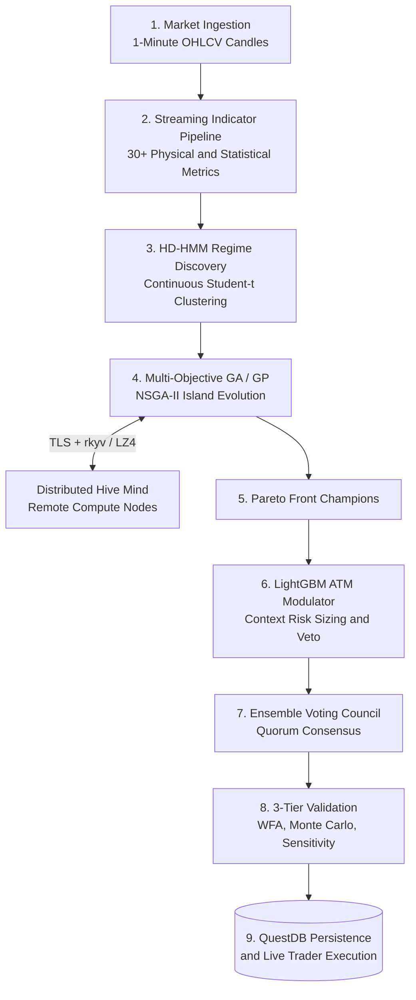
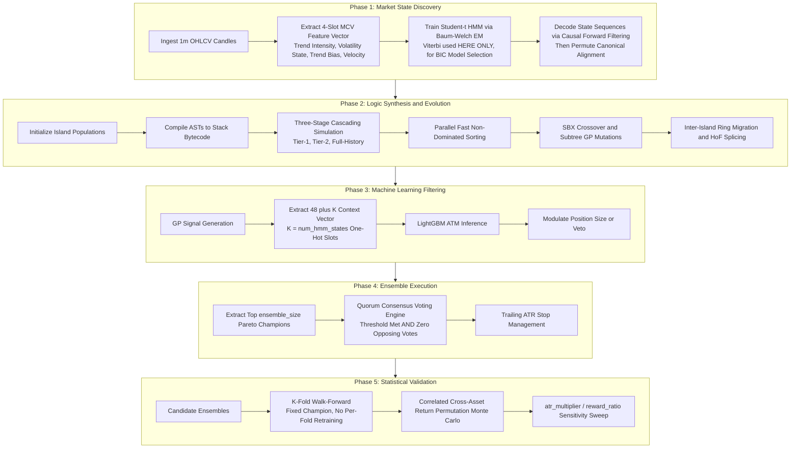
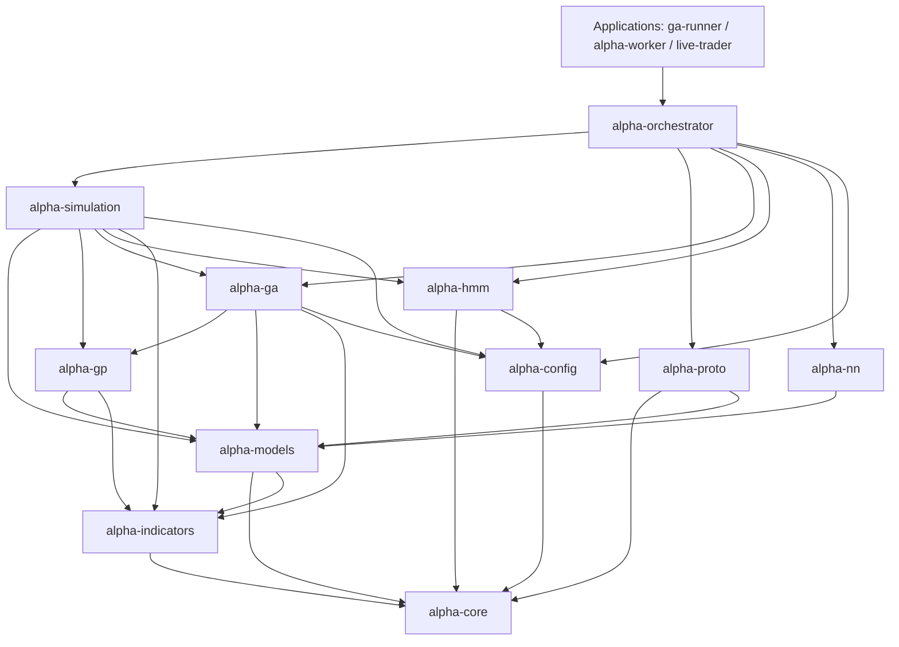
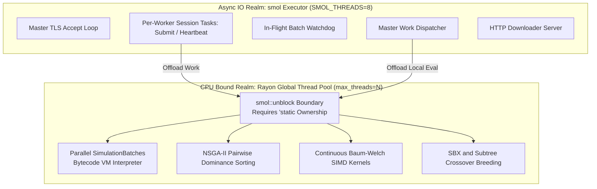

# Chapter 1: End-to-End System Architecture

Welcome to the foundational architecture chapter of the **Alpha Suite Technical Manual**. This document provides an exhaustive, textbook-grade breakdown of the philosophical design, end-to-end data lifecycle, crate dependency graph, memory models, concurrency boundaries, and core system invariants governing Alpha Suite.

---

## 1. High-Level Overview & Design Philosophy

### 1.1 The Quantitative Problem: The Breakdown of Traditional Strategies
Traditional algorithmic trading models suffer from fundamental structural flaws when deployed in modern, high-volatility markets (such as cryptocurrency baskets):

1. **Heuristic Curve-Fitting**: Manually engineered indicator rules (e.g., *“Buy when 14-period RSI < 30 and 50-period SMA crosses 200-period SMA”*) are rigid. They represent human biases fitted to historical market regimes that inevitably change.
2. **Black-Box Neural Network Failure**: Deep neural networks and reinforcement learning agents applied directly to raw price ticks frequently overfit to noise, suffer from non-stationary covariate shift, and fail to provide interpretable execution logic or risk boundaries.
3. **Single-Objective Optimization Pitfalls**: Optimizing solely for total return ($PnL$) inevitably selects strategies that took extreme tail risk, resulting in catastrophic account liquidation during unexpected market drawdowns.
4. **Friction Blindness**: Research environments frequently model fees as percentage-of-margin or ignore spread slippage and tax drag. In reality, with $10\times$ leverage, fees apply to **Total Notional Value**, transforming theoretical backtest alpha into immediate real-world ruin.

### 1.2 The Alpha Suite Solution: Autonomous Regime-Aware Symbolic Evolution
Alpha Suite solves these challenges by combining five complementary paradigms into a unified, deterministic research and execution pipeline:



1. **High-Definition Regime Discovery (HD-HMM)**: Instead of assuming stationarity, continuous multivariate Student-t Hidden Markov Models partition market history into distinct latent regimes (e.g. Bull Momentum, Bear Trend, Consolidation Squeeze, Liquidation Cascade).
2. **Genetic Programming (GP) Logic Synthesis**: The engine does not optimize static thresholds; it autonomously constructs and evolves symbolic Boolean Abstract Syntax Trees (ASTs) and nonlinear mathematical decision algorithms tailored specifically for each market regime.
3. **Multi-Objective Evolutionary Optimization (NSGA-II)**: Strategies evolve across parallel island populations balancing two non-collapsing objectives: **Robustness (Profitability, Breadth, Drawdown Protection)** and **Consistency (Equity Curve Linearity / $R^2$)**.
4. **Contextual Machine Learning Filtering (LightGBM ATM)**: A gradient-boosted decision tree evaluates the macro market context at the moment of entry, modulating position risk or vetoing false breakouts.
5. **Ensemble Execution & Quorum Voting**: Champion strategies from distinct evolutionary lineages form an anti-fragile voting council, executing trades only when a quorum consensus is reached.
6. **Institutional Statistical Validation**: Automated Walk-Forward Analysis (WFA), Monte Carlo trade permutation, and Parameter Sensitivity cliff detection ensure strategies are immune to curve-fitting before reaching production.
7. **Distributed Hive-Mind Computing**: High-performance compute scaling across remote worker nodes over zero-copy `rkyv` wire transport.

---

## 2. The 5 Pipeline Phases in Exhaustive Detail

The research lifecycle progresses through five distinct, deterministic phases:



### Phase 1: Market State Discovery (HD-HMM)
- Ingests multi-asset historical 1-minute OHLCV candle series from QuestDB or CSV archives.
- Extracts the 4-slot Market Character Vector feature vector directly off the shared indicator bus: `mcv_trend_intensity_1m`, `mcv_volatility_state_1m`, `mcv_trend_bias_1m`, `mcv_velocity_1m` (`manual/03` §1.2 — this replaced an earlier log-return/NATR/skewness/efficiency-ratio feature set that no longer matches the code).
- Trains continuous Student-t Hidden Markov Models (independent per-feature emissions, not a full covariance matrix — `manual/03` §2.2) via log-space Baum-Welch Expectation-Maximization across multi-core CPU SIMD kernels (AVX-512 / AVX-2).
- Filters out degenerate ghost states and collapsed Shannon entropy models.
- Decodes hidden market regimes (e.g., 16 distinct states) via **causal forward filtering** (argmax at each step, no backward pass) for every backtest-facing or live state sequence. The Viterbi algorithm is used **only** inside BIC model selection, where whole-sequence access is legitimate — using Viterbi for the GA's own state sequences was a look-ahead bias fixed by this switch; see `manual/03` §7 for the full story.
- Executes cross-ticker canonical state alignment, ensuring that State 0 represents the same underlying physical regime across BTC, ETH, SOL, TURBO, and BONK.
- Emits precomputed regime timelines (`Vec<usize>`) and caches them to disk as `hmm_precomputed_states.<fingerprint>.cache.json` (a BLAKE3-fingerprinted filename, not a fixed name — `manual/03` §7.3).

### Phase 2: Logic Synthesis & Genetic Evolution (GA / GP)
- Partitions the global population (e.g. 10,000 individuals) across $M$ isolated **Islands** (e.g. 32 islands of 312 individuals each).
- Each individual genotype (`GpSimulationParams`) owns $K$ independent per-state strategies (`StateStrategy`).
- Compiles recursive AST signal trees into flat, linear bytecode instruction arrays (`Vec<Op>`).
- Executes a **three-stage cascading evaluation** (`manual/06` §4), not a two-tier one:
  - **Tier-1 (`tier_1_days`)**: Ultra-fast pre-screening. Sub-optimal individuals receive graduated failure scores.
  - **Tier-2 (`tier_2_days`)**: Deeper simulation over a longer recent slice; pass/fail thresholds scale linearly from tier-1's by the day ratio.
  - **Full-History (terminal)**: Every tier-2 survivor is simulated across the entire historical window. This stage has **no pass/fail threshold of its own** — the 7-stage fitness pipeline judges the result directly.
- Evaluates the 7-stage fitness pipeline to assign **Robustness Scores** and computes trade-weighted cumulative PnL $R^2$ for **Consistency Scores**.
- Performs parallel fast non-dominated sorting and relative-scale crowding distance calculation to establish Pareto fronts.
- Breeds subsequent generations using Simulated Binary Crossover (SBX), Polynomial Mutation, and subtree swapping.
- Executes inter-island ring migration, local Hall of Fame elitist state replacement, and performance-gated adaptive difficulty annealing.
- **Neural seeding** (when `nn.use_neural_seeding` is on): every generation — not only generation 0 — 5 Transformer-generated candidates are injected into that generation's offspring (`manual/08` §3); `nn.seeding_ratio` is parsed but not actually read by this path.

### Phase 3: Machine Learning Trade Filtering (ATM Modulator)
- For every generated entry signal, extracts a **48 + K**-dimensional market context feature vector ($K$ = `num_hmm_states`, one-hot encoded) via `build_ml_feature_vector` — not 16-dimensional. The 48 fixed slots span the MCV features, classic momentum/volatility indicators, volume, the physics/thermodynamics family, Hurst/skewness/correlation, aggregate-timeframe indicators, and the active strategy's own risk genes (`manual/08` §1.A).
- Evaluates the vector through a trained **LightGBM Adaptive Trade Modulator (ATM)** binary classifier.
- Predicts trade win probability $P(\text{Win})$.
- Dynamically scales trade position sizing via `min_risk_modulator` or vetoes low-confidence signals entirely.
- The model itself is trained via the separate `ga-runner train-filter` step against a harvest run's strategies, strictly on in-sample data (`manual/08` §1.C, `manual/11` §2.F) — not automatically as a side effect of a GA run.

### Phase 4: Ensemble Execution & Quorum Voting
- Selects the top `ensemble.ensemble_size` Pareto-front members, in front order (rank, then crowding distance) — not a separately re-ranked "best K".
- **Correlation de-duplication ($r > 0.85$) is not implemented** anywhere in `alpha-simulation::ensemble` — treat this as a planned feature, not current behavior (`manual/09` §5).
- Evaluates live or backtested market ticks across all ensemble members simultaneously.
- Fires trade entries only when a **quorum threshold is met in one direction AND zero members voted the opposite direction** — stricter than "at least N of M agree" (`manual/09` §5).
- Manages portfolio-level risk, dynamic ATR trailing stops, and independent account equity tracking.

### Phase 5: Statistical Validation Suite
- **Walk-Forward Analysis (WFA)**: evaluates one already-fixed champion (no per-fold retraining) across $K$ contiguous out-of-sample folds of the 80–100% Validation-Test band. Walk-Forward Efficiency is **not computed anywhere in code** — only `net_profit`/`max_drawdown`/`win_rate`/`trade_count` are logged per fold; any WFE-style ratio is a manual interpretation of that table (`manual/09` §2).
- **Monte Carlo Permutation**: **not** trade-sequence reshuffling — draws one shared permutation of per-bar returns across all tickers per simulation (preserving cross-asset correlation), reconstitutes synthetic price series, and re-runs the full simulation including HMM re-classification. "Probability of ruin" is not computed by code; only `final_equity`/`max_drawdown_percent` per simulation are logged, and percentiles are read off that distribution (`manual/09` §3).
- **Parameter Sensitivity Analysis**: sweeps only `atr_multiplier` and `reward_ratio`, clamped to the GA's own search bounds; logs `net_profit`/`max_drawdown`/`win_rate`, not Sharpe. Indicator periods and the ML threshold are **not** swept (`manual/09` §4).
- Persists final validated strategy models, AST bytecode, and ensemble configuration parameters to QuestDB and JSON model definitions.
- **Live trading (`apps/live-trader`) is planned, not implemented** — `main.rs` is currently `const fn main() {}` (`manual/09` §6).

---

## 3. Complete Crate Architecture & Module Breakdown

The Alpha Suite workspace consists of 12 specialized crates organized with clean separation of concerns and zero cyclic dependencies:



### Deep Crate Inventory:

#### 1. `alpha-core`
- **Scope**: Fundamental shared primitives, time formatting, dataset hashing, dispatch helpers, and tier slicing.
- **Key Modules**:
  - `dataset_hash`: Computes **BLAKE3** dataset hashes (`calculate_dataset_hash`) over market candle vectors and state arrays, used in the HiveMind handshake (`manual/07` §3.1). FNV-1a is used only for the much smaller per-state checksum and `IndicatorPeriods::structural_hash` — not for the dataset hash itself.
  - `dispatch`: Helper logic for batch partition sizing, work stealing eligibility, and reference ticker selection.
  - `tier_slice`: Slices candle datasets and HMM state vectors into Tier-1 (30-day) and Tier-2 (180-day) contiguous evaluation windows.
  - `security`: Constant-time token verification for cluster authentication.
  - `rkyv_time`: Serde/rkyv serializable wrappers for `chrono::NaiveDateTime`.
- **Key Structs**: `Ohlcv`, `TickerResult`, `PerStateTickerResult`, `PerStateMap<T>`, `IndicatorPeriods`, `PerAssetLimits`.
- **Constants**: `WARMUP_PERIOD = 2000`, `CALENDAR_DAYS_PER_YEAR = 365.0`, `MINUTES_PER_DAY = 1440`.

#### 2. `alpha-config`
- **Scope**: TOML configuration parsing, bounds definitions, deserialization, and structural integrity validation.
- **Key Modules**: `ga`, `simulation`, `hmm`, `ml_filter`, `ensemble`, `validation`, `distributed`, `nn`, `paths`, `api`, `price_capture`, `gpu`, `downloader` — the complete set of 13 `pub mod` config sections (`manual/10` covers each exhaustively).
- **Key Structs**: `Config`, `GaConfig`, `SimulationConfig`, `FrictionConfig`, `IslandModelConfig`, `ObjectiveAnnealingConfig`, `ParsimonyPenaltyConfig`, `EvaluationTiersConfig`.

#### 3. `alpha-indicators`
- **Scope**: Per-tick streaming indicator engine, memory bus, and physical dynamic calculators.
- **Key Modules**:
  - `bus`: Flat pre-allocated float buffer (`IndicatorBus`) and type-safe `TerminalId` handles.
  - `registry`: `SlotRegistry` storing slot descriptors, categories, and GP visibility flags.
  - `streaming`: Buffer-reusing streaming data structures (`SortedWindow`, `SlidingWindowMinMax`).
  - `pipeline`: Core indicator runners (~30 runners covering Volatility, Momentum, Trend, Kinematics, Thermodynamics).
  - `registration`: `DefaultSlots` compiled handle mapping.

#### 4. `alpha-models`
- **Scope**: Strategy representation, AST expression trees, Backtest results, and terminal descriptors.
- **Key Modules**:
  - `strategy::expressions`: `SignalExpression` (Boolean logic) and `FloatExpression` (mathematical operations).
  - `strategy::params`: `GpSimulationParams`, `StateStrategy`, `StrategyParams`, `StrategyDirection`.
  - `strategy::terminals`: `Terminal`, `TerminalNode`, `TerminalWeights`.
  - `backtest`: `BacktestResult`, `BacktestTrade`.

#### 5. `alpha-gp`
- **Scope**: Genetic Programming engine: stack-based bytecode compiler and VM interpreter, crossover, mutation, and AST generation.
- **Key Modules**:
  - `evaluator`: `StatefulGpEvaluator`, `Op` bytecode instruction set, `FixedStack<T, 30>`.
  - `evaluator::state`: Rolling node states (`SmaState`, `StdDevState`, `LagState`).
  - `operators::crossover`: Zero-clone subtree swapping (`crossover_signals`).
  - `operators::mutation`: Subtree, point, and terminal mutation (`mutation_signal`, `mutation_float`).
  - `operators::generation`: Ramped Half-and-Half tree generation (`ramped_half_half`).

#### 6. `alpha-ga`
- **Scope**: Multi-Objective Genetic Algorithm: NSGA-II non-dominated sorting, crowding distance, island migration, and deterministic RNG seeding.
- **Key Modules**:
  - `nsga2`: `MultiObjectiveGA` engine coordinator.
  - `nsga2::sorting`: Parallel fast non-dominated sorting (`non_dominated_sort_indices`) and scale-free crowding distance calculation.
  - `nsga2::evolution`: Evolutionary breeding loop, Hall of Fame state splicing, and offspring generation.
  - `operators`: Real-valued Simulated Binary Crossover (SBX) and Polynomial Mutation.
  - `rng_seed`: Coordinate-based deterministic RNG derivation (`seeded_rng`).

#### 7. `alpha-hmm`
- **Scope**: Hidden Markov Model regime discovery: continuous Student-t Baum-Welch EM (per-feature diagonal emissions, not full covariance), SIMD acceleration, causal forward-filter classification, and cross-ticker alignment.
- **Key Modules**:
  - `baum_welch`: Continuous Baum-Welch EM in log-space with AVX-512/AVX-2 SIMD kernels. Viterbi lives here too, used only for BIC model selection over a fixed, fully-observed candidate dataset.
  - `model`: Continuous per-feature Student-t emission distributions (`ContinuousEmissions`).
  - `classifier`: `HmmClassifier` executing **causal forward-filter** state decoding (`filter_batch`/`filter_batch_with_bias`) for every backtest-facing or live consumer; `viterbi`/`viterbi_with_bias` remain available but are only correct for `baum_welch.rs`'s whole-sequence use — see `manual/03` §7.
  - `align`: Cross-ticker canonical state permutation and alignment.

#### 8. `alpha-simulation`
- **Scope**: Backtesting simulation engine, position sizing, realistic fee/slippage friction, funding fees, mark-to-market drawdown, Austrian tax, multi-objective fitness evaluation, and validation suite.
- **Key Modules**:
  - `engine`: Sequential tick simulator (`run_simulation`), independent symbol account states (`TickerSimulationState`), order execution (`execution.rs`).
  - `engine::tiering`: **Three-stage** cascading batch evaluator (`evaluate_batch_tiered`) — tier-1, tier-2, and a terminal full-history stage with no threshold of its own.
  - `fitness`: 7-stage multi-objective fitness pipeline (`calculate_log_utility_fitness`, `compute_objectives`).
  - `ensemble`: Quorum voting council engine (`EnsembleEngine`) — quorum requires zero opposing votes, not just meeting the threshold; correlation de-duplication is not implemented.
  - `validation`: Walk-Forward analysis (fixed champion, no per-fold retraining), Monte Carlo simulation (correlated return permutation, not trade reshuffling), Parameter Sensitivity analysis (`atr_multiplier`/`reward_ratio` only).

#### 9. `alpha-orchestrator`
- **Scope**: Master GA execution loop, distributed master coordinator (`WorkerManager`), QuestDB persistence layer, session checkpointing, and post-GA pipeline.
- **Key Modules**:
  - `ga_loop`: Central evolutionary loop coordinator (`run_ga_optimization`, `run_ga_loop_from_state`).
  - `distributed::manager`: Cluster work queue management, dispatch, heartbeat tracking, and work stealing.
  - `session`: Compressed `.bin.lz4` session serialization and deserialization.
  - `db`: QuestDB PostgreSQL queries, ILP metrics streaming, and schema migrations.

#### 10. `alpha-proto`
- **Scope**: Network wire protocol: `rkyv` wire types (fully deserialized on decode, not zero-copy access — `manual/07` §2.2), LZ4 compression for select large payloads only, and async TLS transport (`SmolTransport`).
- **Key Modules**:
  - `lib`: Message definitions — `ClientMessage` (worker → master) and `ServerMessage` (master → worker), not `MasterMessage`/`WorkerMessage`; `SimulationBatch`; `WorkerResult`, not `BatchResult`; `HandshakeRequest`/`HandshakeResponse`; `WorkerHeartbeat`.
  - `transport`: Length-prefixed async TLS stream framing (`SmolTransport`) — `[u32 big-endian length][rkyv-archived bytes]`, with LZ4 wrapping only `SyncData`/on-disk-cache/session-checkpoint payloads.

#### 11. `alpha-nn`
- **Scope**: Strategy-generating Transformer ("Alpha Architect"), neural seeding, and tokenized strategy grammar.
- **Key Modules**:
  - `model`: Autoregressive Transformer decoder (`StrategyTransformer`).
  - `tokenizer`: AST node-to-token bidirectional grammar tokenizer (`StrategyTokenizer`).
  - `regime_context`: Context encoder embedding historical return/volatility sequences.

#### 12. `alpha-fmp-client`
- **Scope**: Financial Modeling Prep (FMP) WebSocket client and REST client for historical data capture.

---

## 4. Application Binaries

The suite compiles into several specialized standalone binaries located in `apps/`:

- **`apps/ga-runner`**: The primary research master. Controls data ingestion, HMM training, island GA evolution, distributed worker coordination, database logging, and automated post-GA validation.
- **`apps/alpha-worker`**: High-performance compute worker daemon. Connects to `ga-runner` over TLS, caches market data, and executes simulation batches on local Rayon threads.
- **`apps/alpha-launcher`**: Lightweight self-updating bootstrap binary for remote worker deployment.
- **`apps/price-capture`**: Real-time market data ingestion daemon streaming 1-minute OHLCV candles from FMP WebSocket into QuestDB.
- **`apps/live-trader`**: **Planned, not implemented** — `main.rs` is currently `const fn main() {}` and `engine.rs` is empty. The description here (live execution connecting to broker/exchange APIs to execute ensemble quorum signals in real time) is the design target, not current behavior; see `manual/09` §6.
- **`apps/forensic-api`**: High-speed REST/WebSocket API providing full trade forensics, strategy equity curves, and performance telemetry to GUI clients.
- **`apps/ga-gui`**: Frontend interface for real-time visualization of GA runs, Pareto fronts, and island telemetry.
- **`apps/nn-trainer`**: Training harness for the strategy transformer on harvested strategy datasets.

---

## 5. Memory, Concurrency & Threading Model

Alpha Suite implements a strict separation between **Async I/O Concurrency** and **CPU-Bound Parallelism**:



### 5.1 The `smol` Async Runtime
- **Why `smol` instead of `tokio`?** `smol` provides a minimalist, predictable async runtime with zero background thread interference and explicit task detachment.
- **Async Thread Pool (`SMOL_THREADS = 8`)**: Initialized at the start of `main()`. Dedicated strictly to lightweight network I/O (TLS framing, heartbeats, database queries, watchdog timers).

### 5.2 The `rayon` CPU Thread Pool
- **CPU Parallelism**: Initialized via `rayon::ThreadPoolBuilder::build_global()` with `max_threads` from `config.toml` (or physical core count) and a 32 MB worker stack size.
- **Rule**: Async executor threads must **NEVER** execute CPU-heavy calculations inline. All simulation, indicator warmup, HMM training, and GA sorting must route through `smol::unblock` into Rayon.

### 5.3 The `'static` Lifetime Boundary
> [!CRITICAL]
> **The Single Most Important Memory Rule in Alpha Suite**:
> Closures passed across `smol::unblock` or `smol::spawn` require `'static`. A borrowed reference (`&Data`) cannot cross this boundary because the runtime cannot guarantee the caller's stack frame will outlive the background task.
>
> - **The Correct Fix**: Always use **`Arc<T>` (Shared Ownership)**, never attempted lifetime annotations.
> - **The Loophole**: Borrows constructed *inside* the closure from an owned `Arc<T>` clone are completely legal and zero-copy.

---

## 6. The 7 Non-Negotiable System Invariants

Every developer and quant researcher must respect the following core invariants:

### Invariant 1: Fixed Warmup Candle Buffer (`WARMUP_PERIOD = 2000`)
```rust
pub const WARMUP_PERIOD: usize = 2000;
```
- **Rule**: `states.len() == data.len() - WARMUP_PERIOD` exactly.
- **Rationale**: Long-period indicators (200-period SMAs, 300-period Hurst exponent, slow timeframe aggregators) require up to 2,000 candles to stabilize. All simulation evaluation begins at `data[WARMUP_PERIOD..]`. Both the primary engine and ensemble engine enforce this as a runtime error.

### Invariant 2: Total Seed Determinism via Coordinate Hashing
```rust
pub fn seeded_rng(base_seed: u64, coords: &[u64]) -> StdRng { ... }
```
- **Rule**: Every random number generated in the GA derives from stable coordinates:
  $$\text{RNG Stream} = \text{seeded\_rng}(\text{base\_seed}, [\text{island\_index}, \text{generation}, \text{purpose\_tag}, \text{item\_index}])$$
- **Rationale**: Eliminates dependency on thread scheduling. Running a fixed seed on 4 cores or 128 cores produces **bit-identical** evolutionary outcomes. Using `rand::rng()` in production evaluation is strictly forbidden.

### Invariant 3: HMM State Alignment
- **Rule**: `GpSimulationParams.strategies.len() == num_hmm_states`.
- **Rationale**: The simulation engine directly indexes `strategies[current_state]`. `GpSimulationParams::new` enforces normalization and padding with inert default strategies if lengths mismatch.

### Invariant 4: Per-Symbol Independent Account Model
- **Rule**: In multi-ticker simulations, each ticker operates its own independent account with its own initial equity and drawdown tracker.
- **Rationale**: Prevents cross-asset margin contamination during strategy evolution. Multi-asset portfolio utility is computed across all symbol accounts at the end of the simulation.

### Invariant 5: Hard GP Tree Depth Cap (`MAX_GP_TREE_DEPTH = 30`)
```rust
pub const MAX_GP_TREE_DEPTH: usize = 30;
```
- **Rule**: No signal or float tree may exceed depth 30 (root is depth 1).
- **Rationale**: `StatefulGpEvaluator` uses a zero-allocation `FixedStack<T, 30>` backed by an inline array. Trees exceeding depth 30 are clipped by `truncate_to_safe_depth` and rejected by crossover/mutation operators.

### Invariant 6: Zero-Warning Policy (`clippy::pedantic`)
- **Rule**: `clippy::pedantic` is warn-level workspace-wide, and the tree is kept at **ZERO warnings**.
- **Rationale**: Prevents subtle float truncation bugs, unnecessary allocations, and integer cast overflows.

### Invariant 7: rkyv Binary Layout Stability
- **Rule**: Modifying or reordering struct fields in `alpha-proto` alters the serialized binary layout.
- **Rationale**: `rkyv` encodes fields positionally without schemas. Master and workers must be upgraded simultaneously when wire types change.
