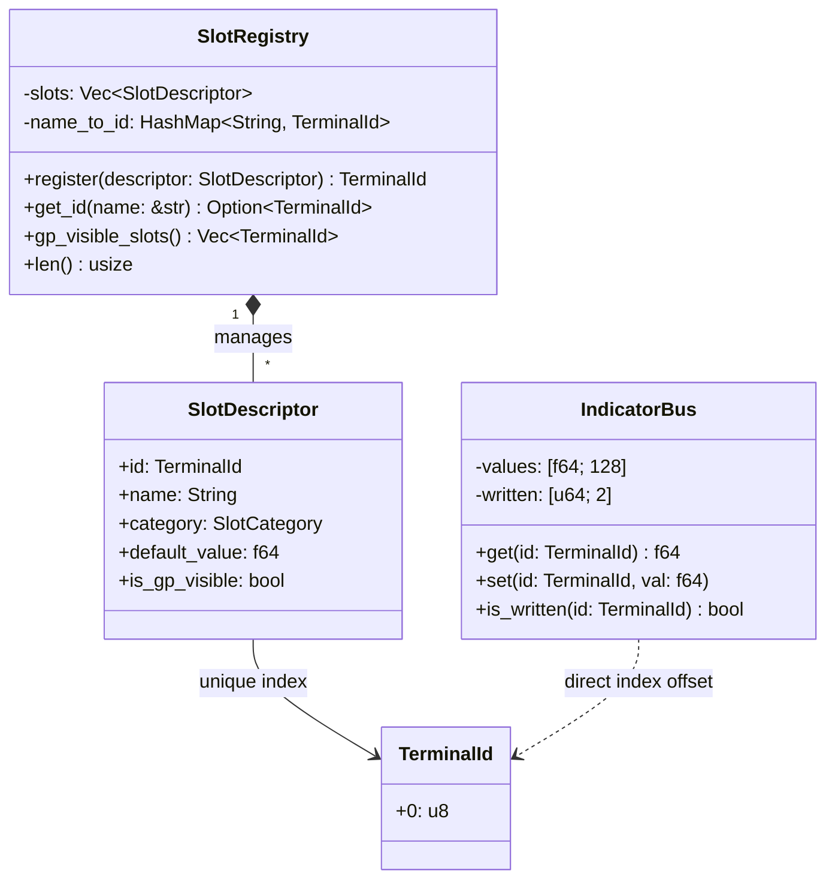
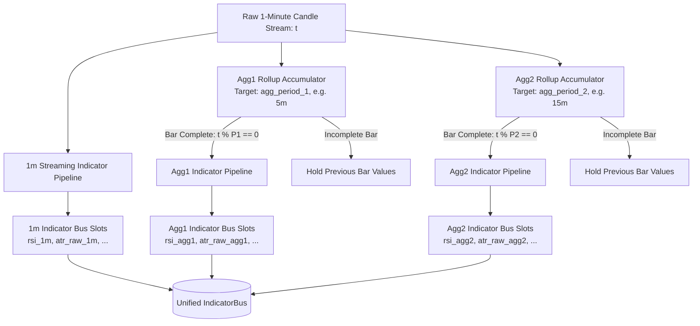
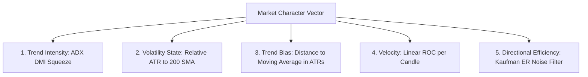
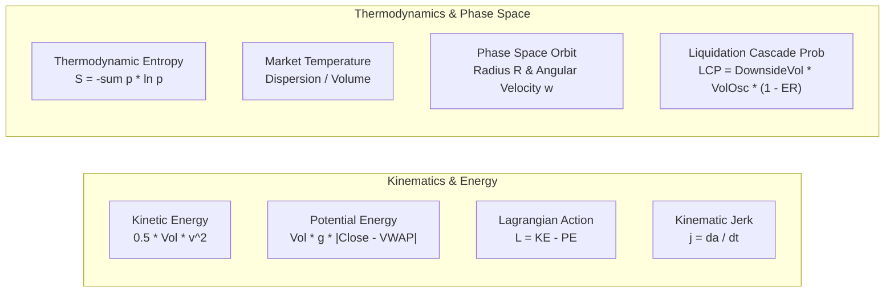
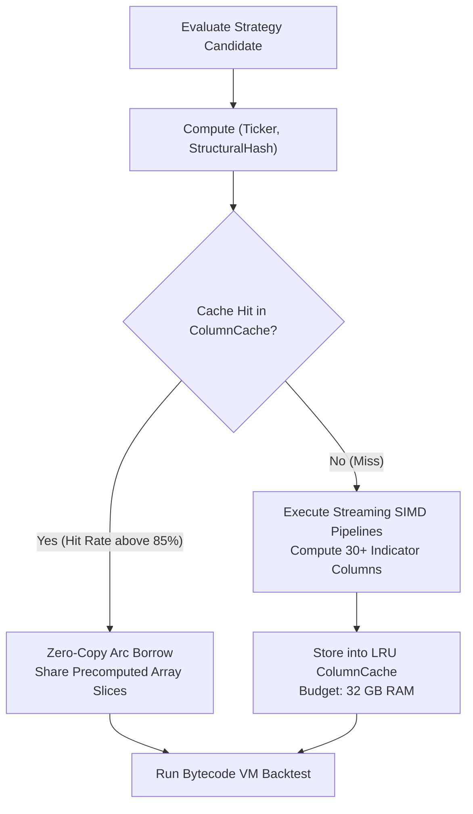

# Chapter 2: Market Physics & Streaming Indicator Engine

In high-frequency and low-latency algorithmic trading, predictive power originates from the quality and fidelity of extracted market features. Rather than treating technical indicators as lagging mathematical heuristics computed in isolation, Alpha Suite (`alpha-indicators`) views price action and order flow as a **continuous dynamical physical system** governed by kinematics, thermodynamics, statistical phase space, and multi-scale volatility mechanics.

This chapter provides an exhaustive, mathematical, algorithmic, and architectural guide to the streaming indicator engine, memory bus, SIMD acceleration kernels, and the complete catalog of ~30 indicators available to the Genetic Programming synthesizer.

---

## 1. The Zero-Allocation Streaming Bus Architecture

In genetic programming, a single evolutionary generation may evaluate $10,000$ strategy candidates across $2$ years of 1-minute historical OHLCV data ($> 1,000,000$ candles). If indicator lookups incurred dynamic hash map lookups, heap allocations, or string formatting, memory bandwidth and cache thrashing would bottleneck the entire CPU.

Alpha Suite eliminates all lookup overhead using a **Pre-Allocated Contiguous Flat Memory Bus**:



### 1.1 Type-Safe Indexing: `TerminalId`
```rust
#[derive(Debug, Clone, Copy, PartialEq, Eq, PartialOrd, Ord, Hash, Serialize, Deserialize, Default)]
pub struct TerminalId(pub u8);
```
- A newtyped **8-bit** integer representing a zero-based offset into the memory array — not `u32`. A single byte is more than enough range: `IndicatorBus` caps out at `MAX_SLOTS = 128` slots (`alpha-indicators/src/bus.rs`), and keeping the handle this small matters because it also travels inside GP bytecode operands (`Op::PushNode(TerminalId)`, `manual/04` §4) evaluated millions of times per generation.
- Calling `bus.get(terminal_id)` translates directly into `self.values[id.0 as usize]`, compiling to a single CPU register-offset load instruction (`MOVSD [RSI + RAX*8], XMM0`) without branching or indirection.
- The bus itself is a fixed `[f64; 128]` array (`MAX_SLOTS`) plus a `[u64; 2]` bitmask (`written`, `WRITTEN_WORDS = MAX_SLOTS / 64`) tracking which slots have actually been written this bar (as opposed to still holding their warmup default) — not a `Vec<f64>`. `set` both writes `values[idx]` and flips the corresponding bit in `written`; `is_written` lets a consumer distinguish "never-written default" from "a real indicator wrote this."

### 1.2 The `SlotRegistry` Metadata Directory
The `SlotRegistry` manages slot lifecycle, category grouping, and genetic visibility:
- **`SlotCategory`**:
  - `Volatility`: True Range, ATR, Bollinger Bands, Downside Semi-Deviation.
  - `Momentum`: RSI, Stochastic %K/%D, Rate of Change, Log Returns.
  - `Trend`: Moving Averages, ADX Trend Intensity, Directional Efficiency.
  - `Physics`: Kinetic Energy, Potential Energy, Lagrangian, Kinematic Jerk, Phase Space.
  - `Thermodynamics`: Statistical Entropy, Market Temperature, Liquidation Cascade Probability.
  - `Internal`: Regime persistence, trade state, and system telemetry.
- **GP Visibility Control**: Not all slots are exposed as terminals to the GP tree builder. Internal debugging counters are masked out (`is_gp_visible = false`), ensuring the evolutionary search space remains focused purely on predictive market dynamics.

### 1.3 `DefaultSlots`: Compile-Time Handle Optimization
To prevent runtime string lookups even during system initialization, `alpha-indicators` exposes the `DefaultSlots` struct containing pre-resolved `TerminalId` constants:
```rust
pub struct DefaultSlots {
    pub atr_raw_1m: TerminalId,
    pub normalized_atr: TerminalId,
    pub rsi_1m: TerminalId,
    pub stochastic_k_1m: TerminalId,
    pub stochastic_d_1m: TerminalId,
    pub kinetic_energy: TerminalId,
    pub potential_energy: TerminalId,
    pub lagrangian: TerminalId,
    pub kinematic_jerk: TerminalId,
    pub phase_space_radius: TerminalId,
    pub thermo_entropy: TerminalId,
    // ...
}
```

---

## 2. Multi-Scale Timeframe Aggregation

Financial time series exhibit multi-fractal properties: macro trends manifest over hours, while micro volatility impulses occur in sub-minute bursts. Alpha Suite processes market data concurrently across three distinct timeframe scales:



### 2.1 Bar Rollup Mechanics
For higher timeframes $\text{Agg}_k$, candles are accumulated using streaming rollup math:
- $\text{Open}_{\text{agg}} = \text{Open}_1$ (price of the first 1-minute candle in the window).
- $\text{High}_{\text{agg}} = \max_{i=1}^W (\text{High}_i)$.
- $\text{Low}_{\text{agg}} = \min_{i=1}^W (\text{Low}_i)$.
- $\text{Close}_{\text{agg}} = \text{Close}_W$ (price of the current 1-minute candle).
- $\text{Volume}_{\text{agg}} = \sum_{i=1}^W \text{Volume}_i$.

### 2.2 The Latching Invariant
When a higher-timeframe candle closes, its computed indicators update in the `IndicatorBus`. During intermediate 1-minute bars, higher-timeframe slots **latch** (retain their closed value) to avoid lookahead bias and intra-bar repaint artifacts.

---

## 3. High-Performance Streaming Window Primitives

Evaluating rolling statistics over sliding windows $W$ without recalculating from scratch requires specialized, allocation-free data structures:

### 3.1 `SortedWindow`: Amortized $O(W)$ Rank & Quantile Tracking
Computing median, interquartile ranges, or quantile ranks typically requires sorting $W$ elements ($O(W \log W)$). `SortedWindow` maintains two arrays: a circular ring buffer tracking arrival order and a sorted contiguous array.

```rust
pub struct SortedWindow {
    capacity: usize,
    ring: Vec<f64>,
    sorted: Vec<f64>,
    head: usize,
    count: usize,
}
```
1. **Oldest Element Removal**: Uses binary search (`sorted.binary_search_by`) to locate the departing element in $O(\log W)$ and shifts elements in $O(W)$.
2. **New Element Insertion**: Binary searches the insertion point and shifts elements in $O(W)$.
3. **Quantile Lookup**: Returns median or quantile in $O(1)$ by direct array indexing: `sorted[count / 2]`.

### 3.2 `SlidingWindowMinMax`: Amortized $O(1)$ Monotonic Deque
Finding the rolling maximum and minimum over lookback $W$ (e.g. for Donchian channels or Stochastic oscillators) is achieved in amortized $O(1)$ time using a monotonic double-ended queue (`VecDeque<(usize, f64)>`):
- When pushing value $v_t$ at time $t$, pop all elements from the back where $v_{\text{back}} \le v_t$.
- Pop elements from the front whose timestamps $t - t_{\text{front}} \ge W$.
- The front element is always the exact rolling maximum in $O(1)$.

### 3.3 Buffer Reuse & The `clone_from` Invariant
> [!IMPORTANT]
> **Heap Reallocation Avoidance**:
> Standard Rust `#[derive(Clone)]` reallocates heap buffers from scratch on every clone, dropping capacity.
> `alpha-indicators` implements custom `Clone` and `clone_from` methods for all streaming runners:
> ```rust
> fn clone_from(&mut self, source: &Self) {
>     self.buf.clear();
>     self.buf.extend_from_slice(&source.buf);
>     self.head = source.head;
>     self.count = source.count;
> }
> ```
> This preserves pre-allocated memory buffers across generations, eliminating memory fragmentation.

---

## 4. Comprehensive Indicator & Physics Catalog

Below is the exhaustive catalog of all indicators implemented in Alpha Suite, complete with mathematical formulations, code logic, and trading interpretations.

---

### Group A: Volatility & Dispersion Dynamics

#### 1. Average True Range (`atr_raw_1m`) & Normalized ATR (`normalized_atr`)
- **Mathematical Derivation**:
  $$\text{True Range } TR_t = \max\Big( High_t - Low_t, \; |High_t - Close_{t-1}|, \; |Low_t - Close_{t-1}| \Big)$$
  $$ATR_t = \alpha \cdot TR_t + (1 - \alpha) \cdot ATR_{t-1}, \quad \alpha = \frac{1}{N}$$
  $$NATR_t = \left( \frac{ATR_t}{Close_t} \right) \times 100$$
- **Trading Interpretation**: Absolute $ATR$ dictates stop-loss dollar distance and position sizing. $NATR$ normalizes volatility across BTC ($60,000) and BONK ($0.00002), enabling universal volatility comparisons.

#### 2. Bollinger Bands (`bollinger_upper_1m`, `bollinger_lower_1m`, `bollinger_band_width`, `percent_b_1m`)
- **Mathematical Derivation**:
  $$\mu_t = \frac{1}{N} \sum_{i=0}^{N-1} Close_{t-i}$$
  $$\sigma_t = \sqrt{ \frac{1}{N-1} \sum_{i=0}^{N-1} (Close_{t-i} - \mu_t)^2 } \quad \text{(Bessel's Sample Correction)}$$
  $$\text{Upper}_t = \mu_t + K \cdot \sigma_t, \quad \text{Lower}_t = \mu_t - K \cdot \sigma_t \quad (K = 2.0)$$
  $$\text{BandWidth}_t = \frac{\text{Upper}_t - \text{Lower}_t}{\mu_t}$$
  $$\%B_t = \frac{Close_t - \text{Lower}_t}{\text{Upper}_t - \text{Lower}_t}$$
- **Trading Interpretation**: $\%B > 1.0$ indicates an overbought band penetration; $\%B < 0.0$ indicates an oversold dump. BandWidth contractions identify volatility squeezes preceding explosive expansion breakouts.

#### 3. Downside Volatility (`downside_volatility`)
- **Mathematical Derivation**:
  $$\sigma_{\text{down}, t} = \sqrt{ \frac{1}{N} \sum_{i=0}^{N-1} \min(0, r_{t-i})^2 }, \quad r_t = \ln\left(\frac{Close_t}{Close_{t-1}}\right)$$
- **Trading Interpretation**: Penalizes negative price dispersion while ignoring upside upside momentum; serves as the denominator in Sortino ratio optimization.

---

### Group B: Momentum & Oscillators

#### 4. Relative Strength Index (`rsi_1m`)
- **Mathematical Derivation**:
  $$\Delta_t = Close_t - Close_{t-1}$$
  $$U_t = \max(0, \Delta_t), \quad D_t = \max(0, -\Delta_t)$$
  $$\bar{U}_t = \alpha U_t + (1 - \alpha) \bar{U}_{t-1}, \quad \bar{D}_t = \alpha D_t + (1 - \alpha) \bar{D}_{t-1} \quad \left(\alpha = \frac{1}{N}\right)$$
  $$RS_t = \frac{\bar{U}_t}{\bar{D}_t + \epsilon}, \quad RSI_t = 100 - \frac{100}{1 + RS_t}$$
- **Trading Interpretation**: Bounded momentum oscillator ($0 \dots 100$) measuring directional velocity. Divergences between price and RSI signal impending structural trend exhaustions.

#### 5. Stochastic Oscillator (`stochastic_k_1m`, `stochastic_d_1m`)
- **Mathematical Derivation**:
  $$\%K_t = \frac{Close_t - \min_{i=0}^{N-1} Low_{t-i}}{\max_{i=0}^{N-1} High_{t-i} - \min_{i=0}^{N-1} Low_{t-i} + \epsilon} \times 100$$
  $$\%D_t = \frac{1}{M} \sum_{j=0}^{M-1} \%K_{t-j}$$
- **Trading Interpretation**: Identifies where the current close sits relative to the recent high-low trading range. $\%K$ crossing above $\%D$ in oversold territory ($< 20$) provides high-precision trend-reversal trigger signals.

#### 6. Rate of Change (`roc_1m`) & Continuous Log Return (`log_return_1m`)
- **Mathematical Derivation**:
  $$ROC_t(N) = \left( \frac{Close_t - Close_{t-N}}{Close_{t-N}} \right) \times 100$$
  $$r_t = \ln\left( \frac{Close_t}{Close_{t-1}} \right)$$
- **Trading Interpretation**: Pure mathematical velocity and logarithmic return series, essential for continuous statistical modeling and regression analysis.

---

### Group C: Market Character Vector (MCV) & Statistical Dynamics

The **Market Character Vector (MCV)** encapsulates the macroeconomic state of order flow across 5 orthogonal dimensions:



#### 7. Trend Intensity (`mcv_trend_intensity_1m`)
- Directional Movement Index ($+DI, -DI$) smoothed into the Average Directional Index ($ADX$). Bounded $0 \dots 100$. $ADX > 25$ indicates an active institutional trend; $ADX < 15$ indicates consolidation chop.

#### 8. Volatility State (`mcv_volatility_state_1m`)
- $$\text{VolState}_t = \frac{ATR_t(N)}{SMA_t(ATR, 200)}$$
- Measures whether current market volatility is expanding relative to its long-term baseline ($> 1.0$) or compressing ($< 1.0$).

#### 9. Trend Bias (`mcv_trend_bias_1m`)
- $$\text{Bias}_t = \frac{Close_t - SMA_t(Close, N)}{ATR_t(N)}$$
- Dimensionless metric expressing how far price is stretched above or below its moving average in units of ATR.

#### 10. Kaufman Directional Efficiency Ratio (`mcv_directional_efficiency_1m`)
- $$ER_t = \frac{|Close_t - Close_{t-N}|}{\sum_{i=1}^N |Close_{t-i+1} - Close_{t-i}|}$$
- $ER \in [0, 1]$. $ER \approx 1.0$ represents a pure straight-line trend with zero noise; $ER \approx 0.0$ represents high-friction brownian chop.

#### 11. Hurst Exponent (`hurst`) via Rescaled Range ($R/S$) Regression
- **F19 correction**: the runner previously fit $H$ from a *single* window (the full `hurst_period`), i.e. $H = \ln(R/S)/\ln(N)$ evaluated once -- a point estimate that overfits to whatever noise realization happened to occupy that one span. It now regresses across four nested window sizes instead.
- **Mathematical Derivation**:
  For the return series $X = \{r_1, \dots, r_n\}$ (`n = hurst_period`), and a sub-window of the most recent $k$ returns with mean $\bar r_k$:
  $$Y_j = \sum_{i=1}^{j} (r_i - \bar r_k), \quad j = 1, \dots, k$$
  $$R(k) = \max_j Y_j - \min_j Y_j, \qquad S(k) = \sqrt{\frac{1}{k-1}\sum_{i=1}^k (r_i-\bar r_k)^2}$$
  Rescaled range $R(k)/S(k)$ is computed at $k \in \{\lfloor n/8\rfloor, \lfloor n/4\rfloor, \lfloor n/2\rfloor, n\}$ (any $k < 2$, or a window with numerically zero variance, is skipped). $H$ is then the ordinary-least-squares slope of $\ln(R(k)/S(k))$ regressed on $\ln(k)$ across the surviving windows:
  $$H = \frac{m\sum \ln k_i \cdot \ln(R/S)_i - \sum \ln k_i \sum \ln(R/S)_i}{m \sum (\ln k_i)^2 - \left(\sum \ln k_i\right)^2}$$
  ($m$ = number of surviving windows, $\le 4$). Clamped to $[0, 1]$; falls back to the registry default $0.5$ when fewer than two windows survive (e.g. a flat price series).
- **Trading Interpretation** (unchanged by the correction):
  - $H > 0.5$: **Persistent / Trending** (past gains imply future gains; trend-following rules thrive).
  - $H < 0.5$: **Anti-Persistent / Mean-Reverting** (past gains imply future reversals; mean-reversion rules thrive).
  - $H = 0.5$: **Brownian Noise / Random Walk** (no statistical edge; avoid trading).
- **Cache invalidation**: same slot id, same default, only the numerics changed -- `SlotRegistry::INDICATOR_ALGORITHM_VERSION` (`crates/alpha-indicators/src/registry.rs`) was bumped to `1` specifically so any `IndicatorWarmupCache`/GPU-side column cache entry computed under the old single-window formula is invalidated (its `version_hash()` changes) rather than silently replayed.

#### 12. Return Skewness (`return_skewness`)
- **Mathematical Derivation**:
  $$\tilde{\mu}_3 = \frac{ \frac{1}{N} \sum_{i=1}^N (r_i - \bar{r})^3 }{ \left( \frac{1}{N} \sum_{i=1}^N (r_i - \bar{r})^2 \right)^{3/2} }$$
- **Trading Interpretation**: Quantifies distributional tail asymmetry. Negative skewness ($\tilde{\mu}_3 < -1.0$) warns of severe downside crash risk and liquidation cascades.

#### 13. Trend Linearity (`price_correlation`)
- **F19 correction**: displayed (in `apps/ga-strat-editor`) as "Price Correlation" before this fix, which is doubly misleading -- the runner correlates price against neither volume nor its own past values. The slot's internal id/name (`price_correlation`) and the `price_correlation_period` config key are unchanged (both are load-bearing for `SlotRegistry::version_hash()`, cache keys, and any already-persisted strategy), but the human-facing label is now "Trend Linearity" -- see `SlotDescriptor::display_name`.
- Rolling Pearson correlation of price against a **linear time index** $x_i = i$ over the window (i.e. how well price fits a straight line, not a price/volume relationship or serial autocorrelation):
  $$r = \frac{n\sum x_i y_i - \sum x_i \sum y_i}{\sqrt{\left(n\sum x_i^2 - \left(\sum x_i\right)^2\right)\left(n\sum y_i^2 - \left(\sum y_i\right)^2\right)}}, \quad y_i = Close_{t-n+1+i},\ x_i = i$$
- $|r| \to 1$: price is tracking a clean, consistent linear trend (up for $r \to 1$, down for $r \to -1$). $r \to 0$: price is chopping sideways with no consistent linear drift.

---

### Group D: Market Physics, Kinematics & Thermodynamics

Alpha Suite pioneers the application of classical Lagrangian mechanics and thermodynamics to financial microstructure:



#### 14. Kinetic Energy (`kinetic_energy`)
- **Formula**:
  $$E_k = \frac{1}{2} \cdot Volume_t \cdot \left( \frac{Close_t - Close_{t-1}}{\Delta t} \right)^2$$
- **Physical Meaning**: Mass ($Volume$) multiplied by velocity squared. Represents the raw kinetic momentum driving a breakout. High kinetic energy confirms that substantial institutional capital is propelling price movement.

#### 15. Potential Energy (`potential_energy`)
- **Formula**:
  $$E_p = Volume_t \cdot g \cdot |Close_t - VWAP_t|$$
- **Physical Meaning**: Gravitational well pulling price back toward fair-value equilibrium ($VWAP$). Overextended price moves accumulate enormous potential energy, creating a high-probability rubber-band mean-reversion snap.

#### 16. The Lagrangian (`lagrangian`) & Principle of Least Action
- **Formula**:
  $$L = E_k - E_p$$
- **Physical Meaning**: Under the Principle of Least Action, physical systems minimize action $\int L \, dt$:
  - $L > 0$: **Kinetic Dominance** (Breakout regime; trend momentum overcomes gravitational pull).
  - $L < 0$: **Potential Dominance** (Mean-reversion regime; VWAP gravity overpowers momentum).

#### 17. Kinematic Jerk (`kinematic_jerk`) & Acceleration
- **Formula**:
  $$v_t = \frac{Close_t - Close_{t-1}}{\Delta t}, \quad a_t = \frac{v_t - v_{t-1}}{\Delta t}, \quad j_t = \frac{a_t - a_{t-1}}{\Delta t}$$
- **Physical Meaning**: Jerk is the third derivative of price with respect to time. Extreme spikes in jerk ($|j_t| \gg 0$) detect violent liquidity shocks, stop-run sweeps, and structural order book collapses before velocity indicators register the move.

#### 18. Phase Space Orbit Radius (`phase_space_radius`) & Angular Velocity (`phase_space_angular_velocity`)
- **Formula**:
  Let displacement $x_t = Close_t - SMA_t(N)$ and velocity $v_t = \frac{dx}{dt}$.
  $$R_t = \sqrt{ x_t^2 + \left( \frac{v_t}{\omega_0} \right)^2 }$$
  $$\omega_t = \frac{d\theta}{dt} = \frac{x_t \dot{v}_t - v_t \dot{x}_t}{x_t^2 + v_t^2}$$
- **Physical Meaning**: Maps price and velocity into a 2D Hamiltonian phase space $(x, v)$. Stable market oscillations form closed elliptical limit cycles ($R = \text{const}$). An expanding radius ($R \to \infty$) identifies topological phase transitions into unconstrained runaway trends.

#### 19. Thermodynamic Entropy (`thermo_entropy`) & Market Temperature (`thermo_temp`)
- **Formula**:
  Partitioning volume-weighted price ticks into $B$ discrete price bins with normalized probabilities $p_i = \frac{V_i}{\sum V}$:
  $$S_t = -\sum_{i=1}^B p_i \ln(p_i)$$
  $$T_t = \frac{\sigma_t(Price) \times ATR_t}{Volume_t + \epsilon}$$
- **Physical Meaning**:
  - **Low Entropy ($S \approx 0$)**: Highly structured, organized order flow (clean institutional directional trend).
  - **High Entropy ($S \to \ln B$)**: Maximum disorder and randomness (erratic consolidation chop; GP entry signals are dampened).
  - **High Temperature ($T \gg 0$)**: Fragile liquidity (high price dispersion occurring on thin volume).

#### 20. Liquidation Cascade Probability (`liquidation_cascade_prob`)
- **Formula**:
  $$LCP_t = \sigma_{\text{down}, t} \times \text{VolumeOsc}_t \times (1 - ER_t)$$
- **Physical Meaning**: Quantifies the real-time probability of cascading margin liquidations. Triggered when high downside volatility is accompanied by volume surges under chaotic directional noise.

---

## 5. `IndicatorPeriods` Invariants & Structural Hashing

Every evolved strategy genotype carries an `IndicatorPeriods` struct that parametrizes all lookback windows across the indicator bus:

```rust
pub struct IndicatorPeriods {
    pub atr_period: usize,
    pub rsi_period: usize,
    pub stochastic_k_period: usize,
    pub stochastic_d_period: usize,
    pub roc_period: usize,
    pub lag_period: usize,
    pub agg_period_1: usize,
    pub agg_period_2: usize,
    pub hurst_period: usize,
    pub adx_period: usize,
    pub ter_period: usize,
    pub price_correlation_period: usize,
    pub vol_osc_fast: usize,
    pub vol_osc_slow: usize,
    pub return_skewness_period: usize,
    pub price_to_sma_period: usize,
    pub vwap_period: usize,
    pub downside_vol_period: usize,
    pub physics_fast: usize,
    pub physics_slow: usize,
    pub lcp_period: usize,
    pub bb_period: usize,
    pub bb_std_dev_x100: usize,
    pub atr_volatility_window: usize,
    pub phase_space_slow: usize,
    pub phase_space_fast: usize,
    // Static calibration periods
    pub mcv_adx_period: usize,
    pub mcv_roc_period: usize,
    pub mcv_sma_period: usize,
    pub mcv_atr_period: usize,
    pub mcv_atr_window: usize,
}
```

### 5.1 Enforced Period Ordering Invariants
During crossover, mutation, and AST generation, `IndicatorPeriods::enforce_invariants()` guarantees mathematical validity:
1. `agg_period_1 < agg_period_2` (e.g. 5m Agg1, 15m Agg2).
2. `vol_osc_fast < vol_osc_slow` (e.g. 10 fast, 30 slow).
3. `physics_fast < physics_slow` (e.g. 8 fast, 24 slow).
4. `phase_space_fast < phase_space_slow` (e.g. 12 fast, 36 slow).
5. All periods $\ge 2$.

### 5.2 Structural Period Hashing
```rust
pub fn structural_hash(&self) -> u64 {
    let mut hasher = FnvHasher::default();
    hasher.write_usize(self.atr_period);
    hasher.write_usize(self.rsi_period);
    hasher.write_usize(self.stochastic_k_period);
    // ... hashes all period fields
    hasher.finish()
}
```
The resulting 64-bit structural hash uniquely identifies the numerical parameterization of the entire indicator pipeline.

---

## 6. The Shared Column Cache Architecture (`column_cache_budget_mb`)

In a population of $10,000$ strategies, crossover and mutation frequently produce individuals that share identical indicator period parameterizations. Recalculating 30+ indicators across $1,000,000$ historical bars would perform massive redundant work.

Alpha Suite implements a **Global Thread-Safe Column Cache**:



### Operational Characteristics:
- **Memory Budget**: Configured by `ga.column_cache_budget_mb = 32768` (32 GB RAM).
- **Concurrency**: Thread-safe concurrent reads using `parking_lot::RwLock`.
- **Cache Hit Rate**: Typically exceeds $85\%$ after generation 5, increasing simulation speed by nearly an order of magnitude.
