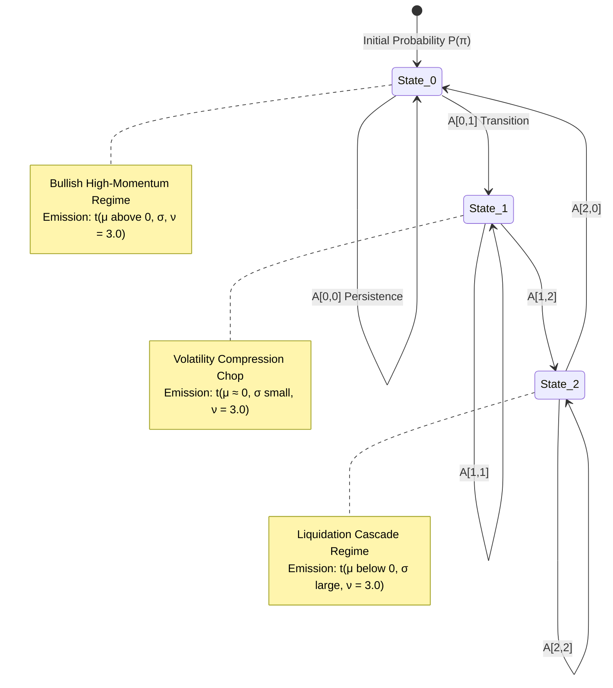
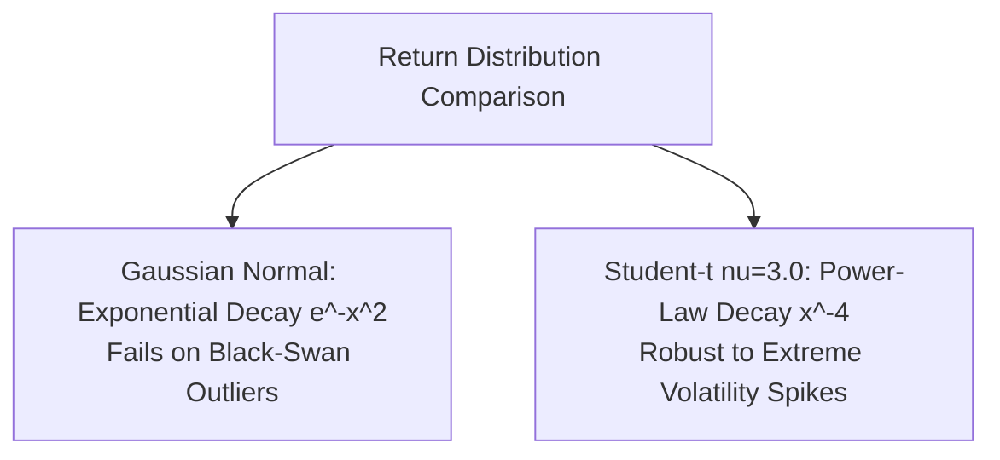
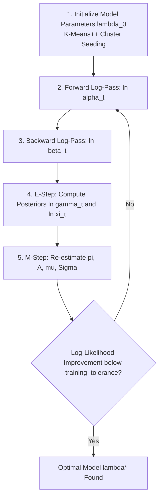
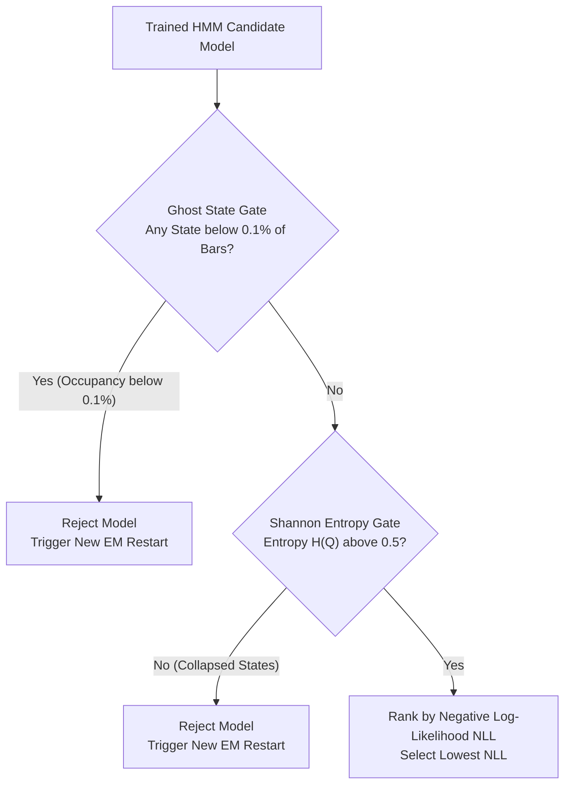
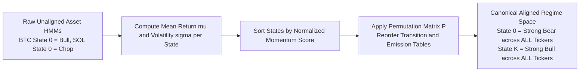
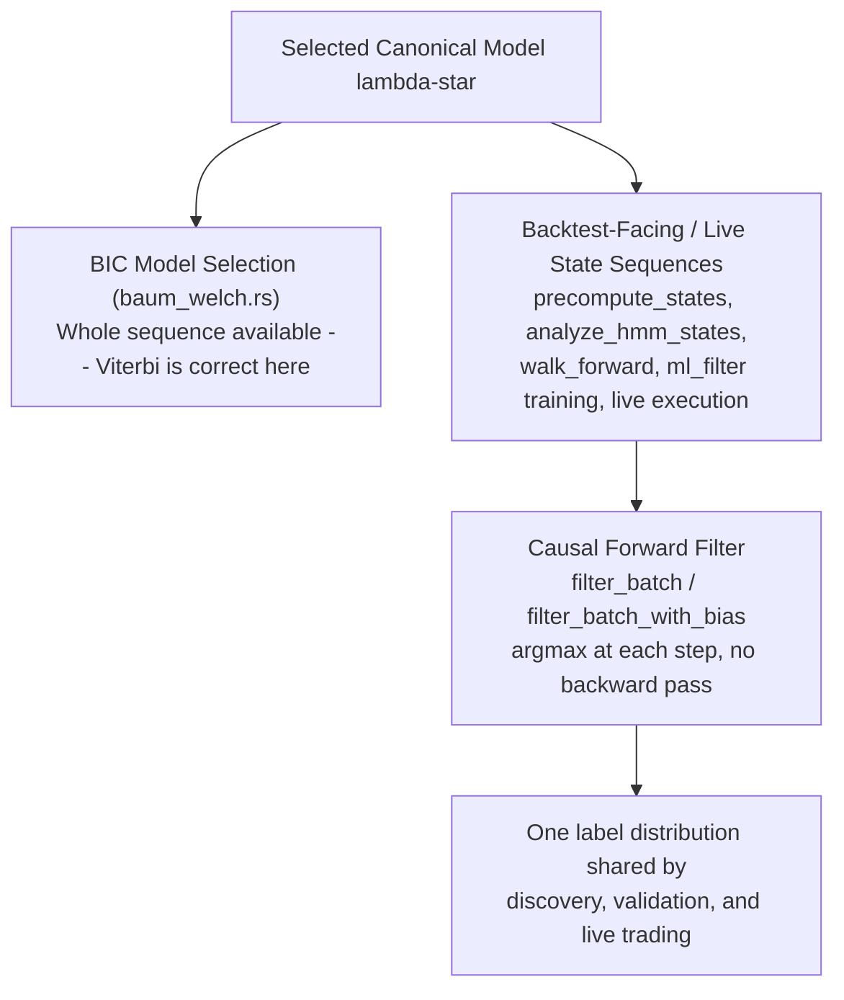

# Chapter 3: High-Definition Regime Discovery (HD-HMM)

Financial markets are fundamentally non-stationary dynamical systems. Market physics, volatility distributions, autocorrelation structures, and order flow dynamics mutate continuously between directional trending, mean-reverting consolidation, volatility compression, and liquidation cascades.

A strategy optimized for a bullish momentum trend will suffer catastrophic drawdowns if deployed during a chop regime.

Alpha Suite solves non-stationarity through **High-Definition Hidden Markov Models (HD-HMM)** (`alpha-hmm`). This chapter provides an exhaustive mathematical derivation, algorithmic breakdown, hardware SIMD optimization guide, and architectural reference for continuous Student-t HMMs, log-space Baum-Welch Expectation-Maximization, ghost-state elimination, cross-ticker canonical alignment, and the two state-decoding algorithms — whole-sequence Viterbi for model selection, causal forward filtering for every backtest-facing or live state sequence.

---

## 1. The Non-Stationarity Problem & Hidden Markov Formulation

Standard quantitative algorithms assume financial time series are stationary (i.e. mean, variance, and autocorrelation remain constant over time). In reality, financial markets undergo sharp **regime shifts**:



### 1.1 The Classical Triplet $\lambda = (\pi, A, B)$
An HMM models an observed continuous multi-dimensional time series $\mathbf{O} = (\mathbf{x}_1, \mathbf{x}_2, \dots, \mathbf{x}_T)$ where $\mathbf{x}_t \in \mathbb{R}^D$ as being generated by an underlying, unobserved discrete Markov chain with $K$ hidden market states $S = \{S_1, S_2, \dots, S_K\}$:

1. **Initial State Distribution $\pi \in \mathbb{R}^K$**:
   $$\pi_i = P(q_1 = S_i), \quad \sum_{i=1}^K \pi_i = 1, \quad \pi_i \ge 0$$
2. **Transition Probability Matrix $A \in \mathbb{R}^{K \times K}$**:
   $$A_{ij} = P(q_{t+1} = S_j \mid q_t = S_i), \quad \sum_{j=1}^K A_{ij} = 1, \quad A_{ij} \ge 0$$
3. **Continuous Emission Distribution $B = \{b_j(\mathbf{x})\}_{j=1}^K$**:
   $$b_j(\mathbf{x}_t) = P(\mathbf{x}_t \mid q_t = S_j)$$

### 1.2 Feature Vector Selection ($\mathbf{x}_t \in \mathbb{R}^D$)
At every 1-minute candle $t$, the continuous observation vector $\mathbf{x}_t$ is the four-slot **Market Character Vector (MCV)** read directly off the shared indicator bus (`alpha-hmm/src/model.rs::ohlcv_to_observations`, mirrored bar-for-bar by `setup.rs::precompute_states` and by the live classifier's `classify`/`classify_bus`):
$$\mathbf{x}_t = \big[ \text{TI}_t, \; \text{VS}_t, \; \text{TB}_t, \; V_t \big]^T$$
- $\text{TI}_t$ = `mcv_trend_intensity_1m`: the ADX(`hmm.mcv_adx_period`) value — direction-agnostic trend *strength*, in $[0, 100]$ (`McvAdxRunner`, `alpha-indicators/src/adx.rs`).
- $\text{VS}_t$ = `mcv_volatility_state_1m`: the current ATR(`mcv_atr_period`) expressed as its **percentile rank** within a rolling window of the last `mcv_atr_window` ATR readings (`McvAtrWindowRunner`, `alpha-indicators/src/atr.rs`) — a normalized, self-relative volatility regime score, not a raw NATR ratio.
- $\text{TB}_t$ = `mcv_trend_bias_1m`: $Close_t / SMA_{\text{mcv\_sma\_period}}(Close)_t - 1$ — signed distance of price from its own moving average (`McvSmaRatioRunner`, `alpha-indicators/src/price_to_sma_ratio.rs`).
- $V_t$ = `mcv_velocity_1m`: the Rate-of-Change over `mcv_roc_period`, $\big(Close_t - Close_{t-N}\big)/Close_{t-N} \times 100$ (`McvRocRunner`, `alpha-indicators/src/roc.rs`) — signed price velocity.

This replaces an earlier feature set (1-bar log return, NATR(14), 30-period return skewness, Kaufman efficiency ratio) that is no longer what the code computes. All four MCV slots are `gp_visible: true` in the registry (`alpha-indicators/src/registration.rs`), so the GP tree layer can also read them directly — the HMM and the genetic program observe the same market description, just at different levels of abstraction.

---

## 2. Heavy-Tailed Student's t Emission Distributions

In standard financial engineering literature, emission probabilities are typically assumed to follow Gaussian normal distributions:
$$\mathcal{N}(\mathbf{x} \mid \boldsymbol{\mu}, \boldsymbol{\Sigma}) = \frac{1}{(2\pi)^{D/2} |\boldsymbol{\Sigma}|^{1/2}} \exp\left( -\frac{1}{2} (\mathbf{x} - \boldsymbol{\mu})^T \boldsymbol{\Sigma}^{-1} (\mathbf{x} - \boldsymbol{\mu}) \right)$$

### 2.1 The Gaussian Breakdown in Crypto Markets
Financial return series exhibit extreme **leptokurtosis (fat tails and black-swan outliers)**:
- Under a Gaussian model, a 5% 1-minute flash dump has a probability of $P(\mathbf{x}) \approx 10^{-20}$.
- In floating-point computation, multiplying these probabilities across consecutive bars causes arithmetic underflow ($0.0$).
- The Expectation-Maximization algorithm becomes unstable, forcing covariance matrices $\boldsymbol{\Sigma}$ to collapse to singular degenerate matrices.

### 2.2 Diagonal (Per-Feature Independent) Student's t-Distribution
Alpha Suite does **not** fit a full $D \times D$ covariance matrix $\boldsymbol{\Sigma}$. `ContinuousEmissions` (`alpha-hmm/src/model.rs`) stores a location $\mu_{j,d}$, a scale $\sigma_{j,d}$, and a degrees-of-freedom $\nu_{j,d}$ **per (state $j$, feature $d$)** — three $K \times D$ matrices, no off-diagonal covariance term anywhere. Emission density for state $j$ is the *product* of $D$ independent univariate Student-t densities, one per MCV feature:

$$b_j(\mathbf{x}) = \prod_{d=1}^{D} f\big(x_d \mid \mu_{j,d}, \sigma_{j,d}, \nu_{j,d}\big), \qquad
f(x \mid \mu, \sigma, \nu) = \frac{\Gamma\left(\frac{\nu+1}{2}\right)}{\Gamma\left(\frac{\nu}{2}\right)\sqrt{\nu\pi}\,\sigma} \left( 1 + \frac{1}{\nu}\left(\frac{x-\mu}{\sigma}\right)^2 \right)^{-\frac{\nu+1}{2}}$$

so that in log-space (`ContinuousEmissions::log_pdf`) the per-feature log-densities simply sum:

$$\ln b_j(\mathbf{x}) = \sum_{d=1}^{D} \left[ \underbrace{\ln\Gamma\!\left(\tfrac{\nu_{j,d}+1}{2}\right) - \ln\Gamma\!\left(\tfrac{\nu_{j,d}}{2}\right) - \tfrac{1}{2}\ln(\nu_{j,d}\pi) - \ln\sigma_{j,d}}_{\text{cached as } \texttt{log\_norm}[j,d]} \;-\; \frac{\nu_{j,d}+1}{2} \ln\!\left(1 + \frac{1}{\nu_{j,d}}\left(\frac{x_d-\mu_{j,d}}{\sigma_{j,d}}\right)^2\right) \right]$$

This is a deliberate simplification, not an oversight: assuming feature independence within a state avoids ever inverting or storing a $D \times D$ matrix per state (cheap and numerically safe with only $D=4$ features), and `log_norm[j,d]` is precomputed once per M-step and reused across every bar's `log_pdf` call, which is the dominant cost in the forward pass.



### 2.3 Mathematical Properties with $\nu = 3.0$:
- **Power-Law Tail Decay**: Each feature's tail density decays as $x^{-(\nu+1)} = x^{-4}$, matching the empirical cubic power-law of financial market returns.
- **Fixed $\nu$, moment-matched scale**: The code does not run the classical robust-EM re-weighting scheme (an iterative per-observation weight $u_{tj}$ down-weighting outliers). Instead `update_continuous_emissions` (`baum_welch.rs`) computes the ordinary $\gamma$-weighted mean and variance per (state, feature) from the E-step posteriors, then converts variance to a Student-t scale by moment-matching at a **fixed** $\nu = $ `hmm.student_t_nu` (default $3.0$, clamped to $\ge 2.1$ so the second moment exists):
  $$\sigma_{j,d} = \sqrt{\widehat{\text{Var}}_{j,d} \cdot \frac{\nu - 2}{\nu}}, \qquad \text{since } \text{Var}[\text{Student-t}(\mu,\sigma,\nu)] = \sigma^2 \frac{\nu}{\nu-2} \text{ for } \nu > 2$$
  $\nu$ itself is never re-estimated by the M-step — it is held at the config value every iteration. The robustness to outliers here comes entirely from the heavy tail of a *fixed* low-$\nu$ distribution shape, not from adaptive downweighting.

---

## 3. Log-Space Baum-Welch Expectation-Maximization

Training the HMM involves finding the maximum likelihood parameter set $\lambda^* = \arg\max_\lambda \ln P(\mathbf{O} \mid \lambda)$.

Because time horizons span hundreds of thousands of bars ($T > 500,000$), calculating raw probabilities results in immediate arithmetic underflow. Alpha Suite executes the entire Baum-Welch Expectation-Maximization algorithm in **logarithmic probability space**:

$$\ln \alpha_t(i), \quad \ln \beta_t(i), \quad \ln \gamma_t(i), \quad \ln \xi_t(i, j)$$



---

### 3.1 The Log-Sum-Exp (LSE) Operator
To evaluate $\ln \sum_{i=1}^N \exp(x_i)$ without numerical underflow or overflow:
$$\text{LSE}(x_1, \dots, x_N) = x_{\max} + \ln \left( \sum_{i=1}^N \exp(x_i - x_{\max}) \right), \quad x_{\max} = \max_{1 \le i \le N} x_i$$

### 3.2 The Forward Log-Pass ($\ln \alpha_t$)
The forward log-variable $\ln \alpha_t(i) = \ln P(\mathbf{x}_1, \dots, \mathbf{x}_t, q_t = S_i \mid \lambda)$:
1. **Initialization ($t = 1$)**:
   $$\ln \alpha_1(i) = \ln \pi_i + \ln b_i(\mathbf{x}_1), \quad 1 \le i \le K$$
2. **Induction ($t = 1 \dots T-1$)**:
   $$\ln \alpha_{t+1}(j) = \ln b_j(\mathbf{x}_{t+1}) + \text{LSE}_{i=1}^K \Big( \ln \alpha_t(i) + \ln A_{ij} \Big), \quad 1 \le j \le K$$
3. **Total Log-Likelihood**:
   $$\ln P(\mathbf{O} \mid \lambda) = \text{LSE}_{i=1}^K \Big( \ln \alpha_T(i) \Big)$$

### 3.3 The Backward Log-Pass ($\ln \beta_t$)
The backward log-variable $\ln \beta_t(i) = \ln P(\mathbf{x}_{t+1}, \dots, \mathbf{x}_T \mid q_t = S_i, \lambda)$:
1. **Initialization ($t = T$)**:
   $$\ln \beta_T(i) = 0.0, \quad 1 \le i \le K$$
2. **Induction ($t = T-1 \dots 1$)**:
   $$\ln \beta_t(i) = \text{LSE}_{j=1}^K \Big( \ln A_{ij} + \ln b_j(\mathbf{x}_{t+1}) + \ln \beta_{t+1}(j) \Big), \quad 1 \le i \le K$$

### 3.4 Expectation Step: Posterior Probabilities
1. **State Occupancy Probability $\gamma_t(i) = P(q_t = S_i \mid \mathbf{O}, \lambda)$**:
   $$\ln \gamma_t(i) = \ln \alpha_t(i) + \ln \beta_t(i) - \ln P(\mathbf{O} \mid \lambda)$$
2. **Transition Probability $\xi_t(i, j) = P(q_t = S_i, q_{t+1} = S_j \mid \mathbf{O}, \lambda)$**:
   $$\ln \xi_t(i, j) = \ln \alpha_t(i) + \ln A_{ij} + \ln b_j(\mathbf{x}_{t+1}) + \ln \beta_{t+1}(j) - \ln P(\mathbf{O} \mid \lambda)$$

### 3.5 Maximization Step: Parameter Updates
$$\hat{\pi}_i = \exp\big(\ln \gamma_1(i)\big)$$
$$\hat{A}_{ij} = \frac{\text{LSE-summed } \xi_t(i,j) + \epsilon_{\text{Laplace}}}{\text{LSE-summed } \gamma_t(i) + K \cdot \epsilon_{\text{Laplace}}}$$
where `LAPLACE_SMOOTHING` ($\epsilon_{\text{Laplace}} = 0.1$) is added to every transition count before normalizing, so no transition probability collapses to exactly zero from a single restart's sparse counts.

Emission parameters update **per (state $j$, feature $d$) independently** — there is no cross-feature covariance term to estimate (see §2.2):
$$\hat{\mu}_{j,d} = \frac{\sum_{t=1}^T \gamma_t(j) \cdot x_{t,d}}{\sum_{t=1}^T \gamma_t(j)}, \qquad
\widehat{\text{Var}}_{j,d} = \frac{\sum_{t=1}^T \gamma_t(j) \cdot (x_{t,d} - \hat{\mu}_{j,d})^2}{\sum_{t=1}^T \gamma_t(j)}, \qquad
\hat{\sigma}_{j,d} = \sqrt{\widehat{\text{Var}}_{j,d} \cdot \frac{\nu - 2}{\nu}}$$
$\nu_{j,d}$ is set to the fixed config value `hmm.student_t_nu` on every iteration, not re-estimated (see §2.3). The normalization constants `log_norm[j,d]` are recomputed from the new $(\sigma_{j,d}, \nu_{j,d})$ immediately after this step, before the next Baum-Welch iteration's forward/backward pass runs against them.

---

## 4. Hardware SIMD Acceleration & Cross-Hardware Reproducibility

During Baum-Welch training, $\approx 95\%$ of CPU cycles are spent computing log-emission exponentials and the `Log-Sum-Exp` reduction loop.

`alpha-hmm` implements runtime CPU feature dispatch:

```rust
SIMD_PATH.get_or_init(|| {
    if is_x86_feature_detected!("avx512f") {
        SimdPath::Avx512
    } else if is_x86_feature_detected!("avx2") && is_x86_feature_detected!("fma") {
        SimdPath::Avx2
    } else {
        SimdPath::Scalar
    }
});
```

### 4.1 SIMD Implementations
- **AVX-512 (`mm512_exp_pd`)**:
  - Processes 8 double-precision floats (`f64`) per instruction.
  - Evaluates degree-6 minimax polynomial expansions with hardware `_mm512_roundscale_pd` reductions.
- **AVX-2 (`mm256_exp_pd`)**:
  - Processes 4 double-precision floats concurrently with fused multiply-add (`FMA`).
- **Scalar Fallback**: Uses standard library `f64::exp` on ARM or non-AVX architectures.

> [!WARNING]
> **SIMD Floating-Point Rounding & Determinism Across Clusters**:
> Because AVX-512 minimax polynomials and AVX-2 FMA instructions evaluate polynomials in different register orders, their lowest mantissa bits differ slightly. If every worker node trained the HMM independently, different CPU architectures would produce slightly different state sequences.
>
> **The Alpha Suite Architecture Solution**:
> In Alpha Suite, the **Master Coordinator (`ga-runner`) trains the HMM model once** on its local host. The resulting discrete state timelines (`Vec<usize>`) are serialized and distributed to all worker nodes over TLS. All cluster nodes simulate against identical state sequences, guaranteeing bit-exact evolutionary reproducibility.

---

## 5. Ghost-State Elimination & Shannon Entropy Filtering

Standard EM algorithms often get trapped in degenerate local optima where one or more states become **"ghost states"** (states that capture $< 0.1\%$ of candles) while other states collapse into an undifferentiated mega-cluster.

Alpha Suite executes `NUM_RESTARTS = 20` parallel training restarts (a hardcoded constant in `alpha-hmm/src/setup.rs`, not a config key), each run for up to `hmm.training_iterations` EM iterations (config, default $100$, `training_tolerance` default $10^{-6}$), subjecting each candidate model to two strict rejection gates:



### 5.1 The Ghost-State Gate
Any candidate model where any state $S_i$ captures fewer than:
$$\text{MinBars} = \max(5, \; 0.001 \cdot T)$$
is immediately discarded.

### 5.2 Shannon Entropy Floor
To guarantee that market states represent genuinely distinct, balanced regimes rather than a single dominant state with tiny perturbations, the system computes the Shannon entropy of the Viterbi state path:
$$H(Q) = -\sum_{i=1}^K p(S_i) \ln p(S_i), \quad p(S_i) = \frac{\sum_{t=1}^T \mathbb{I}(q_t = S_i)}{T}$$
Models with $H(Q) \le 0.5$ (indicating severe state collapse) are rejected.

---

## 6. Cross-Ticker Canonical State Alignment (`align.rs`)

When training across a multi-asset cryptocurrency basket (e.g. BTC, ETH, SOL, TURBO, BONK), unsupervised clustering might assign State 0 to "Bull Trend" on BTC, but State 0 to "Consolidation Chop" on SOL.

To allow a single evolved strategy genotype (`GpSimulationParams`) to trade across all assets universally, Alpha Suite applies **Canonical State Permutation Alignment**:



1. **State Profiling**: For every state $k \in [0, K-1]$, the engine computes its mean return $\bar{\mu}_k$ and mean volatility $\bar{\sigma}_k$ across all tickers.
2. **Canonical Ordering**: Computes a momentum score $\text{Score}_k = \frac{\bar{\mu}_k}{\bar{\sigma}_k + \epsilon}$ and sorts states monotonically:
   - States $0 \dots M/2$: Bearish to neutral momentum regimes.
   - States $M/2 \dots K$: Volatile consolidation to aggressive bullish momentum regimes.
3. **State Re-Mapping**: Permutes all transition matrices $A$ and observation timelines into this unified canonical state space.

---

## 7. State Decoding: Viterbi (Model Selection Only) vs. Causal Forward Filtering (Everything Downstream)

`classifier.rs` implements **two different decoders**, and which one is used depends entirely on whether the whole sequence is legitimately allowed to be known in advance. Conflating them was an actual bug in this codebase's history (see §7.2), so the distinction is load-bearing, not stylistic.

### 7.1 Viterbi Trellis Recurrence — used only inside `baum_welch.rs` for BIC model selection

The **Viterbi Algorithm** calculates the single most probable *global* hidden state path $Q^* = (q_1^*, q_2^*, \dots, q_T^*)$ given the *entire* observation sequence:

1. **Initialization ($t = 1$)**:
   $$V_1(i) = \ln \pi_i + \ln b_i(\mathbf{x}_1), \quad \psi_1(i) = 0, \quad 1 \le i \le K$$
2. **Recursion ($t = 2 \dots T$)**:
   $$V_t(j) = \max_{1 \le i \le K} \Big( V_{t-1}(i) + \ln A_{ij} \Big) + \ln b_j(\mathbf{x}_t), \quad 1 \le j \le K$$
   $$\psi_t(j) = \arg\max_{1 \le i \le K} \Big( V_{t-1}(i) + \ln A_{ij} \Big), \quad 1 \le j \le K$$
3. **Termination & Backtracking**:
   $$q_T^* = \arg\max_{1 \le i \le K} V_T(i)$$
   $$q_t^* = \psi_{t+1}(q_{t+1}^*), \quad t = T-1, T-2, \dots, 1$$

Because step 3 backtracks from the *final* timestep, $q_t^*$ is a function of every observation at $j > t$ — including bars that, for any downstream backtest use, lie entirely in $t$'s future. That is exactly right for what Viterbi is used for in this codebase: `find_best_hmm_for_n_states` (`baum_welch.rs`) runs Viterbi once per training restart, purely to compute the Shannon-entropy and ghost-state diagnostics of §5 over a fixed, fully-observed candidate dataset. There is no per-bar decision being made there — it is a whole-sequence explanation used to *score a model*, and `HmmClassifier::viterbi` / `viterbi_with_bias` remain the correct tool for that job. `viterbi_with_bias` additionally accepts a per-timestep systemic-context table (`global_contexts`) and folds it into the self-transition log-probability as $\ln\big((1+\text{bias})\text{.clamp}(0.5, 2.0)\big)$ before taking the max — mechanically identical biasing to §7.2's causal counterpart, `filter_batch_with_bias`.

### 7.2 Causal Forward-Filter Decoding — used for every backtest-facing or live state sequence

Every consumer whose output feeds a per-bar trading decision decodes **causally**: `alpha_hmm::setup::precompute_states` and `analyze_hmm_states` (used by the GA and by the state-characterization report), `alpha_simulation::validation::walk_forward` and `ml_filter::training` (via `classify_bus`), and live/ensemble execution (via `classify_batch_bus`) all run the HMM's forward pass only — no backward pass, no future observations, argmax taken at each step as it arrives:

$$\ln\alpha_t(j) = \text{LSE}_{i=1}^K\big(\ln\alpha_{t-1}(i) + \ln A_{ij}\big) + \ln b_j(\mathbf{x}_t), \qquad q_t = \arg\max_{1 \le i \le K} \ln\alpha_t(i)$$

renormalized by subtracting the running max at every step to stay in a stable log range (`HmmClassifier::forward_step_inner`). `filter_batch` / `filter_batch_with_bias` (`classifier.rs`) are this recursion factored out so the unbiased and context-biased causal decoders share one implementation rather than risking silent drift between two copies.

**This was not always the case for the GA's own state sequences, and the switch matters.** `precompute_states` used to decode with offline Viterbi. Its output indexes `params.strategies[current_state]` per bar in `alpha_simulation::engine::run_simulation`, so the GA was being scored against regime labels computed from a global MAP path that had already seen the bar's future — a textbook look-ahead bias. Worse, it was a **train/serve skew**: every other consumer above already decoded causally, so GA discovery was evolving strategies against a *different label distribution* than the one walk-forward validation, ML-filter training, and live trading would ever produce over the same candles. Switching `precompute_states` (and `analyze_hmm_states`, so the state-characterization report describes the same labels the GA actually traded) to `filter_batch` / `filter_batch_with_bias` closes both problems at once: no information from $j > t$ reaches $q_t$, and there is now exactly one label distribution shared by discovery, validation, and live execution.



### 7.3 Precomputed State Disk Cache
The resulting `HashMap<String, Vec<usize>>` (mapping ticker $\to$ array of causally-decoded state indices) is serialized to `hmm_precomputed_states.<fingerprint>.cache.json`, where `<fingerprint>` is the first 16 hex characters of a BLAKE3 digest (`alpha-orchestrator/src/hmm_setup/cache.rs::compute_fingerprint`) over the HMM model file bytes, the optional NN context model bytes, every ticker's full candle data (every OHLCV field, not just length/endpoints — so an in-place backfill correctly invalidates the cache), `hmm.state_search_range`, the indicator registry's `version_hash()`, and a `STATE_DECODER_VERSION` constant. That last component exists specifically so a decoding-*algorithm* change like the Viterbi→causal-filter switch above invalidates old cache files even though none of the data-shaped inputs changed — without it, a stale `hmm_precomputed_states.*.cache.json` on disk would keep serving Viterbi-decoded labels forever. On a fingerprint match, `ga-runner` reloads the cached states without repeating the Baum-Welch training or decode pass; on any mismatch the cache is a transparent miss (recompute, then atomically overwrite via a `.tmp` rename).

---

## 8. State Count Selection Policy & Configurable Feature Periods (F08)

Two things that used to be hardcoded are now config-driven, without changing today's default behaviour:

### 8.1 `hmm.state_selection`: `"bic"` (default) vs `"fixed"`

`find_optimal_hmm_states` (`alpha-hmm/src/setup.rs`) now branches on `hmm.state_selection`:
- **`"bic"`** (default): runs the full §5 restart-and-reject sweep over every $N$ in `hmm.state_search_range`, logs the per-$N$ BIC table, and keeps the lowest-BIC model. This is exactly what the function always did before this switch existed, so every config file written before F08 (where the field is absent and `#[serde(default)]` supplies `"bic"`) behaves identically.
- **`"fixed"`**: skips the sweep entirely and trains a single model at `state_search_range.0`. `Config::validate` rejects a `"fixed"` config whose `state_search_range.0 != .1` — a non-degenerate range in this mode would otherwise silently ignore `.1` rather than surfacing that the two settings disagree.

Both modes ultimately call the same `train_fixed_state_model` helper when there is only one candidate to train (this is also what a degenerate range under `"bic"` reproduces, unchanged from before F08).

### 8.2 `hmm.features`: the classifier's own MCV feature window

`precompute_states`, `analyze_hmm_states`, and `model::ohlcv_to_observations` each build a small `IndicatorPeriods` (distinct from the GA's own evolved, per-individual periods) purely to drive the four MCV slots §1.2 describes -- `mcv_trend_intensity_1m` (`McvAdxRunner`, keyed on `mcv_adx_period`), `mcv_volatility_state_1m` (`McvAtrWindowRunner`, keyed on `mcv_atr_period` + `mcv_atr_window`), `mcv_trend_bias_1m` (`McvSmaRatioRunner`, keyed on `mcv_sma_period`), and `mcv_velocity_1m` (`McvRocRunner`, keyed on `mcv_roc_period`). These five `IndicatorPeriods` fields are the *only* ones that reach any of the four slots -- see §1.2 and `alpha_indicators::registration::build_default_pipeline_with_bus`.

These periods used to be three hardcoded `dummy_periods` literals (`roc_period: 10, lag_period: 5, agg_period_1: 5`) duplicated at each call site. An earlier version of this config block moved exactly those three literals into `hmm.features.roc_period` / `lag_period` / `agg_period` -- which was a no-op: `IndicatorPeriods::roc_period` / `lag_period` / `agg_period_1` drive `roc_1m`, `lag_close_1m`, and the Agg1 aggregation window respectively, none of which any of the four MCV slots above ever reads. Changing that config therefore compiled, deserialized, and validated correctly, but had zero effect on the trained model or the decoded states. `hmm.features` now instead exposes exactly the five fields that matter: `hmm.features.mcv_adx_period` / `mcv_roc_period` / `mcv_sma_period` / `mcv_atr_period` / `mcv_atr_window` (all `usize`, validated `> 0`), defaulting to `14` / `14` / `50` / `14` / `200` -- `IndicatorPeriods::default()`'s own values for these fields, which is what the hardcoded `dummy_periods` literal actually left them at (it never touched them), so this default reproduces production's actual historical behaviour, not the vestigial `roc`/`lag`/`agg` literal that never influenced it.

### 8.3 Persistence: `ga_run_metadata`

The resolved state count, the selection policy that produced it, and the five feature periods are persisted into `ga_run_metadata` (`num_hmm_states`, `hmm_state_selection`, `hmm_feature_mcv_adx_period`, `hmm_feature_mcv_roc_period`, `hmm_feature_mcv_sma_period`, `hmm_feature_mcv_atr_period`, `hmm_feature_mcv_atr_window`) by `db::log_run_hmm_selection`, right after HMM discovery completes in `run::run`. `db::get_run_hmm_selection` reads it back with `LATEST ON timestamp`, exactly like the existing `ga_seed` / partition-plan columns. `resume_from_db` and `run_post_ga_pipeline_from_db` prefer this persisted value over deriving the state count from a reconstructed population (which is only ever a proxy, and silently defaults to 3 or 0 respectively when that population is empty); a run logged before F08 has `NULL` here, so both call sites fall back to the old derivation and log a loud warning that the recovered value is not guaranteed to match the original run's.

### 8.4 Regime posterior confidence as a GP terminal (M1, blueprint 81f1)

§8.4 used to describe this as investigated-but-not-wired. It is now wired, CPU-only, behind `hmm.expose_regime_confidence` (default `false`) -- `hmm_persistence`/`hmm_regime_stability` (below) remain the still-unwired pair; `regime_confidence` is a separate, new slot.

**What it is.** `max_j softmax(\ln\alpha_t)[j]` -- the concentration of the causal filtered posterior (§7.2) at bar $t$, i.e. how confident the forward filter is in its own `current_state` label at that exact bar. `HmmClassifier::filter_batch_with_confidence` / `filter_batch_with_bias_and_confidence` (`classifier.rs`) compute it as a byproduct of the identical forward recursion `filter_batch`/`filter_batch_with_bias` already run, reusing `forward_step`/`forward_step_inner` rather than a second copy of the DP loop (the exact class of drift `viterbi`/`viterbi_with_bias` suffered from historically -- §7 above).

**How it reaches the bus.** `alpha_hmm::setup::precompute_confidence` is a wholly SEPARATE decode from `precompute_states` (§7.3), not a byproduct reused from it: `precompute_states` may run bias-adjusted (`filter_batch_with_bias`) when a systemic NN context model is configured, and turning `hmm.expose_regime_confidence` on must never change the `current_state` sequence strategies are indexed by (convention 9). `precompute_confidence` therefore always uses the plain, context-free filter. **Consequence**: when a systemic context model IS configured and the switch is on, `regime_confidence`'s own argmax-implied state need not agree bar-for-bar with the context-biased `current_state` for that same bar (the bias only perturbs the self-transition term, which can flip the argmax right at a regime boundary). This is a known, accepted scope limit, not an oversight.

`alpha_orchestrator::hmm_setup::precompute_states_and_confidence_systemic` calls the existing, on-disk-cached `precompute_states_systemic` UNCHANGED for `states` (so the switch never touches that cache's hit/miss behaviour or format), and separately computes confidence via `precompute_confidence` only when the switch is on -- confidence is deliberately NOT persisted to that on-disk cache (it is cheap, and only ever computed once per process at pipeline setup, never per generation).

The confidence series is written into the bus by `alpha_simulation::engine::run_simulation_with_regime_confidence` -- an additive sibling of `run_simulation`, sharing a private `run_simulation_inner` so the pre-M1 `run_simulation` (still the only function every existing caller compiles against) is bit-identical to before (convention 9). The write happens in the per-bar loop right after indicators update and before any GP evaluator reads the bus for that bar.

**Registry.** `alpha_indicators::registration::regime_confidence` is registered (GP-visible, `ScaleClass::BoundedOscillator` -- the same class `liquidation_cascade_prob` uses for its own $[0,1]$ probability, there being no dedicated "probability" scale class) only via `build_default_registry_with_options(true)`, appended after `adv_notional` so no existing slot is renumbered. `build_default_registry()` (the zero-arg function nearly every caller in this workspace still uses) delegates to `build_default_registry_with_options(false)`: the slot is not registered at all in that case, so slot count, every existing id, and `SlotRegistry::version_hash()` are bit-identical to a pre-M1 registry.

**GPU.** `Config::validate` rejects `hmm.expose_regime_confidence = true` combined with `gpu.enabled = true`. `alpha_simulation::gpu::build_snapshot_matrix` builds the GPU snapshot buffer by ticking the real `IndicatorPipeline` alone; `regime_confidence` (like `hmm_persistence`/`hmm_regime_stability`) is written externally, never by a pipeline runner, so a GPU-evaluated bar would otherwise silently see the slot's registry default instead of a live value. Gathering it into the GPU snapshot path (mirroring the deferred kernel-wiring work `gpu_column_gather`'s own module doc describes) is a follow-up subtask; until then this is CPU-only by hard rejection, not a silent gap.

**Production wiring (M1.4).** `apps/ga-runner` and `apps/forensic-api` build their process-wide registry via `build_default_registry_with_options(config.hmm.expose_regime_confidence)`, so the switch and the registry the whole process runs against always agree. `run.rs::run`/`resume`/`resume_from_db` all call `hmm_setup::precompute_states_and_confidence_systemic` instead of the states-only function, slice the resulting confidence map alongside `historical_data`/`precomputed_states` through `ResolvedPartitions::slice_with_confidence` (a confidence-aware sibling of `slice`, added rather than changing `slice` itself, so every other caller's off-switch behaviour is untouched), and thread it through `ga_loop::run_ga_optimization` / `run_ga_loop_from_state` / `run_ga_loop_internal` into `build_local_eval_context`. That context's `regime_confidence`/`tier1_confidence`/`tier2_confidence` fields are attached to every `BacktestEvaluator` `evaluate_generation` builds (both the static tier-1/tier-2 slices and F14's per-generation random-anchor rebuild), and `BacktestEvaluator::simulate_all`/`run_tier_filter_stage` call `run_simulation_with_regime_confidence` exactly when a confidence map is present, plain `run_simulation` otherwise. The periodic health check (`OosPartition::regime_confidence`), the burn-once final holdout (`FinalHoldout::confidence`), forensic replay (`ForensicContext::regime_confidence`), and CPCV/PBO (`validation::cpcv::RealCpcvScorer`) all follow the identical pattern -- confidence sliced or independently re-decoded alongside whatever states that call site already uses, `run_simulation_with_regime_confidence` only when it's present. `pipeline::run_post_ga_pipeline` decodes its OWN confidence map (mirroring its own independent states recompute) rather than receiving one from its caller, so it stays self-consistent even though it re-derives states separately from `run()`.

**Distributed path (deviation).** The `HiveMind` worker protocol's `SyncData` payload is a fixed `(Vec<Ohlcv>, Vec<usize>, Vec<FundingRate>, String)` tuple, rkyv-archived as a bare tuple on both the master's encode side (`distributed::manager::handlers::sync_data`) and the worker's decode side (`apps/alpha-worker`) -- adding a fifth, per-bar confidence element would be a wire-format version bump touching both sides and the on-disk worker cache format, not a wiring fix. Rather than risk a distributed run silently evaluating `regime_confidence` against the registry's dead default on every worker, `Config::validate` rejects `hmm.expose_regime_confidence = true` combined with a `[distributed]` section outright; the switch works only on the local (non-distributed) evaluation path. Walk-forward re-optimization (`validation::walk_forward::GaFoldReoptimizer`) has the same shape of gap for a different reason -- the generic `FoldReoptimizer` trait hands it only an already-sliced fold window with no offset to derive a matching confidence slice from -- so it likewise returns a clear error naming M1.4 when the switch is on rather than silently dropping the terminal's live values for that fold.

### 8.5 Follow-up idea (not implemented): outer search over feature periods

`hmm.features` fixes one feature window and lets `hmm.state_selection` search over state *count*. A natural next step — not implemented here — is an outer search that also sweeps `mcv_adx_period` / `mcv_roc_period` / `mcv_sma_period` / `mcv_atr_period` / `mcv_atr_window` (e.g. a small grid or Bayesian search over feature windows, each scored by the BIC of its own best state-count sweep), so the HMM's own MCV feature horizon is chosen from data rather than fixed by convention. This would multiply the cost of §5's restart-and-reject sweep by the size of the feature-period grid, so it should stay opt-in behind its own config switch rather than replace today's fixed-feature, BIC-over-states-only search.
