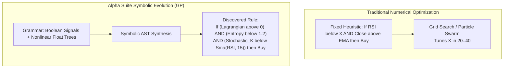
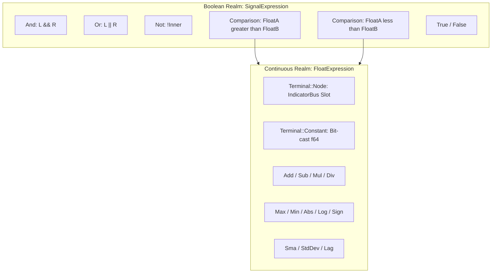
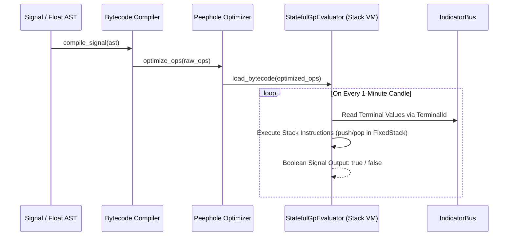
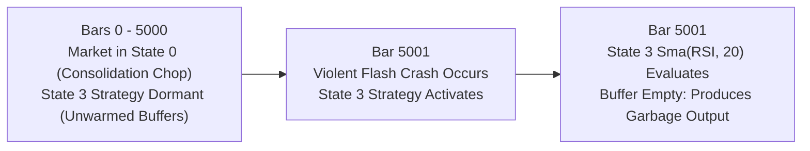
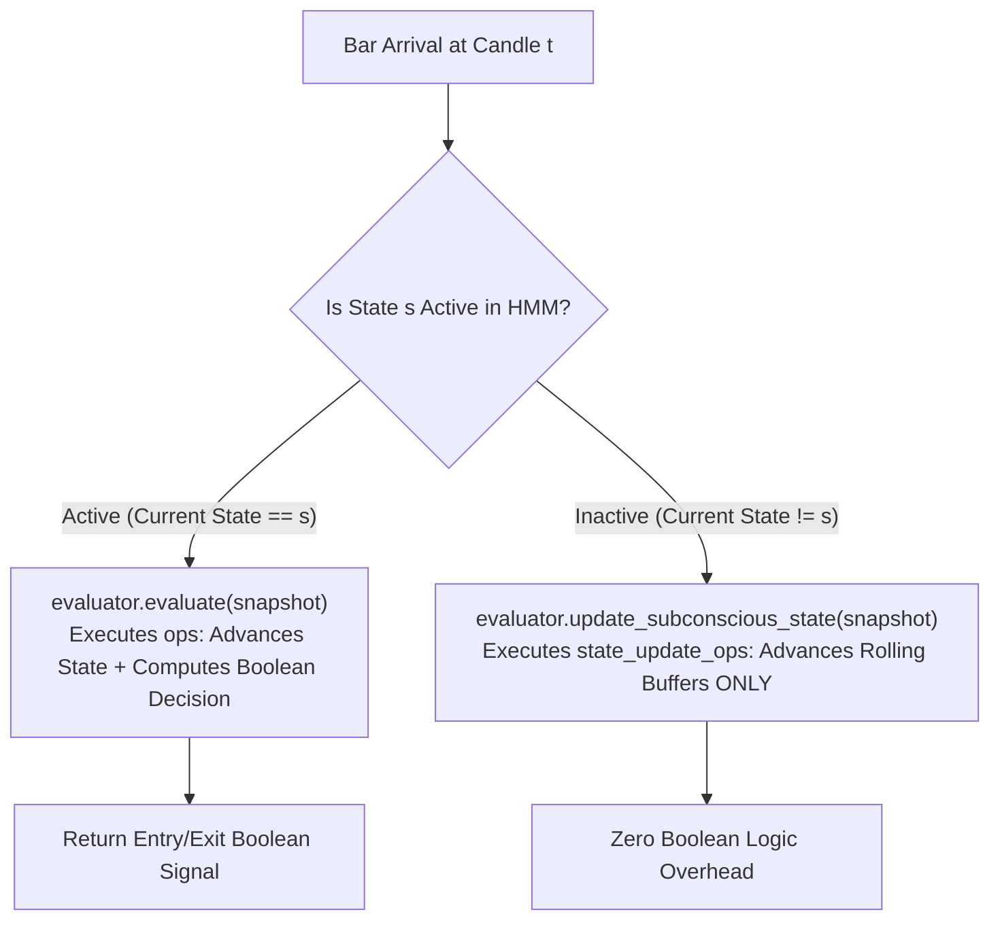
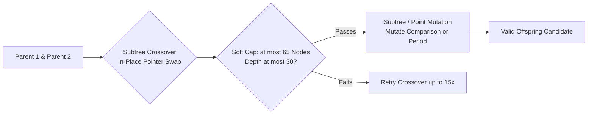

# Chapter 4: Genetic Programming Engine & Bytecode VM

While traditional algorithmic trading systems optimize a fixed set of numerical parameters within hard-coded indicator rules (such as optimizing the threshold of an RSI overbought signal), **Genetic Programming (GP)** (`alpha-gp` & `alpha-models`) evolves entire **symbolic algorithms, nonlinear mathematical transformations, and Boolean logic trees** from scratch.

This chapter provides an exhaustive technical reference for the strategy grammar, Abstract Syntax Tree (AST) representations, the stack-based linear Bytecode Virtual Machine (`StatefulGpEvaluator`), zero-allocation memory models (`FixedStack`), scale-free arithmetic, subconscious state tracking across dormant regimes, peephole optimization passes, and genetic recombination operators.

---

## 1. Symbolic Logic Synthesis vs. Numerical Optimization

In quantitative finance, the structure of a market rule is far more important than its exact numerical parameters:



### Key Advantages of Symbolic AST Synthesis:
1. **Unconstrained Hypothesis Space**: The algorithm can synthesize non-obvious relationships (e.g., comparing the rate of change of thermodynamic entropy against the ratio of kinetic to potential energy).
2. **Dynamic Adaptation**: Because different HMM regimes exhibit completely different market physics, GP evolves completely distinct decision trees for each regime state.
3. **Interpretability**: Evolved ASTs are human-readable mathematical formulas and Boolean expressions, unlike opaque deep neural network weights.

---

## 2. Strategy Representation & AST Grammar

Every evolved candidate genotype (`GpSimulationParams`) contains $K$ independent per-state strategies (`StateStrategy`), matching the number of discovered HMM states:

```rust
pub struct StateStrategy {
    pub entry_signal: SignalExpression,
    pub exit_signal: SignalExpression,
    pub params: StrategyParams,
}
```

### 2.1 The Two Grammar Universes
The grammar strictly separates **Boolean decision logic (`SignalExpression`)** from **continuous mathematical calculations (`FloatExpression`)**:



### 2.2 `SignalExpression` (Boolean Rule Grammar)
```rust
#[derive(Debug, Clone, PartialEq, Serialize, Deserialize)]
pub enum SignalExpression {
    True,
    False,
    And(Box<SignalExpression>, Box<SignalExpression>),
    Or(Box<SignalExpression>, Box<SignalExpression>),
    Not(Box<SignalExpression>),
    Comparison(Box<FloatExpression>, Box<FloatExpression>, ComparisonOp),
}

#[derive(Debug, Clone, Copy, PartialEq, Eq, Serialize, Deserialize)]
pub enum ComparisonOp {
    Gt,
    Lt,
}
```

### 2.3 `FloatExpression` (Continuous Quantitative Grammar)
```rust
#[derive(Debug, Clone, PartialEq, Serialize, Deserialize)]
pub enum FloatExpression {
    Terminal(Terminal),
    Add(Box<FloatExpression>, Box<FloatExpression>),
    Sub(Box<FloatExpression>, Box<FloatExpression>),
    Mul(Box<FloatExpression>, Box<FloatExpression>),
    Div(Box<FloatExpression>, Box<FloatExpression>),
    Max(Box<FloatExpression>, Box<FloatExpression>),
    Min(Box<FloatExpression>, Box<FloatExpression>),
    Abs(Box<FloatExpression>),
    Log(Box<FloatExpression>),
    Sign(Box<FloatExpression>),
    Sma(Box<FloatExpression>, usize),
    StdDev(Box<FloatExpression>, usize),
    Lag(Box<FloatExpression>, usize),
}
```

### 2.4 Terminal Descriptors
```rust
#[derive(Debug, Clone, Copy, PartialEq, Eq, Hash, Serialize, Deserialize)]
pub enum Terminal {
    Node(TerminalId),
    Constant(u64), // IEEE 754 float stored as u64 to avoid float bit-equality issues
}
```

---

## 3. The Linear Bytecode Interpreter VM (`StatefulGpEvaluator`)

Evaluating recursive ASTs via tree traversal in Rust requires function call recursion, pointer chasing across heap-allocated `Box` pointers, and frequent branching. When evaluating millions of strategies across millions of candle bars, this incurs severe L1 CPU instruction-cache misses.

Alpha Suite compiles every AST into a flat **linear array of bytecode instructions (`Vec<Op>`)** evaluated on a high-speed stack machine:



---

## 4. The Instruction Set Architecture (`Op`)

The `Op` enum defines the complete virtual machine instruction set:

```rust
#[derive(Debug, Clone)]
pub enum Op {
    // -------------------------------------------------------------
    // Float Stack Operations
    // -------------------------------------------------------------
    PushNode(TerminalId),
    PushTerminal(Terminal),
    Add,
    Sub,
    Mul,
    Div,
    Max,
    Min,
    Abs,
    Log,
    Sign,
    Sma(usize),
    StdDev(usize),
    Lag(usize),
    SmaDirect(TerminalId, usize),
    StdDevDirect(TerminalId, usize),
    LagDirect(TerminalId, usize),

    // -------------------------------------------------------------
    // Signal (Boolean) Stack Operations & Control Flow
    // -------------------------------------------------------------
    PushTrue,
    PushFalse,
    CmpGt,
    CmpLt,
    CmpNodeNodeGt(TerminalId, TerminalId),
    CmpNodeNodeLt(TerminalId, TerminalId),
    And,
    Or,
    Not,
    JumpIfFalse(usize),
    JumpIfTrue(usize),
    /// Pops and discards the top of `float_stack`, pushing nothing back.
    /// Emitted only by `compile_state_update_signal`, immediately after a
    /// stateful comparison operand, so `update_states_only` never leaves
    /// that operand's value stranded on the float stack -- see §5.1.
    DiscardFloat,
    Nop,
}
```
Note: the real derive is `#[derive(Debug, Clone)]` — no `Copy`, no `PartialEq`. `Op` carries `TerminalId`/`Terminal`/`usize` payloads that are themselves cheap to clone, but the enum is never compared for equality or implicitly copied in the interpreter loop, so those derives were never added.

### 4.1 Detailed Opcode Walkthrough & Stack Transformations:

| Opcode | Stack Before | Stack After | Description |
|---|---|---|---|
| `PushNode(id)` | `[...]` | `[..., bus.get(id)]` | Pushes float value at `IndicatorBus[id]` onto float stack. |
| `PushTerminal(t)` | `[...]` | `[..., val]` | Evaluates constant or node terminal and pushes result. |
| `Add` | `[..., a, b]` | `[..., a + b]` | Pops top two floats, pushes their sum. |
| `Sub` | `[..., a, b]` | `[..., a - b]` | Pops top two floats, pushes $a - b$. |
| `Mul` | `[..., a, b]` | `[..., a * b]` | Pops top two floats, pushes product $a \cdot b$. |
| `Div` | `[..., a, b]` | `[..., a / b]` | Protected division. Pushes $a/b$ if finite, else $0.0$. |
| `Max` / `Min` | `[..., a, b]` | `[..., max(a, b)]` | Pushes maximum or minimum of top two floats. |
| `Abs` | `[..., a]` | `[..., \|a\|]` | Replaces top float with its absolute value. |
| `Log` | `[..., a]` | `[..., sign(a)*ln(1+\|a\|)]` | Continuous safe log transform preserving sign. |
| `Sign` | `[..., a]` | `[..., signum(a)]` | Pushes $+1.0, -1.0,$ or $0.0$ safely. |
| `Sma(period)` | `[..., a]` | `[..., rolling_sma(a)]` | Updates internal stateful ring buffer and pushes rolling SMA. |
| `CmpGt` | `Float: [..., a, b]` | `Bool: [..., a > b]` | Pops top two floats, pushes Boolean comparison to signal stack. |
| `And` | `Bool: [..., p, q]` | `Bool: [..., p && q]` | Pops top two Booleans, pushes logical AND. |
| `Or` | `Bool: [..., p, q]` | `Bool: [..., p \|\| q]` | Pops top two Booleans, pushes logical OR. |
| `Not` | `Bool: [..., p]` | `Bool: [..., !p]` | Inverts top Boolean on signal stack. |
| `JumpIfFalse(target)`| `Bool: [..., p]` | `Bool: [..., p]` | **Peeks**, does not pop, via `sig_stack.last()`. If `p` is `false`, jumps to `target`; either way `p` is left on the stack as the (short-circuited) result of the enclosing `And`/`Or`. |
| `CmpNodeNodeGt(A, B)`| `Float: [...]` | `Bool: [..., A > B]` | **Fused Instruction**: Directly compares `bus[A] > bus[B]` without stack pushes. |
| `DiscardFloat` | `Float: [..., a]` | `Float: [...]` | Pops and discards the top float. Emitted only in `state_update_ops` (§5.1), never in `ops` — `evaluate` never actually executes this arm on a compiled decision program. |
| `Nop` | No change | No change | No operation. Used as padding during peephole optimization. |

**Why `JumpIfFalse`/`JumpIfTrue` peek instead of pop**: this is what makes short-circuit evaluation work. Compiling `And(L, R)` emits `L`'s bytecode, then `JumpIfFalse(after_R)`, then `R`'s bytecode: if `L` evaluates to `false`, the jump fires and `R` is skipped entirely, leaving `L`'s own `false` sitting on `sig_stack` as the whole expression's result — exactly the value a Boolean `And` should short-circuit to. Popping instead of peeking would leave the stack empty on the short-circuit path, with nothing for the caller to read as the result.

---

## 5. Zero-Allocation Stack Machine (`FixedStack<T, 30>`)

In high-throughput simulation, allocating dynamic vectors (`Vec<f64>`) on every candle causes disastrous memory allocator contention.

Alpha Suite implements an inline, stack-allocated fixed-capacity array stack:

```rust
#[derive(Clone)]
pub struct FixedStack<T: Copy, const N: usize> {
    data: [MaybeUninit<T>; N],
    len: u8,
}

impl<T: Copy, const N: usize> FixedStack<T, N> {
    #[must_use]
    pub const fn new() -> Self {
        Self {
            data: [MaybeUninit::uninit(); N],
            len: 0,
        }
    }

    /// # Panics
    /// Panics if the stack is already at capacity `N` — a **hard**
    /// `assert!`, not `debug_assert!`, so it still fires in release
    /// builds. `N` is sized from `MAX_GP_TREE_DEPTH`, which is provably
    /// sufficient capacity for any tree honoring the depth cap (see
    /// §5.1) — so reaching this panic means a tree bypassed the cap
    /// upstream (crossover, mutation, or deserialization), a real bug.
    /// Silently saturating instead would feed a corrupted signal into
    /// live trading with no error at all — worse than crashing loudly.
    pub fn push(&mut self, val: T) {
        assert!((self.len as usize) < N, "FixedStack saturated (capacity {N})");
        self.data[self.len as usize] = MaybeUninit::new(val);
        self.len += 1;
    }

    /// # Panics
    /// Panics (a hard `assert!`, same reasoning as `push`) if the stack
    /// is empty.
    pub fn pop(&mut self) -> T {
        assert!(self.len > 0, "FixedStack underflow");
        self.len -= 1;
        unsafe { self.data[self.len as usize].assume_init() }
    }

    /// Reads the top element without popping it — used by `JumpIfFalse`/
    /// `JumpIfTrue` (§4.1) to test the just-computed condition while
    /// leaving it as the short-circuited result.
    ///
    /// # Panics
    /// Panics (a hard `assert!`) if the stack is empty.
    pub fn last(&self) -> T {
        assert!(self.len > 0, "FixedStack underflow");
        unsafe { self.data[(self.len - 1) as usize].assume_init() }
    }

    #[inline(always)]
    pub fn clear(&mut self) {
        self.len = 0;
    }
}
```
`FixedStack::len` is a `u8`. A compile-time assertion enforces `MAX_GP_TREE_DEPTH <= u8::MAX` (255) — raising the depth cap past that would otherwise overflow `len` silently (wrapping in release, panicking only in debug) instead of tripping `push`'s capacity assert, corrupting the evaluator's stack discipline with no error at all.

### 5.1 Mathematical Proof of Depth Boundedness
- **Constant Capacity**: $N = \text{MAX\_GP\_TREE\_DEPTH} = 30$.
- **Theorem**: For any binary expression tree $T$ of maximum depth $D$, post-order linear bytecode evaluation requires at most $D$ live elements on the evaluation stack at any instant.
- **Proof**: The bytecode compiler visits left subtrees, then right subtrees, then operators. At any node at depth $d$, the stack contains at most 1 element per parent level in the branch. Since the maximum allowed tree depth is strictly capped at $D \le 30$, the stack can never exceed 30 elements.
- **Result**: Zero heap allocations, zero dynamic vector resizing, and 100% L1 CPU cache residency.

**The proof above holds for the `ops` program automatically (every comparison pops both operands it pushed, netting to zero stack growth per comparison), but it holds for `state_update_ops` — the second, subconscious-update program §7 describes — only because of `Op::DiscardFloat`.** `compile_state_update_signal` deliberately never emits the `CmpGt`/`CmpLt` that would otherwise consume a stateful comparison operand's pushed value, so without `DiscardFloat` restoring the pre-operand stack depth after each one, `update_states_only` would accumulate one leftover `f64` per stateful comparison operand **cumulatively across the whole tree** — meaning the real capacity bound for that program was the tree's stateful-operand *count* (bounded by `ga.gp_max_terminals`, default 8, and structurally by `SOFT_NODE_CAP` in §9.2), not its depth. A tree with more stateful comparison operands than `MAX_GP_TREE_DEPTH` would have tripped `FixedStack::push`'s panic while the panic message blamed a depth-cap violation that was never the actual cause. Do not remove the `DiscardFloat` emissions in `compile_state_update_signal` without re-deriving this bound from the operand count instead.

---

## 6. Protected Arithmetic & Mathematical Robustness

In genetic algorithms, random recombination frequently produces extreme mathematical edge cases (e.g. division by zero, taking logarithms of negative numbers, or comparing infinite values).

Alpha Suite enforces protected mathematical operations:

### 6.1 Scale-Free Protected Division (`Op::Div`)
```rust
Op::Div => {
    let b = self.float_stack.pop();
    let a = self.float_stack.pop();
    let v = a / b;
    self.float_stack.push(if v.is_finite() { v } else { 0.0 });
}
```

#### Why `is_finite()` is Required for Micro-Cap Assets:
- Micro-cap crypto assets (such as BONK, PEPE, SHIB) trade at prices like $\$0.00001425$ with ATR values around $10^{-7}$.
- If division used an absolute epsilon check (e.g. `if b.abs() < 1e-5 { return 0.0 }`), valid calculations for micro-cap assets would be completely zeroed out.
- `is_finite()` guarantees that small, valid divisions (e.g., $10^{-7} / 10^{-8} = 10.0$) compute correctly, while true divisions by zero ($x / 0.0 \to \infty$ or $0.0 / 0.0 \to \text{NaN}$) safely map to $0.0$.

### 6.2 Symmetric Comparison Clamping (`clamp_for_cmp`)
```rust
const CMP_CLAMP: f64 = 1e18;

#[inline(always)]
fn clamp_for_cmp(x: f64) -> f64 {
    x.clamp(-CMP_CLAMP, CMP_CLAMP)
}
```
- Floating-point extremes (e.g. $10^{300}$) can cause subtle loss of precision during comparison subtractions. Clamping bounds float operands to $[-10^{18}, +10^{18}]$, ensuring that $A > B \iff B < A$ is an exact symmetric identity.

### 6.3 Safe Logarithmic Mapping (`Op::Log`)
```rust
Op::Log => {
    let a = self.float_stack.pop();
    let v = a.signum() * (1.0 + a.abs()).ln();
    self.float_stack.push(if v.is_finite() { v } else { 0.0 });
}
```
- Maps continuous inputs across $(-\infty, +\infty)$ onto a smooth, signed logarithmic scale while guaranteeing zero division or domain errors at $x \le 0$.

---

## 7. Subconscious State Tracking Across Inactive Regimes

A fundamental failure mode in regime-switching systems is the **Regime Cold-Start Problem**:



If State 3 represents a rare "Liquidation Cascade" regime that only triggers once a month, stateful indicators inside State 3 (such as an evolved `Sma(Volume, 20)` or `Lag(RSI, 5)`) would be empty when the regime suddenly triggers.

### 7.1 The Alpha Suite Solution: Dual-Pass Bytecode Compilation
Alpha Suite compiles two distinct bytecode programs for every state strategy:
1. **`ops`**: The full decision program evaluated when the state is active.
2. **`state_update_ops`**: A stripped-down program containing *only* stateful rolling update instructions (`Sma`, `StdDev`, `Lag`, `SmaDirect`).



When State 3 finally triggers, all its internal rolling averages, standard deviations, and lagged price buffers are **100% warmed up and mathematically valid on bar 0**.

---

## 8. Peephole Bytecode Optimization Passes

Before evaluation begins, `optimize_ops` executes peephole bytecode fusion:

### 8.1 Pattern 1: Direct Terminal Comparison Fusion
- **Unoptimized Bytecode (3 instructions)**:
  `[PushNode(IdA), PushNode(IdB), CmpGt]`
- **Optimized Fused Bytecode (1 instruction + 2 NOPs)**:
  `[CmpNodeNodeGt(IdA, IdB), Nop, Nop]`
- **Speedup**: Eliminates two memory pushes and two pops, evaluating the comparison directly between register-offset memory addresses in a single instruction.

### 8.2 Pattern 2: Direct Stateful Indicator Fusion
- **Unoptimized Bytecode (2 instructions)**:
  `[PushNode(IdA), Sma(period)]`
- **Optimized Fused Bytecode (1 instruction + 1 NOP)**:
  `[SmaDirect(IdA, period), Nop]`
- **Speedup**: Reads directly from `IndicatorBus[IdA]` into the rolling accumulator without touching the float evaluation stack.

### 8.3 Preservation of Absolute Jump Addresses
> [!NOTE]
> Replaced instructions are overwritten with `Nop` rather than removed from the vector. This guarantees that all precomputed absolute jump targets (`JumpIfFalse(target)`) remain exact and valid without requiring an expensive jump-table relocation pass.

---

## 9. Genetic Operators: Crossover, Mutation & Bloat Control



### 9.1 Tree Generation: Ramped Half-and-Half
New trees are initialized using Koza's **Ramped Half-and-Half** method across depths $2 \dots 5$:
- **50% Full Method**: Nodes at depths $< D_{\max}$ are chosen strictly from function sets; terminal nodes appear only at depth $D_{\max}$, creating symmetric, dense trees.
- **50% Grow Method**: Nodes at depths $< D_{\max}$ are chosen randomly from function or terminal sets, producing diverse, asymmetric tree structures.

### 9.2 Subtree Crossover (`crossover_signals`)
- Randomly selects a crossover point in Parent 1 and Parent 2.
- Performs an in-place zero-clone pointer swap (`std::mem::swap`).
- **Depth & Breadth Guard**: If the offspring exceeds `SOFT_NODE_CAP = 65` or `MAX_GP_TREE_DEPTH = 30`, crossover retries up to 15 times before falling back to an unmodified clone of Parent 1.

### 9.3 Subtree & Point Mutation (`mutation_signal`, `mutation_float`)
- **Comparison Operator Flip**: Flips `Gt` $\leftrightarrow$ `Lt`.
- **Period Perturbation**: Perturbs an evolved indicator lookback period by $\pm 5$ bars.
- **Subtree Replacement**: Prunes an entire branch and replaces it with a freshly generated random AST subtree.
- **Terminal Mutation**: Swaps an indicator terminal for another terminal drawn from `TerminalWeights`.

### 9.4 Non-Linear Parsimony Pressure (Anti-Bloat Penalty)
In genetic programming, trees tend to grow progressively larger over generations without adding predictive accuracy (**Code Bloat**).

Alpha Suite suppresses bloat via non-linear parsimony regularization, applied to the **average** node count per HMM state (`ParsimonyPenalty::apply`, `alpha-simulation/src/fitness.rs` — identical formula to `manual/06` §5, Stage 7):

$$N_{\text{total}} = \sum_{s=1}^K \Big( \text{count\_nodes}(\text{entry}_s) + \text{count\_nodes}(\text{exit}_s) \Big), \qquad \overline{N} = \frac{N_{\text{total}}}{\max(1, K)}$$
$$\text{Excess} = \max(0, \; \overline{N} - \text{node\_soft\_cap}), \qquad \text{Penalty} = \text{base\_penalty\_factor} \times \text{Excess}^{\text{complexity\_exponent}}$$
$$\text{Base} \leftarrow \text{Base} \times \max(0, \; 1 - \text{Penalty})$$
- **Averaged, not summed**: the cap is compared against nodes-per-state, not the raw total — a strategy with more evolved states is not penalized merely for having more trees. This is a correction from an earlier version of this manual, which divided the already-exponentiated penalty by $K$ instead of averaging the node count *before* comparing it to the cap — those are not the same computation.
- **Soft Cap**: E.g. `node_soft_cap = 50` (or 80 in harvest mode).
- **Nonlinear Exponent**: `complexity_exponent = 1.5` applies an escalating penalty gradient to oversized trees, favoring compact solutions. There is no `tanh` saturation anywhere in this formula — the shrink factor is a plain linear `(1 - Penalty)` clamped only at zero, so a large enough excess drives the multiplier all the way to $0$, not asymptotically toward it.

### 9.5 Shared Indicator-Period Families (M2, blueprint 81f1)

`GpSimulationParams::indicator_periods` (`alpha_core::IndicatorPeriods`) carries 26 independently evolved lookback windows (plus 5 non-tunable `mcv_*` calibration fields fixed per run, F08) — far more independent dimensions than a finite backtest history can reliably distinguish, since most of these fields are the SAME physical quantity ("how many bars does this look back") applied to a different indicator. `ga.periods.sharing = "family"` (`manual/10` §"[ga.periods]", off by default) shrinks this to 7 evolved dimensions by grouping fields into `alpha_core::PeriodFamily` and evolving one representative per family:

| Family | Members |
|---|---|
| `Momentum` | `rsi_period`, `roc_period`, `stochastic_k_period`, `adx_period`, `ter_period` |
| `Volatility` | `atr_period`, `downside_vol_period`, `atr_volatility_window`, `bb_period` |
| `Structure` | `hurst_period`, `price_correlation_period`, `return_skewness_period`, `lcp_period`, `price_to_sma_period`, `vwap_period` |
| `Fast` | `vol_osc_fast`, `physics_fast`, `phase_space_fast` |
| `Slow` | `vol_osc_slow`, `physics_slow`, `phase_space_slow` |
| `Smooth` | `stochastic_d_period`, `lag_period` |
| `Agg` | `agg_period_1`, `agg_period_2` |

`bb_std_dev_x100` (a standard-deviation multiplier, not a lookback) and the five `mcv_*` fields are excluded from every family and keep evolving (or, for `mcv_*`, stay fixed) exactly as under `"none"` mode.

**Why `Fast`/`Slow` are two families, not one.** Three field pairs — `vol_osc_fast`/`vol_osc_slow`, `physics_fast`/`physics_slow`, `phase_space_fast`/`phase_space_slow` — must each satisfy `fast < slow` (§9.3's period-perturbation repair and `alpha_gp::operators::crossover::enforce_period_invariants` both enforce this today). Splitting `Fast` and `Slow` into separate families, each with its OWN representative, preserves this: `ga.search_space.indicator_periods`'s bounds for every `*_fast` field top out strictly below every `*_slow` field's bound floor (e.g. `physics_fast` $\in [2, 10]$, `physics_slow \in [15, 40]$), so clamping the shared FAST representative into `physics_fast`'s own bound and the shared SLOW representative into `physics_slow`'s own bound can never invert the pair — clamping only narrows a value within its own already-non-overlapping range, for all three pairs simultaneously. A single six-member `Speed` family sharing ONE representative across both sides would instead force `fast == slow` after expansion, which the repair would then have to fight on every offspring.

**`Agg` is the one family that accepts this crudeness.** `agg_period_1` ($\in [3, 15]$) and `agg_period_2` ($\in [16, 60]$) are also bound-disjoint, but the blueprint groups them into ONE family sharing a single representative (drawn/mutated against `agg_period_1`'s own bound) rather than splitting them like `Fast`/`Slow`. A shared value below 16 therefore clamps `agg_period_2` down to its own floor (`16`) regardless of what `agg_period_1` holds, effectively pinning `agg_period_2` near-constant under family sharing — an accepted trade-off (one fewer evolved dimension) rather than a defect.

**Mechanics** (`alpha_core::IndicatorPeriods::{family_representatives, expand_from_families}`, pure and RNG-free — see their doc comments):
- **Initialization** (`MultiObjectiveGA::sample_indicator_periods_family`): draws one value per family from the SAME bound §9.1's per-field draw would use for that family's first-listed member (e.g. `Fast`'s representative is drawn from `vol_osc_fast`'s bound), then expands and clamps every field to its own bound (`alpha_gp::operators::clamp_indicator_periods_to_bounds`).
- **Mutation** (`alpha_gp::operators::mutation_indicator_periods_family`): picks ONE family uniformly at random and applies §9.3's existing per-field mutation (probability check + bounds redraw) to just that family's representative — every OTHER family's representative is untouched this call. `bb_std_dev_x100` still mutates independently every call, exactly like `"none"` mode.
- **Crossover** (`alpha_gp::operators::crossover_indicator_periods_family`): swaps whole families between parents — one independent coin flip per family (plus one for `bb_std_dev_x100`) — then re-expands, clamps, and re-applies `enforce_period_invariants`' defensive repair.

The expanded `IndicatorPeriods` — never the compact 7-value representation — is what `structural_hash()` hashes and the F02 JSON codec persists, so this is a search-space restriction on how genes are drawn/varied, not a wire-format or phenotype-hash (F11) change: old runs and every downstream reader load unchanged regardless of which mode produced a given row.
