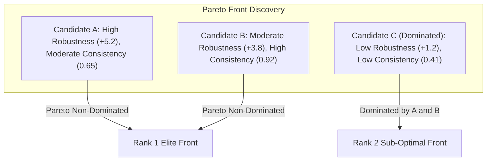
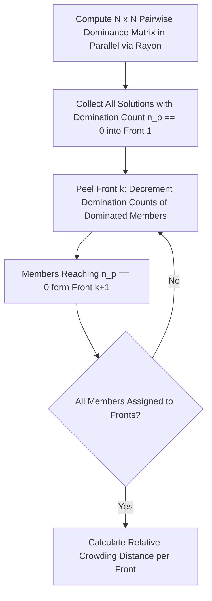
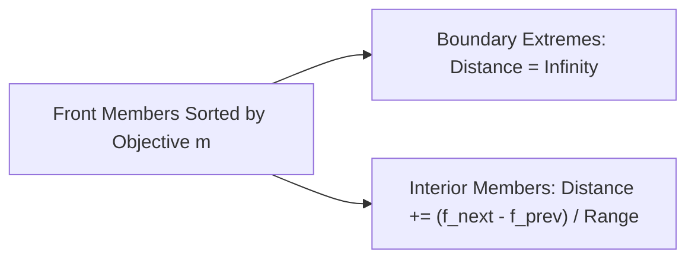
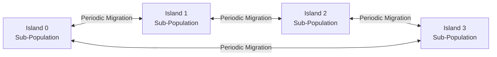
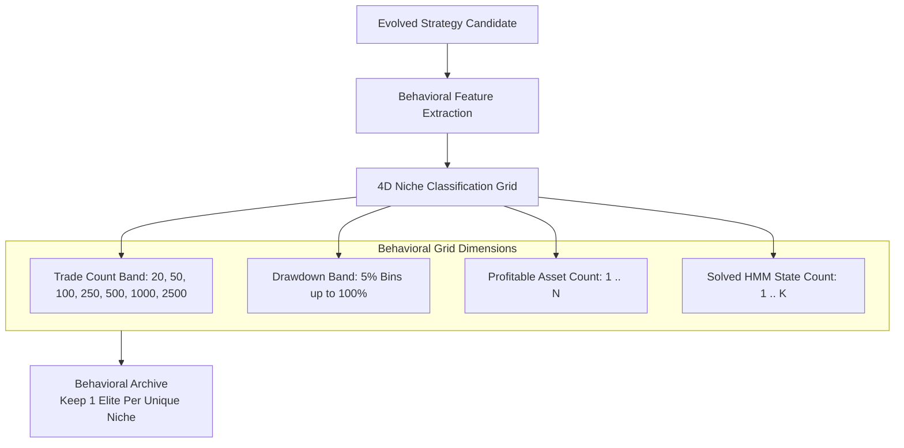

# Chapter 5: Multi-Objective Genetic Algorithm & Island Model

Quantitative trading requires balancing inherently conflicting goals: maximizing portfolio return while minimizing drawdown, maximizing trade frequency while maintaining trade quality, and maintaining robustness across distinct market regimes.

Alpha Suite employs an industrial-strength implementation of the **Non-Dominated Sorting Genetic Algorithm II (NSGA-II)** (`alpha-ga`), combined with an **Island Distributed Model**, **Adaptive Annealing Schedules**, **State-Locking Structural Memory**, and **Behavioral Niche Harvesting**.

---

## 1. Multi-Objective Optimization & The Pareto Front

In single-objective optimization, a strategy that achieves $1000\%$ profit with an $85\%$ drawdown is considered "better" than one that achieves $80\%$ profit with a $6\%$ drawdown. In institutional algorithmic trading, the latter is vastly superior.

Alpha Suite evaluates every strategy against **two non-collapsing objectives**:

$$\mathbf{F}(\theta) = \big[ \text{Objective}_0(\theta), \; \text{Objective}_1(\theta) \big] = \big[ \text{Robustness Score}, \; \text{Consistency Score} \big]$$

### 1.1 Objective 0: Robustness Score
- Combines logarithmic annualized utility across all portfolio assets, soft-knee drawdown penalties, asset breadth bonuses, and weakest-link covenants.
- Measures total survival, profitability, and multi-asset generalizability across all simulated market history.

### 1.2 Objective 1: Consistency Score ($R^2$ Equity Linearity)
- Evaluates whether returns are generated through smooth, compounding capital growth versus a few lucky flash-pump trades:
  $$\text{Consistency} = \left( \frac{\sum_{s=1}^K R_s^2 \cdot \text{Trades}_s}{\sum_{s=1}^K \text{Trades}_s} \right) \times \left( \frac{N_{\text{trades}}}{N_{\text{trades}} + 30} \right)$$
- $R_s^2 \in [0, 1]$ is the linear regression coefficient of determination of the cumulative PnL sequence for HMM state $s$.
- The statistical significance discount $\frac{N}{N + 30}$ prevents a 1-trade "100% win rate" fluke from occupying the Pareto front.

---

## 2. Fast Non-Dominated Sorting & Crowding Distance

### 2.1 Pareto Dominance Definition
Individual $A$ dominates individual $B$ ($A \succ B$) if and only if:
$$\forall i \in \{0, 1\}: f_i(A) \ge f_i(B) \quad \text{and} \quad \exists j \in \{0, 1\}: f_j(A) > f_j(B)$$

### 2.2 Parallelized Non-Dominated Sorting (`sorting.rs`)
1. **Rayon Pairwise Matrix**: Evaluates all $N(N-1)/2$ dominance pairs concurrently across CPU cores into thread-local dominance lists.
2. **Sequential Combine**: Combines thread-local dominance counts into an owned `domination_counts: Vec<usize>` and `dominated_solutions: Vec<Vec<usize>>` without mutex contention.
3. **Front Peeling**: Identifies Rank 1 solutions ($n_p = 0$), then decrements dominance counts for their dependents, peeling subsequent Pareto fronts ($\text{Front}_2, \text{Front}_3, \dots$).

### 2.3 Relative-Scale Crowding Distance Calculation
To maintain genetic diversity along the Pareto front, NSGA-II calculates the density of solutions surrounding each individual:

$$\text{Distance}(i) = \sum_{m=1}^M \frac{f_m(i+1) - f_m(i-1)}{f_m^{\max} - f_m^{\min}}$$

- **Boundary Member Infinity Assignment**: Extreme frontier solutions receive $\text{Distance} = \infty$, ensuring extreme high-profit or ultra-high-consistency champions are permanently preserved.
- **Scale-Free Degeneracy Guard**: For large objective values, floating-point noise is avoided by requiring $(f^{\max} - f^{\min}) > \epsilon \cdot \max(|f^{\max}|, |f^{\min}|)$.

---

## 3. Real-Valued Genetic Operators (`operators.rs`)

For continuous numerical parameters (`StrategyParams`: ATR multiplier, reward ratio, cooldown period, base risk, ML filter threshold, and direction), Alpha Suite applies classic real-valued genetic operators:

### 3.1 Simulated Binary Crossover (SBX)
Simulates the single-point crossover of binary-coded genetic algorithms on real-valued vectors:

Given parent values $y_1 \le y_2$, draw a random $u \in [0, 1]$:
$$\beta = \begin{cases}
(2u)^{\frac{1}{\eta_c + 1}} & \text{if } u \le 0.5 \\
\left(\frac{1}{2(1 - u)}\right)^{\frac{1}{\eta_c + 1}} & \text{if } u > 0.5
\end{cases}$$

Offspring values are computed as:
$$c_1 = \frac{1}{2} \big[ (y_1 + y_2) - \beta (y_2 - y_1) \big], \quad c_2 = \frac{1}{2} \big[ (y_1 + y_2) + \beta (y_2 - y_1) \big]$$

- $\eta_c$ (crossover distribution index) controls the spread of offspring relative to parents:
  - Low $\eta_c$ ($5.0$): Offspring disperse far from parents (wide global exploration).
  - High $\eta_c$ ($25.0$): Offspring remain close to parents (fine exploitation).

### 3.2 Polynomial Mutation
Perturbs real parameters with a probability $p_m$:

Given $u \in [0, 1]$ and bounds $[y_L, y_U]$:
$$\delta = \begin{cases}
(2u)^{\frac{1}{\eta_m + 1}} - 1 & \text{if } u < 0.5 \\
1 - \big[ 2(1 - u) \big]^{\frac{1}{\eta_m + 1}} & \text{if } u \ge 0.5
\end{cases}$$
$$y_{\text{mutated}} = \text{clamp}\big(y + \delta (y_U - y_L), \; y_L, \; y_U\big)$$

---

## 4. The Island Distributed Model

To prevent premature convergence to sub-optimal local peaks, the global population $P$ (e.g. $10,000$ individuals) is partitioned into $M$ independent **Islands** (e.g., $16$ or $32$ islands):

### 4.1 Migration Dynamics:
- **`migration_interval`**: E.g. every 10 (production) or 40 (harvest) generations.
- **`migration_rate`**: E.g. 5 elite individuals migrate between neighboring islands in a ring topology.
- **Speciation Advantage**: Different islands naturally explore distinct niches and GP structural trees before sharing discoveries via migration.

---

## 5. Adaptive Annealing Schedules

Alpha Suite dynamically ratchets difficulty and mutation parameters across the generational horizon $g \in [0, G_{\max}]$:

```mermaid
gantt
    title Adaptive Annealing Timeline
    dateFormat X
    axisFormat %s
    section Parameters
    High Mutation / Wide Exploration (Eta Start) :active, 0, 150
    Low Mutation / Fine Exploitation (Eta End)   :crit, 150, 300
    section Objective Difficulty
    Loose Floor (min_trades_start=20, max_dd=60%) :active, 0, 150
    Strict Floor (min_trades_end=4000, max_dd=15%) :crit, 150, 300
```

### 5.1 Annealing Equations:
$$\text{Progress} = \text{clamp}\left( \frac{g}{G_{\max}}, 0.0, 1.0 \right)$$
$$\eta(g) = \eta_{\text{start}} + (\eta_{\text{end}} - \eta_{\text{start}}) \times \text{Progress}$$
$$P_{\text{mut}}(g) = P_{\text{start}} + (P_{\text{end}} - P_{\text{start}}) \times \text{Progress}$$
$$\text{Target DD}(g) = \text{DD}_{\text{start}} + (\text{DD}_{\text{end}} - \text{DD}_{\text{start}}) \times \text{Progress}$$

### 5.2 Performance-Gated Stagnation Freezing (`ANNEALING_FREEZE_AFTER_STAGNATION = 5`)
- If the global population fails to find an improved champion for $> 5$ generations, **the annealing clock freezes**.
- This prevents ratcheting constraints on a struggling population, which would otherwise trigger catastrophic extinction.

---

## 6. Structural Memory: State-Locking & Hall of Fame

A fundamental challenge in multi-state genetic programming is that a beneficial mutation in State 0 might accidentally destroy an already optimal strategy in State 4.

### 6.1 State-Locking (`state_locking_enabled`)
1. When an individual achieves positive PnL in an HMM state exceeding `state_locking_unlock_threshold`, that specific `StateStrategy` is **locked**.
2. Crossover and mutation skip locked states, focusing evolutionary search exclusively on unsolved regimes.
3. Once all states are solved, dynamic unlocking ratchets strength criteria.

### 6.2 Elitist State Replacement & Local Hall of Fame (HoF)
- Each island tracks the single best strategy evolved for each HMM state in a local Hall of Fame:
  $$\text{HoF}[s] = \arg\max_{\text{ind}} \big( \text{PnL}_s(\text{ind}) \big)$$
- With probability `hof_injection_prob` (e.g. $0.20$), an offspring with a poor performance in state $s$ has that state's strategy spliced directly from the Hall of Fame champion.

### 6.3 Overfitting Control: Trial Counting and the Deflated Sharpe Ratio Gate

Admitting the raw best-of-population candidate into the Hall of Fame every generation is itself a multiple-testing problem: across thousands of generations and a large population, SOME candidate will look exceptional purely by chance. Two mechanisms correct for this before a candidate is admitted or crowned champion.

**Trial counting.** The GA loop maintains a `HashSet<u64>` of every phenotype hash (`alpha_gp::operators::compute_phenotype_hash`, F11) evaluated so far this run, updated once per generation right after evaluation. Its size, `n_trials`, is the number of DISTINCT strategies actually tried — not `cumulative_evaluations`, which also counts re-evaluations of carried-over survivors and structurally-identical duplicates. `n_trials` is persisted into `ga_run_metadata` on the same cadence as the annealed objective targets, checkpointed into the session file so a resumed run's count keeps growing rather than resetting, and exposed via `db::data::get_run_n_trials`.

**The deflation gate (`ga.deflation.mode`).** Both the Hall of Fame admission check (`ga_loop::hof::update_hall_of_fame`) and the running-champion check (`ga_loop::post_eval::handle_post_evaluation`) apply a multiple-testing hurdle when `ga.deflation.enabled = true`. Two hurdles are supported, switchable by config (an already-completed run stays reproducible under the mode it actually used — `ga_run_metadata.deflation` is not itself a persisted column, but `objective_mode`-style provenance applies the same way; see `ga.deflation.mode`'s doc comment):

| Mode | Hurdle | Notes |
|---|---|---|
| `"heuristic"` (default) | $\text{base\_threshold} + k\sqrt{2\ln(\max(N,2))}\,\sigma_{\text{pop}}$ | Pre-existing formula (Bailey, Borwein, López de Prado & Zhu, 2014 haircut shape); $N$ = `cumulative_evaluations`, $\sigma_{\text{pop}}$ = population objective-score std dev. Arbitrary $k$, no calibrated probability. |
| `"dsr"` | Deflated Sharpe Ratio probability $\ge$ `ga.deflation.min_dsr_probability` | Calibrated: `alpha_simulation::validation::deflation::{expected_max_sharpe, deflated_sharpe_probability}` (Bailey & López de Prado, 2014). Uses the TRUE `n_trials` above, not `cumulative_evaluations`. |

`expected_max_sharpe(n_trials, var_sr)` estimates the Sharpe ratio one would see by chance alone across `n_trials` independent draws, via the Euler-Mascheroni-constant asymptotic:
$$E[\max SR_n] \approx \sqrt{\text{Var}[SR_n]} \Big[ (1-\gamma)\,\Phi^{-1}\!\big(1 - \tfrac{1}{N}\big) + \gamma\,\Phi^{-1}\!\big(1 - \tfrac{1}{Ne}\big) \Big]$$

`deflated_sharpe_probability(sr_hat, sr_star, n_obs, skew, kurt)` is the Probabilistic Sharpe Ratio (Bailey & López de Prado, 2012) evaluated against that benchmark:
$$\text{DSR} = \Phi\!\left( \frac{(\widehat{SR} - SR^*)\sqrt{n_{\text{obs}} - 1}}{\sqrt{1 - \gamma_3 \widehat{SR} + \frac{\gamma_4 - 1}{4}\widehat{SR}^2}} \right)$$

Both numbers (heuristic haircut/hurdle AND DSR probability) are always computed and logged together regardless of which mode gates admission, so an operator can compare them on the same run. A rejected candidate is logged as `'below deflated threshold'` rather than silently dropped.

> **Known limitation**: `alpha_simulation`'s `BacktestResult`/`TickerResult` do not currently track a per-day return series or its skew/kurtosis, so the `"dsr"` path derives `sr_hat` from a trade-count-weighted average of each ticker's own `sharpe_ratio` and `n_obs` from total trade count, with skew/kurtosis fixed at the normal-distribution defaults (`0.0`, `3.0`). This is an honest interim approximation, not the literal per-day return series the formula was designed around; adding that tracking to the simulation engine would let a future change pass the real moments through.

---

## 7. Behavioral Archive & Harvest Mode (`config.harvest.toml`)

When running in **Harvest Mode** (`ga.harvest_mode = true`), the goal shifts from finding a single best strategy to **building a massive, diverse dataset of profitable strategies** to train the Alpha Architect Transformer:

- **Behavioral Archive**: Stores the highest-performing strategy for every occupied niche coordinate $(B_{\text{trades}}, B_{\text{dd}}, N_{\text{assets}}, K_{\text{states}})$.
- **Stagnation Injection**: Every `injection_interval = 15` generations of stagnation, injects $20\%$ fresh random genotypes to explore unvisited behavioral niches.
