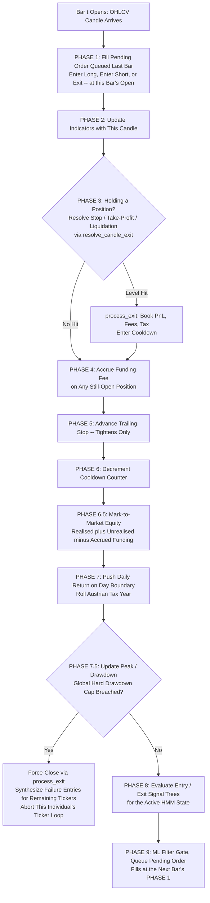
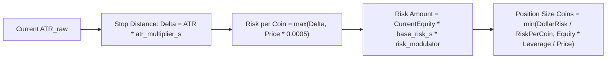
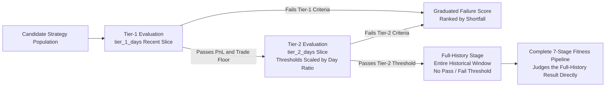
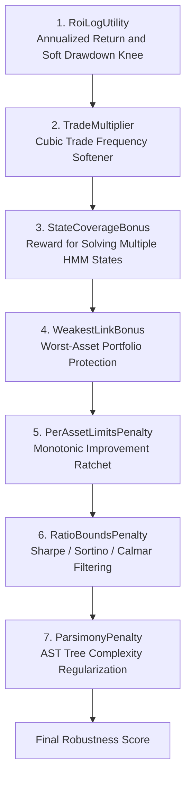

# Chapter 6: Economic Simulation, Friction & Multi-Objective Fitness Evaluation

In quantitative finance, the gap between theoretical backtest profits and real-world trading performance is known as **Execution Drag**. A strategy with high gross backtest profits will rapidly fail in live deployment if the simulation ignores realistic exchange friction, fee compounding on notional leverage, bid-ask slippage, liquidation margin thresholds, and asymmetric capital gains tax.

Alpha Suite’s simulation engine (`alpha-simulation`) provides an institutional-grade backtesting environment featuring **exact notional fee and slippage modeling**, **realistic liquidation margin mechanics**, **per-bar funding fee accrual**, **mark-to-market drawdown tracking with a global circuit breaker**, **Austrian capital gains tax modeling**, **three-stage cascading screening**, and a **7-stage mathematical fitness pipeline**.

---

## 1. The Simulation Execution Loop (`engine/`)

The simulation processes 1-minute historical OHLCV candles sequentially per ticker. Each symbol operates as an **independent account**. The per-bar body (`engine/simulation.rs::run_simulation`) is organized into nine numbered phases (PHASE 1 through PHASE 9, with two mark-to-market sub-phases 6.5 and 7.5) executed strictly in order, every bar, regardless of whether a trading decision happens on that bar:



### 1.1 State Transitions per Ticker (`TickerSimulationState`)
Every symbol account transitions between four mutually exclusive states:
1. **`NoPosition`**: Account is flat ($100\%$ cash/margin). Evaluates the active HMM state’s `entry_signal`.
2. **`InLong`**: Holding a leveraged long position. Tracks entry price, position size in coins, margin allocated, dynamic stop-loss, and take-profit targets.
3. **`InShort`**: Holding a leveraged short position (when `allow_short_selling = true`).
4. **`InCooldown`**: After an exit, trading is suspended for `cooldown_period` bars to prevent immediate re-entry churn during whipsaw market spikes.

### 1.2 Execution Sequencing & Price Priority
To eliminate lookahead bias and reflect real exchange mechanics:
- **Signal Evaluation (PHASE 8)**: Runs against candle $t$'s just-finalized indicator values (PHASE 2 has already folded candle $t$ into the indicator state). A firing entry or GP-driven exit signal does not fill immediately — PHASE 9 queues it as a `PendingOrder`, which only fills at candle $t+1$'s open (PHASE 1 of the next bar), adjusted for slippage. Equivalently: a decision made at the close of bar $t-1$ fills at the open of bar $t$.
- **Stop / Take-Profit / Liquidation (PHASE 3)**: Unlike a signal-driven exit, these are resolved **intrabar**, on the same bar price actually crosses the level — no one-bar fill delay. `resolve_candle_exit` (`engine/utils.rs`) is the single source of truth for exit precedence within a bar; see §2.3.
- **Gap Handling**: If a bar's open already lies past the stop/liquidation/take-profit level (a gap), `resolve_candle_exit` fills at $Open_t$ — the gap price — rather than the stale target level, capturing the real adverse (or favorable) slippage a gap produces.

### 1.3 Funding Fees (PHASE 4)
Every bar a position stays open, a funding fee accrues against it, mirroring the perpetual-futures funding mechanism real exchanges charge:
$$\text{Funding Fee}_t = \text{Size}_{\text{coins}} \times Close_t \times \text{per\_bar\_funding\_decay}$$
$$\text{per\_bar\_funding\_decay} = \frac{\text{annual\_funding\_rate\_pct} / 100}{365 \times 24 \times 60 \, / \, \text{bar\_interval\_minutes}}$$
(`SimulationConfig::per_bar_funding_decay`, `alpha-config/src/simulation.rs`). The annual rate (`simulation.annual_funding_rate_pct`, default $10.0$) is spread evenly across the bars in a 365-day year at `simulation.bar_interval_minutes` (default $1.0$) per bar — this is only the economically-correct per-bar rate when the historical data really is spaced `bar_interval_minutes` apart; nothing in the engine verifies that against the actual candle spacing, so pointing the simulation at differently-spaced data without updating this field silently mis-scales every funding charge by the ratio of the real bar duration to the configured one. The fee accumulates in `accumulated_funding_fee` and is deducted from realized equity only at exit (`process_exit`), but it is already subtracted from *mark-to-market* equity every bar in between (§1.5) — so an open losing position accrues a growing drag on both PnL and the drawdown calculation before it is ever formally realized.

#### 1.3.1 Real Funding Rates (F07, `simulation.funding.mode = "real"`)

The formula above is the **legacy decay** model: a flat, strictly-positive fee applied to every open position regardless of the real market's funding sign — a long and a short pay the identical cost every bar, which is not how a real perpetual-futures exchange works. When real per-interval funding rates are loaded for a ticker, PHASE 4 instead accrues signed funding on every rate boundary the candle stream crosses:
$$\text{Funding Fee (Long)} = \text{Size}_{\text{coins}} \times Close_t \times \text{rate}, \qquad \text{Funding Fee (Short)} = -\text{Size}_{\text{coins}} \times Close_t \times \text{rate}$$
**Exchange convention**: a long **pays** when `rate > 0` and **receives** when `rate < 0`; a short is the mirror image (receives on a positive rate, pays on a negative one) — matching every major perpetual-futures venue's sign convention. `accumulated_funding_fee` is subtracted from PnL at exit (§1.3), so a positive accrual is a cost and a negative one is a credit, for either side.

Two independent switches gate this path, and they OR together (`SimulationConfig::real_funding_enabled`) so an existing config that only sets the legacy flag keeps working unchanged:
- `simulation.use_real_funding` (pre-F07, still live): a plain boolean.
- `simulation.funding.mode = "legacy_decay" | "real"` (F07): the new declarative selector, persisted per-run to `ga_run_metadata.funding_mode` (§10) so a completed run's mode survives independent of today's config.

`Config::validate` cannot see the database, so a second guard runs in `alpha_orchestrator::run` immediately after `db::load_funding_rates`: starting or resuming a run with `funding.mode = "legacy_decay"` while real rates are actually loaded for its tickers is a hard error — silently discarding real, sign-correct rate data in favor of the always-a-cost decay model is exactly the mistake this guard exists to catch — unless `simulation.funding.allow_legacy_with_rates = true` (an explicit escape hatch for deliberately reproducing a pre-F07 run).

### 1.4 Minimum Hold Period
An exit signal tree for the active position is not even evaluated until the position has been held at least `simulation.min_hold_bars` bars (default $5$, PHASE 8's exit-evaluator gate: `sim_state.bars_since_entry >= min_hold_bars`). This exists to stop the GP layer from evolving degenerate one-bar scalping trees that only look profitable because the simulation would otherwise let a position be opened and immediately closed on the very next signal check — a shape that collects fee/slippage-dominated noise, not a real edge. Stop-loss, take-profit, and liquidation (PHASE 3) are **not** subject to this gate — a position can still be stopped out or liquidated in bar 1 of its life; only the *signal-driven* exit path waits.

### 1.5 Mark-to-Market Equity & Drawdown (PHASE 6.5 / 7.5)
`current_equity` only moves on a realized event (an exit, an entry fee). Between those events it says nothing about an open position's paper loss. PHASE 6.5 computes a separate mark-to-market figure every bar, used for both the daily-return series (PHASE 7, feeding Sharpe/Sortino — §6) and the peak/drawdown tracker (PHASE 7.5):
$$\text{Equity}_{\text{MTM}, t} = \text{current\_equity} + \text{UnrealizedPnL}_t - \text{accumulated\_funding\_fee}$$
where the open position is marked to candle $t$'s **close** (not its adverse intrabar extreme — a deliberate, less-conservative choice, but the one every downstream consumer of this series expects). Peak equity and drawdown are tracked from this mark-to-market series, not from `current_equity` alone:
$$\text{Peak}_t = \max(\text{Peak}_{t-1}, \, \text{Equity}_{\text{MTM}, t}), \qquad \text{Drawdown}_t = \frac{\text{Peak}_t - \text{Equity}_{\text{MTM}, t}}{\text{Peak}_t}$$
This means an open position's unrealized loss shows up in drawdown *immediately*, on the bar it happens, rather than only once the trade eventually closes — matching how a real account's margin health is actually monitored.

### 1.6 The Global Drawdown Circuit Breaker (PHASE 7.5)
If running max drawdown ever exceeds `simulation.max_acceptable_drawdown` (a **hard**, global cap — distinct from the per-island *soft* drawdown target that only shapes the fitness knee in §5, Stage 1), the individual's simulation on this ticker is terminated immediately:
1. Any open position is force-closed through the ordinary `process_exit` path at candle $t$'s close — booking real slippage, taker fee, accrued funding, and Austrian-tax handling exactly like any other exit, rather than hand-computing an approximate PnL. This is deliberate: the realized figures downstream fitness consumers read (`final_equity`, `per_state_results`) must reflect what actually happened, not a synthetic shortcut.
2. Every ticker in this individual's alphabetically-sorted ticker list that had not yet been simulated gets a **synthetic failure entry** — `trades = 0`, `final_equity = simulation.failed_equity`, `max_drawdown_percent` carried forward from the breach — instead of being left absent from `ticker_results`. Without this backfill, an individual that blows up on an early ticker would be scored on fewer, differently-weighted assets than a survivor that reaches every ticker, and every fitness consumer that divides or takes `min()`/`sum()` over `ticker_results` (§5's `RoiLogUtility`, `TradeMultiplier`, `StateCoverageBonus`) would be comparing incommensurable things. The backfill guarantees every individual is scored on the same asset count.

### 1.7 Cooldown Semantics
`cooldown_period` (an evolved gene, default search bounds $[5, 240]$ bars) is meant to block exactly $N$ bars of re-entry after an exit. Because PHASE 6's decrement runs unconditionally on every bar the state is `InCooldown` — including the very bar `process_exit` just set it on, since PHASE 1/3/7.5 (where exits happen) all run earlier than PHASE 6 within the same bar — `process_exit` seeds the counter to `cooldown_period + 1`, not `cooldown_period`. PHASE 6's same-bar decrement then lands the counter on exactly `cooldown_period` at the end of the exit's own bar, and it takes that many further per-bar decrements to release — so `cooldown_period = N` blocks exactly $N$ bars (the exit's own bar plus $N-1$ more) before PHASE 9 can evaluate a fresh entry signal again. A bare `cooldown_counter = cooldown_period` would have silently blocked only $N-1$ bars for every value the GA could search, and `cooldown_period = 1` would have blocked zero bars outright (immediate same-bar release).

---

## 2. Realistic Position Sizing & Economic Friction

### 2.1 Volatility-Based Position Sizing
When an entry signal fires in state $s$, position sizing is derived from volatility risk budgeting:



1. **Stop Distance**:
   $$\Delta_{\text{stop}} = ATR_{\text{raw}, t} \times \text{atr\_multiplier}_s$$
   $$\text{Risk per Coin} = \max\big( \Delta_{\text{stop}}, \; P_{\text{entry}} \times 0.0005 \big)$$
2. **Dollar Risk Budget**:
   $$\text{Risk Amount} = \text{CurrentEquity} \times \text{base\_risk\_per\_trade}_s \times \text{risk\_modulator}$$
3. **Leverage Cap & Final Position Size**:
   $$\text{Size}_{\text{coins}} = \min\left( \frac{\text{Risk Amount}}{\text{Risk per Coin}}, \; \frac{\text{CurrentEquity} \times \text{leverage}}{P_{\text{entry}}} \right)$$

---

### 2.2 Notional Friction (Taker Fee & Slippage)

> [!CRITICAL]
> **The Leverage Friction Multiplier**:
> In real cryptocurrency margin trading, exchange fees apply to the **Total Notional Value** ($Q \times P$), not the margin collateral deposited.
>
> If a trader opens a $\$100$ margin position with $10\times$ leverage, the notional position size is $\$1,000$.
> A taker fee of $0.075\%$ on notional is $\$0.75$, which represents a **$0.75\%$ fee drag on the $\$100$ margin per side** ($1.50\%$ round-trip fee drag). $0.075\%$ is the shipped `config.toml`'s `friction.taker_fee_pct`; the code-level default (`FrictionConfig::default`, used when the key is absent) is $0.07\%$ — check which one applies to your run.
>
> Algorithms that ignore notional fee scaling discover high-frequency "scalping" rules that are completely wiped out by transaction costs in live execution.

#### Mathematical Formulation:
$$\text{Entry Price}_{\text{Long}} = P_{\text{open}} \times \left(1 + \frac{\text{slippage\_pct}}{100}\right)$$
$$\text{Entry Price}_{\text{Short}} = P_{\text{open}} \times \left(1 - \frac{\text{slippage\_pct}}{100}\right)$$
$$\text{Notional}_{\text{entry}} = \text{Size}_{\text{coins}} \times \text{Entry Price}$$
$$\text{Entry Fee} = \text{Notional}_{\text{entry}} \times \left(\frac{\text{taker\_fee\_pct}}{100}\right)$$

On trade exit at price $P_{\text{exit}}$:
$$\text{Exit Price}_{\text{Long}} = P_{\text{exit}} \times \left(1 - \frac{\text{slippage\_pct}}{100}\right)$$
$$\text{Notional}_{\text{exit}} = \text{Size}_{\text{coins}} \times \text{Exit Price}$$
$$\text{Exit Fee} = \text{Notional}_{\text{exit}} \times \left(\frac{\text{taker\_fee\_pct}}{100}\right)$$

---

### 2.2b Spread-and-Impact Cost Model (F07, `simulation.friction.model = "spread_and_impact"`)

Section 2.2's `slippage_pct` is a single constant per side — it has no notion of the bid-ask spread actually implied by recent price action, nor of how a fill's own size compares to the market's typical volume. `simulation.friction.model` (default `"constant"`, reproducing §2.2 bit-for-bit) adds a second, optional model that prices both of those:
$$\text{cost\_pct} = \text{est\_half\_spread\_pct} + \text{impact\_k} \times \sigma_{\text{bar\_pct}} \times \sqrt{\text{participation}}$$
where every term on the right comes from a non-GP-visible indicator slot, not a config constant:
- **`est_half_spread_pct`**: the Corwin & Schultz (2012) high-low spread proxy (`SpreadProxyRunner`, `alpha-indicators/src/spread_proxy.rs`), a rolling-window estimate of the effective half-spread from OHLC alone.
- **`sigma_bar_pct`**: `normalized_atr` — the existing ATR-over-close volatility slot, reused here as the impact term's volatility scale.
- **`participation`**: this fill's own notional divided by the rolling `adv_notional` slot (`AdvNotionalRunner`, a rolling SUM of `close * volume` — literally an Average-Daily-Volume notional estimate at the default one-day window). `adv_notional <= 0.0` (still warming up) treats participation as `0.0` rather than dividing by zero.
- **`impact_k`** (`simulation.friction.impact_k`, default $0.1$) is the one config-level coefficient in the formula.

`cost_pct` replaces `slippage_pct` in every formula in §2.2 above — the entry/exit price adjustments and the fee-bearing notional both derive from whichever model is selected, so `spread_and_impact` composes with the notional fee math unchanged. **Participation cap (entries only)**: if this fill's `participation` would exceed `simulation.friction.max_participation` (default $0.02$, i.e. $2\%$ of the rolling ADV), the entry is rejected outright — no position opens, no fee is charged, and the attempt is counted (`TickerSimulationState::rejected_fills`, surfaced to callers via a thread-local sidecar counter -- `alpha_simulation::engine::take_last_rejected_fills` -- rather than a new `BacktestResult` field, since that struct travels over the wire and dozens of construction sites across other crates would otherwise need updating; consumed by the capacity curve below). Exits are never rejected this way: a position that is already open must always be closable, so `process_exit` prices `cost_pct` directly without consulting the cap.

`stressed_config` (§10) scales `impact_k` the same way it already scales `slippage_pct`/`taker_fee_pct`; the half-spread term, being a runtime indicator value rather than a config scalar, is instead scaled at the point of use via `simulation.friction.spread_stress_multiplier`, which `stressed_config` sets to the same `ga.friction_stress_multiplier` factor.

> [!NOTE]
> `adv_window_bars`/`spread_window_bars` (the two indicators' rolling-window lengths, §10) reach the indicator pipeline through `alpha_simulation::engine::friction_windows_from_config` → `alpha_indicators::FrictionWindows` → `MultiScaleIndicatorState::new_with_columns_and_windows` → `build_default_pipeline_with_bus_and_windows`, on every live CPU engine path: `run_simulation`'s cache-miss fallback, every `IndicatorWarmupCache` (each production cache owner — master, worker, health check, local fallbacks, `alpha-bench` — applies `set_friction_windows` from its config; a cache whose windows change drops its entries, and `run_simulation` debug-asserts that the cache it is handed agrees with the config), the ensemble replay and ML-filter training. The original, unparameterized `build_default_pipeline_with_bus` is untouched and keeps the 1440-bar defaults (`FrictionWindows::default()`) for every path that never reads the two friction slots — HMM feature extraction, phenotype hashing, walk-forward classification — and for the GPU / kernel-reference snapshot paths, which only ever run the `constant` model (`manual/14` row O17). A non-default window is therefore a CPU-only setting, exactly like `model = "spread_and_impact"` itself, and a default config is bit-identical to the config-less paths.

#### 2.2b-ii Intraday Volume Profile (M3, blueprint 81f1, `simulation.friction.intraday_profile`)

`adv_notional` above is a flat rolling-window SUM -- literally an Average-Daily(-ish) Volume estimate that is the SAME regardless of what time of day a fill happens, even though real liquidity is not flat intraday. `simulation.friction.intraday_profile` (default `false`, CPU-only, off by default per convention 9) replaces that flat denominator with a causal time-of-day volume profile, `alpha_simulation::engine::IntradayVolumeProfile` (`engine/intraday_profile.rs`):

- Built once per ticker per dataset (never per individual/generation -- see `engine::cache::IndicatorWarmupCache::get_or_build_intraday_profile`) by a single causal forward pass over the ticker's full `Ohlcv` history, bucketing each bar's `close * volume` notional into a fixed-width time-of-day bucket (`simulation.friction.intraday_bucket_minutes`, default $60$, i.e. $24$ buckets/day) and tracking the trailing mean of each bucket's daily total across the last `simulation.friction.intraday_profile_days` (default $20$) COMPLETED calendar days.
- **Causal by construction**: the snapshot associated with day $D$ is captured the moment day $D$ is first encountered, strictly before any of day $D$'s own rows are folded in -- a bar on day $D$ can therefore never see day $D$'s own volume. Until `intraday_profile_days` full completed days exist, `expected_notional` returns `None` and the fill falls back to the flat `adv_notional` path exactly as if the switch were off.
- **Participation formula** (`execution.rs::resolve_participation`), when the switch is on and the profile has a ready value for the fill's bucket:
$$\text{denominator} = \text{expected\_bucket\_notional} \times \frac{\text{adv\_window\_bars}}{\text{intraday\_bucket\_minutes}}, \qquad \text{participation} = \max\!\left(0.0, \frac{\text{notional}}{\text{denominator}}\right)$$
`expected_bucket_notional` only covers `intraday_bucket_minutes` worth of bars per day, not a full day, so it is scaled up to an ADV-equivalent window spanning the same `adv_window_bars` bars the flat path uses. This is exact (not approximate) under a perfectly flat volume profile: with a constant per-bar notional rate $r$, `expected_bucket_notional == r * intraday_bucket_minutes` for every bucket, so `denominator == r * adv_window_bars` -- precisely the flat path's `adv_notional` rolling sum over the same rate. `backtest_engine_tests.rs`'s `test_intraday_profile_flat_profile_matches_flat_adv_path_within_tolerance` pins this equivalence to within `1e-12`.
- This denominator feeds directly into §2.2b's `cost_pct` formula and the entry-only `max_participation` cap in place of the flat `adv_notional / notional` division -- everything else (the half-spread term, the impact coefficient, the cap's reject-and-count behaviour) is unchanged.
- **CPU-only**: `IntradayVolumeProfile` is built and consumed entirely inside `execution.rs`'s CPU friction-cost path, with no GPU kernel mirror. Unlike `model = "spread_and_impact"` itself (which the GPU path merely warns about, §10), starting a run with `intraday_profile = true` and `gpu.enabled = true` is a **hard error** (`alpha_orchestrator::run::check_intraday_profile_gpu_conflict`) -- an explicitly-opted-into switch silently falling back to the flat path on GPU-evaluated tiers only would defeat the point of turning it on for exactly those tiers, with no operator-visible signal.
- Persisted per-run as `ga_run_metadata.friction_intraday_profile` alongside `friction_model`/`funding_mode` (§10) via the same extended `db::log_run_friction_and_funding_mode` writer, read back by `db::data::get_run_friction_intraday_profile`.

#### 2.2c Capacity Curve (F07, `validation.capacity_curve.enabled`)

`run_post_ga_pipeline` (`alpha-orchestrator/src/pipeline/mod.rs`), immediately after the championship validation suite (`manual/09`), can re-run the selected champion at several notional multipliers of `simulation.initial_equity` — $\{1, 2, 5, 10, 20\}\times$ — forcing `simulation.friction.model = "spread_and_impact"` regardless of the run's own setting, since the point of the curve is specifically to chart how cost scales with fill size (the `constant` model has no such dependency to chart). For each multiplier it persists `(ga_run_id, params_hash, multiplier, net_profit, sharpe_ratio, rejected_fills)` to the `ga_capacity_curve` table (`db::log_capacity_curve_row`) and logs the smallest multiplier whose `net_profit` has dropped to at or below half of the $1\times$ baseline (`db::find_halving_multiplier`) — the point at which the strategy's edge, priced honestly against its own market impact, has visibly decayed. Gated behind `validation.capacity_curve.enabled` (default `false`, §10): this stage adds five extra full-history simulations to the pipeline, so it stays off unless explicitly requested.

---

### 2.3 Liquidation Margin Mechanics & Intrabar Exit Precedence
For leveraged positions, liquidation occurs when unrealized paper loss exceeds the exchange maintenance margin loss threshold (`simulation.liquidation_margin_loss_pct`, default $0.5$, i.e. $50\%$):

$$\text{Margin} = \frac{\text{Size}_{\text{coins}} \times P_{\text{entry}}}{\text{leverage}}$$
$$P_{\text{liq, Long}} = P_{\text{entry}} \times \left(1 - \frac{\text{liquidation\_margin\_loss\_pct}}{\text{leverage}}\right)$$
$$P_{\text{liq, Short}} = P_{\text{entry}} \times \left(1 + \frac{\text{liquidation\_margin\_loss\_pct}}{\text{leverage}}\right)$$

If a candle's $Low_t \le P_{\text{liq, Long}}$ (or $High_t \ge P_{\text{liq, Short}}$), the position is forcibly liquidated:
$$\text{Realized Loss} = -\text{Margin} \times \text{liquidation\_margin\_loss\_pct}$$
The account equity is decremented immediately, and the strategy is locked into a mandatory cooldown (§1.7).

**Exit precedence within one candle** (`resolve_candle_exit`, `engine/utils.rs`) is not simply "check liquidation, then check stop": it resolves in this order —
1. **Gap-through on open, highest priority**: if $Open_t$ itself has already crossed the liquidation level, the stop, or the take-profit, the exit fills at $Open_t$ (the gap price) rather than at the stale target level.
2. **Whichever loss-side level sits closer to entry, intrabar**: under the *documented* gene ordering (stop distance is `(ATR * atr_multiplier).max(0.0005 * entry_price)`; liquidation distance is `entry_price * liquidation_margin_loss_pct / leverage`, $5\%$ of entry at defaults), the stop normally sits strictly closer to entry than liquidation, so a stop-out is detected before price could ever reach the liquidation level and the stop resolves first. But `atr_multiplier` is an evolved gene (default bounds $[1.0, 12.0]$) with no relationship enforced against the fixed liquidation distance — on a sufficiently volatile series or a wide-multiplier genotype, `atr_multiplier * ATR` can exceed the liquidation distance, **inverting** the ordering. `resolve_candle_exit` handles this explicitly: it checks which of the two loss-side levels is actually closer to entry and resolves *that one* first, rather than unconditionally preferring the stop. Resolving stop-first unconditionally (the old behavior) would, on an inverted genotype, book a loss *larger* than the capped liquidation loss the model is supposed to enforce everywhere else.
3. **Take-profit** only competes with the stop when both are touched within the same candle; the stop is conservatively assumed to resolve first.

Because trailing stops only ever tighten (§1, PHASE 5 moves the stop toward price, never away), the gap between stop and liquidation can only shrink once a trade is running — the inverted case is therefore most reachable immediately after entry, before any trailing has occurred.

---

## 3. Austrian Capital Gains Tax Simulation (`simulate_austrian_tax`)

In live trading, asymmetric taxation creates a severe drag: winning trades incur tax immediately, while losing trades only provide future tax loss-carryforwards.

When `simulate_austrian_tax = true`, the engine models the Austrian 27.5% flat crypto capital gains tax (KESt) with a dynamic **Loss Pot (`loss_pot`)**:

```rust
if config.simulate_austrian_tax {
    if net_pnl_dollars > 0.0 {
        let taxable_gain = (net_pnl_dollars - *loss_pot).max(0.0);
        let tax_due = taxable_gain * 0.275;
        *loss_pot = (*loss_pot - net_pnl_dollars).max(0.0);
        *current_equity += net_pnl_dollars - tax_due;
    } else {
        *loss_pot += net_pnl_dollars.abs();
        *current_equity += net_pnl_dollars;
    }
}
```

---

## 4. Three-Stage Cascading Evaluation (`ga.evaluation_tiers`, `evaluate_batch_tiered`)

Evaluating an entire generation ($10,000$ strategies) across 2 years of 1-minute data ($1,000,000$ bars) requires substantial compute.

Alpha Suite implements a **three-stage cascading filter** (`evaluate_batch_tiered`, `engine/tiering.rs`): tier-1 (short recent slice), tier-2 (longer slice), then a terminal **full-history** stage. This is not a two-tier design — the full-history stage is a distinct third pass with its own semantics, not an alias for tier-2:



1. **Tier-1 Fast Filter (`tier_1_days`)**:
   - Evaluates strategies across the `tier_1_days`-wide window `ga.evaluation_tiers.window_anchor` selects (see "Window Anchoring" below) — the most recent `tier_1_days` of market data under the default `"latest"` anchor.
   - Discards failing strategies via `process_tier_outcomes`, using one of two selection modes (`ga.evaluation_tiers.selection`, `manual/10` §4):
     - **`"quantile"` (default, F14)**: ranks the whole evaluation batch by total PnL (descending), then trade count (descending), then index (ascending), and keeps the top `quantile_keep_fraction` (default $0.3$) that ALSO clears the PnL/trade floors below — except INVARIANT 2: if every candidate in the batch misses the floors, the single top-ranked candidate is unconditionally promoted anyway, so there is always at least one survivor to carry a search gradient forward.
     - **`"absolute"` (legacy)**: every candidate must independently satisfy $PnL \ge \text{tier\_1\_min\_total\_pnl}$ AND $\min(\text{Trades}) \ge \text{tier\_1\_min\_trades\_per\_asset}$ — no batch-relative ranking. In a harsh regime or an early generation this can cull an entire batch to zero survivors, stalling evolutionary progress; this is the defect F14's `"quantile"` default fixes.
   - Either way, a rejected candidate is recorded with a graduated (not flat) failure result so the GA still has a gradient to climb out of the failure region.
2. **Tier-2 Deep Simulation (`tier_2_days`)**:
   - Only strategies passing Tier-1 are re-evaluated across the longer `tier_2_days` slice. Tier-2's pass/fail thresholds are **not** independently configured — they scale linearly from the tier-1 thresholds by the day ratio, since more elapsed time means proportionally more expected trades and more room for PnL to drift:
     $$\text{scale} = \frac{\text{tier\_2\_days}}{\text{tier\_1\_days}}, \qquad \text{tier\_2\_pnl} = \text{tier\_1\_min\_total\_pnl} \times \text{scale}, \qquad \text{tier\_2\_trades} = \max\big(1, \lfloor \text{tier\_1\_min\_trades\_per\_asset} \times \text{scale} \rfloor\big)$$
   - Tier-2 is skipped entirely (falls straight through to full-history) if `tier_2_days <= tier_1_days` — a degenerate config — or if no tier-2 data was supplied.
3. **Full-History Stage (terminal, unconditional pass-through)**:
   - Every survivor of tier-2 (or of tier-1 alone, if tier-2 is inactive) is simulated across the **entire** historical window via the ordinary `run_simulation` path. Unlike tier-1/tier-2, this stage has **no pass/fail threshold of its own** — every individual that reaches it produces a final `BacktestResult` (`process_full_outcomes`), and the §5 seven-stage fitness pipeline is what actually judges the result. There is nothing here to "pass"; culling has already happened upstream.
   - On GPU-enabled configurations this stage additionally chunks survivors by `IndicatorPeriods`-tuple column-cache footprint (`run_full_history_filter_gpu`, `plan_column_cache_groups`) — see `manual/12` §9 for that chunking design; a tuple whose footprint alone exceeds `gpu.column_cache_budget_mb` falls back to the ordinary CPU path for its survivors rather than ever risking a residency eviction.
4. **Graduated Failure Band**:
   - Culled strategies (tier-1 or tier-2 rejects) receive a graduated failure score based on their trade and PnL shortfall rather than a flat $-10^6$ penalty, providing a smooth evolutionary gradient for the GA to climb out of the failure region.

### 4.1 Window Anchoring (F14, `ga.evaluation_tiers.window_anchor`)

Under `window_anchor = "latest"` (the default), tier-1/tier-2 windows ALWAYS end on each ticker's own most recent candle — every generation's culling gate looks at the identical, current-day era. This systematically biases the gate toward whatever fits the CURRENT market regime: an individual that happens to trade well in the last `tier_1_days`/`tier_2_days` survives to full-history evaluation regardless of how it would have performed in a different era, and one that would generalize well but underperforms in the current window never gets the chance.

`window_anchor = "random"` fixes this by drawing ONE offset per GENERATION — shared by every individual dispatched that generation, not redrawn per individual — from `alpha_ga::rng_seed::seeded_rng(base_seed, &[tags::TIER_WINDOW, generation])`, uniformly over `[0, len_days - window_days - WARMUP_PERIOD]` where `window_days` is the wider of `tier_1_days`/`tier_2_days`. The offset counts candles excluded from the tail of every ticker's series before the ordinary trailing-window arithmetic runs, so the whole tier-1/tier-2 window shifts backward in time by that many candles — the culling gate looks at a different (earlier) era each generation instead of always "the most recent days".

The offset is computed ONCE by the master per generation and carried on the wire as `SimulationBatch::tier_window_offset` (`alpha-proto`, bumped to protocol `0.2.0`), so every remote worker (`apps/alpha-worker/src/cache.rs::DataCache::tier1_view_for_batch`/`tier2_view_for_batch`) and the master's own local-fallback / non-distributed evaluation path (`alpha_orchestrator::ga_loop::evaluation::resolve_tier_window_offset`) slice the IDENTICAL window for a given generation without any of them re-deriving the RNG draw. A ticker whose own history doesn't reach back far enough to survive the shift is omitted from that tier for that generation (mirroring the existing empty-ticker-omission rule tier-slicing already uses), rather than clamped to a degenerate window.

---

## 5. The 7-Stage Multi-Objective Fitness Pipeline

For strategies completing full simulation, the **Robustness Score** is calculated through 7 specialized fitness stages:



### Stage 1: `RoiLogUtility`
Calculates logarithmic annualized utility across all $N$ asset accounts:
$$\text{ROI}_a = \frac{\text{FinalEquity}_a - \text{InitialEquity}}{\text{InitialEquity}}, \qquad \text{ROI}_a^{\text{safe}} = \max(\text{ROI}_a, -0.99)$$
$$\text{Annualized ROI}_a = \begin{cases} (1 + \text{ROI}_a^{\text{safe}})^{\frac{365}{\text{Days}}} - 1 & \text{if } \text{ROI}_a^{\text{safe}} > 0 \\ \text{ROI}_a^{\text{safe}} & \text{otherwise} \end{cases}$$
Annualization is deliberately **asymmetric** (`RoiLogUtility::apply`, `fitness.rs`): only a *positive* ROI is compounded up to a yearly rate; a losing account's ROI is taken as-is, since compounding a fractional loss over $365/\text{Days}$ would shrink its magnitude toward zero and flatter exactly the strategies the penalty terms below exist to punish. The $-0.99$ floor keeps $\ln(1 + x)$ finite for a near-total account wipeout.
$$U_a = \text{clamp}\big(\ln(1 + \text{Annualized ROI}_a), \; -10.0, \; \text{pnl\_saturation\_factor}\big)$$

- **Dimensionless Soft Drawdown Knee**:
  $$\text{If } \text{DD}_a > \text{TargetDD}: \quad U_a \leftarrow U_a - \frac{\text{DD}_a - \text{TargetDD}}{\max(\text{TargetDD}, 1.0)}$$
- **Portfolio Aggregation**:
  $$\text{Base} = \bar{U} + \min(U) \times \text{min\_utility\_weight}$$

### Stage 2: `TradeMultiplier` (Cubic Softener)
Penalizes under-trading strategies:
$$\text{If } \min(\text{Trades}) < \text{RequiredTrades}: \quad M = \left( \frac{\min(\text{Trades}) + 0.001}{\text{RequiredTrades}} \right)^3$$
$$\text{Base} \leftarrow \begin{cases} \text{Base} \times M & \text{if Base} > 0 \\ \text{Base} \times (2 - M) & \text{if Base} \le 0 \end{cases}$$

### Stage 3: `StateCoverageBonus`
Rewards strategies that achieve positive profit across multiple HMM regimes:
$$\text{Coverage Ratio} = \frac{\text{Solved Regime-Asset Units}}{K \times N}$$
$$\text{Base} \leftarrow \text{Base} \times (1.0 + \text{Coverage Ratio})$$

### Stage 4: `WeakestLinkBonus`
Prevents strategies from generating 99% of profits from BTC while losing heavily on SOL or meme coins:
$$\text{Bonus} = \tanh(\text{WeakestAssetRatio} \times 0.5)$$
$$\text{Base} \leftarrow \text{Base} \times (1.0 + \text{Bonus} \times \text{profit\_pressure\_factor})$$

### Stage 5: `PerAssetLimitsPenalty`
Monotonically ratchets minimum required performance per asset based on previous generation champions.

### Stage 6: `RatioBoundsPenalty`
Applies soft saturation penalties if Sharpe, Sortino, or Calmar ratios violate configured `[min, max]` bounds.

### Stage 7: `ParsimonyPenalty`
Penalizes AST node count exceeding `node_soft_cap`, only when `ga.parsimony_penalty.enabled` and only against positive fitness. The complexity measure is the *average* node count per HMM state, not the raw total — a strategy with more evolved states is not penalized simply for having more trees:
$$\overline{\text{Nodes}} = \frac{\sum_{s} \big(\text{count\_nodes}(entry\_signal_s) + \text{count\_nodes}(exit\_signal_s)\big)}{\max(1, K)}, \qquad \text{Excess} = \max(0, \, \overline{\text{Nodes}} - \text{node\_soft\_cap})$$
$$\text{Penalty} = \text{base\_penalty\_factor} \times \text{Excess}^{\,\text{complexity\_exponent}}, \qquad \text{Base} \leftarrow \text{Base} \times \max(0, \, 1 - \text{Penalty})$$
There is no `tanh` saturation and no $0.01$ floor in the implementation (`ParsimonyPenalty::apply`, `alpha-simulation/src/fitness.rs`) — the shrink factor is a plain linear `(1 - Penalty)`, clamped only at zero, so a large enough excess can drive the multiplier all the way to $0$.

> [!NOTE]
> This pipeline has grown two more always-config-gated stages since the diagram above was drawn (`EraStability` and `LcbExpectancy`, both disabled by default) plus `NullBaselineExcess` at the end — the full, current legacy dispatch order is `RoiLogUtility → EraStability → TradeMultiplier → LcbExpectancy → StateCoverageBonus → WeakestLinkBonus → PerAssetLimitsPenalty → RatioBoundsPenalty → ParsimonyPenalty → NullBaselineExcess` (`calculate_log_utility_fitness`, `evaluator/utility.rs`). None of that changes the formulas documented above for the stages that were already here.

---

## 5b. The Stationary Objective (F04, `ga.objective.mode = "stationary"`)

Every stage in §5 above is part of the **legacy** objective (`ga.objective.mode = "legacy"`, the default — nothing above changes). Legacy is deliberately *non-stationary*: `RoiLogUtility`'s drawdown knee reads the per-island `local_max_drawdown_target`, `TradeMultiplier` reads `local_min_trades_target`, and `PerAssetLimitsPenalty` reads floors that ratchet up every generation from that island's own champion (`ga_loop::post_eval::handle_post_evaluation`) and decay back down on sustained stagnation (`ga_loop::maintenance`, every 10th stagnant generation). The practical consequence: the SAME `BacktestResult` scores differently depending purely on which generation produced it.

`ga.objective.mode = "stationary"` (§10 has the full `[ga.objective]` key reference) replaces this with a fixed-threshold, per-era statistical score. It runs a shorter component array — `RoiLogUtility → StateCoverageBonus → WeakestLinkBonus → PerAssetLimitsPenalty → RatioBoundsPenalty → ParsimonyPenalty → NullBaselineExcess` — dropping `EraStability` (redundant with the era-Sharpe statistic below), `TradeMultiplier`, and `LcbExpectancy`. `RoiLogUtility` itself branches internally on the mode (`RoiLogUtility::apply_stationary`, `fitness.rs`) rather than becoming a separate component, so both modes share the exact same avg+min portfolio blending rule.

### Per-ticker score
For each ticker, using the SAME per-era split `EraStability` reads (`TickerResult::per_era_results`, always populated with `ga.era_fitness.num_eras` eras regardless of `era_fitness.enabled` — no second era split is computed):

$$r_i = \frac{\text{EraPnL}_i}{\text{InitialEquity}}, \qquad \bar{r} = \text{mean}(r), \qquad \sigma_r = \text{stddev}(r), \qquad \widehat{\text{Sharpe}} = \frac{\bar{r}}{\sigma_r}$$

$$\text{SE}(\widehat{\text{Sharpe}}) = \sqrt{\frac{1 + \widehat{\text{Sharpe}}^2 / 2}{n}} \quad \text{(Lo, 2002)}, \qquad \text{LCB} = \widehat{\text{Sharpe}} - z \times \text{SE}(\widehat{\text{Sharpe}})$$

$$\text{TickerScore} = \begin{cases} \text{LCB} \times \ln(1 + \max(\text{ROI}, -0.99)) & \text{LCB} > 0 \\ \text{LCB} + \min(0, \, \ln(1 + \max(\text{ROI}, -0.99))) & \text{LCB} \le 0 \end{cases}$$

$z$ is `ga.objective.stationary.sharpe_lcb_z` (default $1.0$). The `LCB <= 0` branch deliberately does NOT multiply — two negatives (an unattested edge times a losing ROI) would otherwise cancel into a false positive. **Neither term is annualized**, unlike legacy's `RoiLogUtility` — the whole point of resampling across eras is a statistic that doesn't depend on how long the evaluation window happened to be, so annualizing only the ROI half would reintroduce exactly the window-length sensitivity this objective removes. This makes F04's "no annualization under 90 days" requirement a strict special case: stationary mode never annualizes, for any window length.

Portfolio aggregation reuses the identical avg+min rule from §5 Stage 1: $\text{Base} = \bar{S} + \min(S) \times \text{min\_utility\_weight}$, where $S$ is the vector of per-ticker scores above.

### Fixed-threshold feasibility gates (no annealing, no ratchet, no decay)
Trade count and drawdown are checked BEFORE the score above is computed, against `ga.objective.stationary.min_trades` / `max_drawdown` — FIXED config values, never the annealed `local_min_trades_target` / `local_max_drawdown_target` legacy mode uses, and never ratcheted from a champion (`handle_post_evaluation` skips `PerAssetLimits::ratchet_from_result` under this mode, and `ga_loop::maintenance`'s stagnation-triggered ratchet decay is skipped too — there is nothing to decay). Any ticker breaching either floor routes the WHOLE individual to the same graduated failure band tier-filter rejections use (`graduated_failure_score`, §4's "Graduated Failure Band"), so an infeasible individual is still rankable by how badly it missed:

$$\text{Score} = -500{,}000 - \text{clamp}(\text{TradeShortfall}, 0, 1) \times 100{,}000 - \text{clamp}(\text{DrawdownExcess}, 0, 1) \times 100{,}000$$

`PerAssetLimitsPenalty` and `WeakestLinkBonus` (§5 Stages 4–5) are still IN the stationary pipeline but become no-ops: with `ratchet_from_result` never called, `PerAssetLimits` stays at its default (empty) state for the whole run. There is no static "fixed threshold" substitute for a per-asset floor by design — those floors are inherently something legacy mode *learns* per ticker at runtime, and stationary mode deliberately has no runtime learning at all. `RatioBoundsPenalty` (Stage 6) needs no substitution: its Sharpe/Sortino/Calmar bounds (`[simulation]`, §2 of `manual/10`) were already fixed config values in legacy mode.

### Generation independence and persistence
Because every input above is either part of the frozen `BacktestResult` or a fixed config value, the SAME result scores bit-identically regardless of which generation, or which annealed `(island_min_trades, island_max_drawdown)` a caller happens to pass in — the property `fitness_tests.rs`'s `stationary_score_is_generation_independent` exercises directly. The mode a run used is persisted in `ga_run_metadata.objective_mode` (F13's same-path precedent: `db::log_run_final_targets` / `db::log_run_completion_status`) and re-resolved (`db::resolve_objective_mode`, mirroring `db::resolve_final_targets`) by `post-process`, so re-scoring a completed run always uses the mode it actually ran with, not whatever the operator's config file says today.

---

## 6. Performance Statistics & Ratios

The simulation outputs institutional risk-adjusted return ratios, computed by `calculate_risk_ratios` (`engine/utils.rs`) from the mark-to-market daily-return series built in §1.5/PHASE 7. There is **no risk-free rate term** in the implementation — both formulas are plain mean-over-volatility, annualized by the precomputed constant `alpha_core::SQRT_DAYS_PER_YEAR` ($=\sqrt{365} \approx 19.105$, for 24/7 crypto markets with no trading-day gaps):

| Metric | Mathematical Formula | Purpose |
|---|---|---|
| **Sharpe Ratio** | $\text{Sharpe} = \sqrt{365} \times \dfrac{\bar{r}}{\sigma_r}$ | Risk-adjusted return relative to total return volatility. $0.0$ when $\sigma_r \le 10^{-9}$ (no denominator blowup on a flat return series). |
| **Sortino Ratio** | $\text{Sortino} = \sqrt{365} \times \dfrac{\bar{r}}{\sigma_{\text{downside}}}$ | Risk-adjusted return penalizing *only* downside volatility. $\sigma_{\text{downside}}^2$ is the mean of $r^2$ over **negative-return days only, but still divided by the total day count $n$** (not the count of negative days) — so a return series with few losing days gets a smaller downside variance than a per-losing-day average would produce, not a larger one. |
| **Calmar Ratio** | $\text{Calmar} = \dfrac{(\text{FinalEquity} - \text{InitialEquity}) / \text{InitialEquity}}{\text{MaxDrawdown}_{\text{fraction}}}$ | Total-period return over maximum peak-to-trough drawdown (both as fractions, drawdown tracked mark-to-market per §1.5). Note the numerator is **not** annualized in the implementation (`run_simulation`'s per-ticker `calmar` computation) — it is the whole simulated window's return — and the ratio is $0.0$ when max drawdown is zero. |
| **$R^2$ Equity Linearity** | Coefficient of determination of cumulative equity curve | Evaluates smoothness and predictability of profit growth. |
