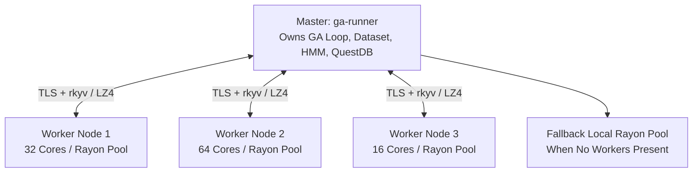
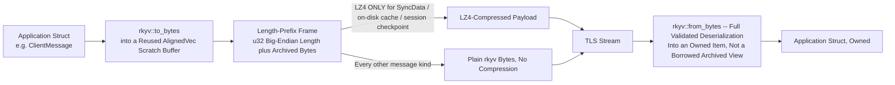
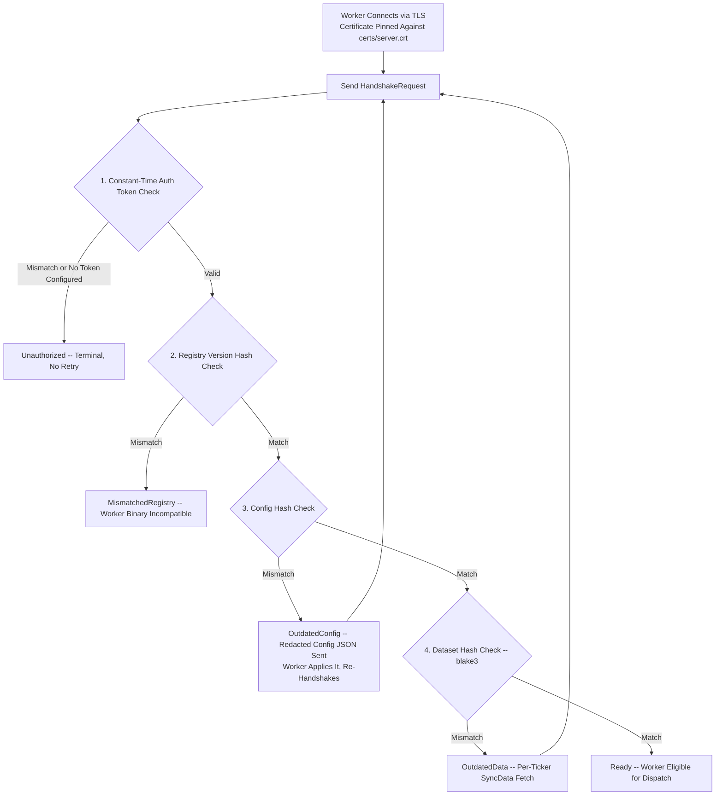
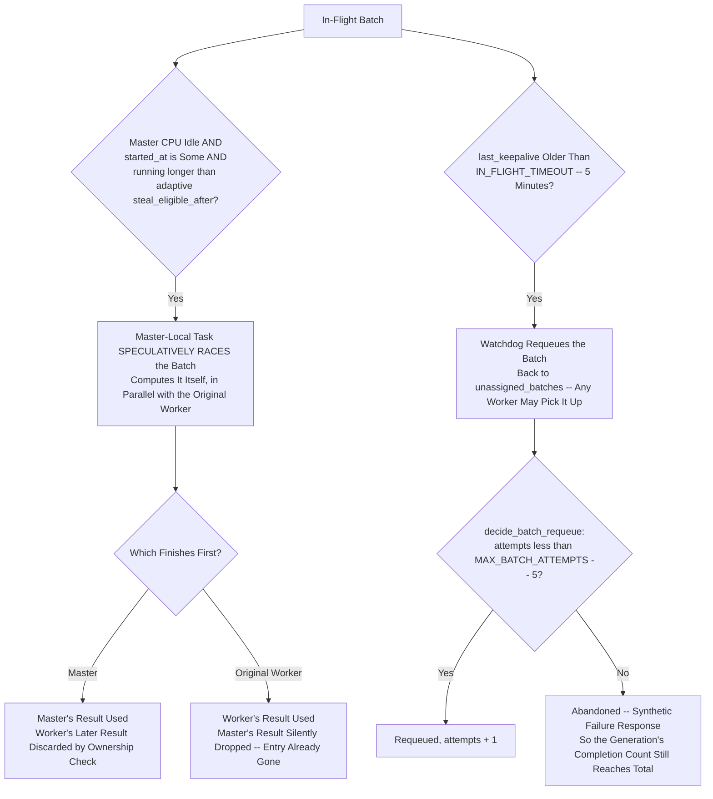

# Chapter 7: Distributed Hive Mind & Transport Architecture

To evolve tens of thousands of strategies across multiple assets in real time, Alpha Suite implements a distributed compute cluster called the **Hive Mind** (`alpha-proto`, `alpha-orchestrator::distributed`, & `alpha-worker`).

This chapter covers the Master-Worker architecture, `rkyv` wire framing over async TLS, shared-secret security, dataset synchronization, batch dispatching, straggler mitigation, fault tolerance, and session persistence — at the same depth as the GP and GA chapters, since this is the largest subsystem by file count in the workspace.

---

## 1. The Hive-Mind Cluster Topology

The Hive Mind operates as a centralized master with dynamic, heterogeneous worker nodes:



### Roles:
- **Master (`apps/ga-runner`)**:
  - Ingests market data and trains the HD-HMM regime model.
  - Orchestrates island populations, NSGA-II sorting, and breeding.
  - Partitions unevaluated populations into `SimulationBatch` payloads.
  - Manages work queues, timeouts, straggler mitigation, and session checkpoints.
- **Workers (`apps/alpha-worker`)**:
  - Connects to master over TLS with certificate pinning and shared secret auth.
  - Synchronizes market dataset and precomputed HMM states.
  - Evaluates simulation batches in parallel on local Rayon thread pools (or a GPU evaluator — §4.6).
  - Returns `WorkerResult` payloads to master.

> [!NOTE]
> **Wire type names, corrected**: the actual `alpha-proto` message enums are `ClientMessage` (worker → master) and `ServerMessage` (master → worker), not `WorkerMessage`/`MasterMessage`. The per-batch result payload is `WorkerResult`, not `BatchResult`. `SimulationBatch` is correct as-is. This correction applies everywhere these names appear in this manual, including the crate inventory in `manual/01` §3.

---

## 2. Wire Framing & Protocol (`alpha-proto`)

Network serialization for millions of genetic AST trees can quickly become a CPU and memory bottleneck. Alpha Suite's transport, `SmolTransport` (`alpha-proto/src/transport.rs`), is a length-prefixed `rkyv` framing codec shared by both ends of the cluster — the same module implements both the worker's and the master's side, so the two can never drift on framing details the way two hand-maintained copies once did.

### 2.1 Every Frame is Raw `rkyv`, Not LZ4
Every single frame on the wire, regardless of message kind, is:
$$[\text{u32 big-endian length}][\text{rkyv-archived payload bytes}]$$
**LZ4 does not wrap every frame.** It wraps only specific, deliberately chosen payloads that are large or already off the hot control path: a `ServerMessage::SyncData` per-ticker candle series, the worker's on-disk `DataCache`, and the master's `GaSessionState` checkpoint file. A `Handshake`, `RequestWork`, `Heartbeat`, `SubmitWork`, or any other control-plane message is plain `rkyv`-archived bytes inside the length prefix — no compression step at all.

### 2.2 Decoding is Full Deserialization, Not Zero-Copy Access
The read side calls `rkyv::from_bytes::<Item, rkyv::rancor::Error>(&read_buffer[..len])` — a full, **validated** deserialization into an owned `Item` — not the zero-copy `rkyv::access` API that hands back a borrowed `&Archived<Item>` view directly over the buffer. This is a deliberate choice forced by the shape of the `Stream`/`Sink` traits `SmolTransport` implements: `Stream::poll_next` returns `Option<Self::Item>`, an *owned* value with no lifetime tied back to `self` — there is no way to hand a caller a reference borrowed from `read_buffer` across that boundary, so the frame has to be fully decoded into an owned value before it can be returned at all.

What IS zero-copy is the buffer *alignment*: `read_buffer` is an `rkyv::util::AlignedVec`, not a plain `Vec<u8>`, so network bytes land pre-aligned for `rkyv` and `from_bytes` never needs an extra copy just to satisfy alignment — unlike the LZ4-compressed payloads above, which decompress into a plain `Vec<u8>` and must be copied into an `AlignedVec` afterward before `rkyv` can touch them. "Zero-copy-friendly aligned buffers, full validated deserialization" is the accurate description — not "zero-copy deserialization" outright.



### 2.3 Protocol Invariants
- **Maximum Frame Length**: `MAX_FRAME_LEN = 1 GiB` — sized against the largest realistic payload (`SyncData`'s "tens to hundreds of MB for a multi-year 1-minute dataset"), with an order of magnitude of headroom.
- **Maximum Decompressed LZ4 Buffer**: `MAX_DECOMPRESSED_LZ4_LEN = 8 GiB` — caps the *decompressed* size a worker will allocate for an LZ4 payload; deliberately well above `MAX_FRAME_LEN` since LZ4 always makes the compressed wire frame smaller than the decompressed data it was built from.
- **Read buffer growth is bounded, not eager**: the untrusted length prefix is never used to `resize`-and-zero a buffer up front — `SmolTransport` grows its read buffer in bounded `256 KiB` steps as bytes actually arrive, so a corrupt or hostile length cannot force an unbounded allocation before a single body byte has landed.
- **Positional Encoding Invariant**: `rkyv` serializes struct fields positionally without schemas. Adding, removing, or reordering a field in any `alpha-proto` type changes the archived byte layout. Both master and workers must be upgraded together — this is documented field-by-field with "Wire compatibility" notes throughout `alpha-proto/src/lib.rs` (e.g. `HandshakeRequest::config_hash`, `SimulationBatch::dispatch_epoch`, `WorkerHeartbeat::started_batches`).

---

## 3. Security, Authentication & the Handshake Ladder

Connecting remote compute nodes over public networks requires strict security. Every worker connection runs through a strict, ordered ladder of checks (`handle_handshake`, `alpha-orchestrator/src/distributed/manager/handlers/handshake.rs`) — each stage gates the next, and the order itself is deliberate, not incidental:



### 3.1 The Four Rungs, in Order, and Why That Order
1. **Auth token, constant-time** (`alpha_core::security::verify_shared_secret`): checked before anything else runs, including before a `SyncData` request becomes reachable — `SyncData` leaks the entire historical dataset and the (redacted) `Config`, so an unauthenticated connection must never reach any later stage. A mismatch, or no token configured on the master at all (fail-closed), returns `HandshakeResponse::Unauthorized` — the one **terminal** outcome on this ladder: no amount of resyncing or registry-updating fixes it, so the worker must stop, not retry.
2. **Indicator registry version hash**: checked next because a mismatch here means the worker binary cannot even interpret the current `IndicatorPeriods`/slot layout correctly — a more fundamental incompatibility than a stale config value, not worth walking the worker through a config resync it can't act on correctly anyway.
3. **Config hash** (`Config::canonical_hash()`): checked *before* the dataset hash so a worker whose candles are already current can converge in one extra round-trip instead of being routed through an `OutdatedData` response it doesn't need. On mismatch, the master's response carries the new config inline as **redacted** JSON (`Config::redacted_for_worker()`) — the real `Config` holds live credentials (the FMP API key, the QuestDB Postgres URI, the HiveMind shared secret itself), and the worker persists whatever it receives straight to plaintext disk, so those secrets are never serialized into the wire payload at all, not merely stripped client-side.
4. **Dataset hash** (`alpha_core::calculate_dataset_hash`, blake3 — not FNV-1a; FNV is used only for the small per-state checksum and the `IndicatorPeriods` structural hash, an unrelated, much smaller hash): on mismatch, `OutdatedData` names the tickers to resync, and the worker requests each via `SyncData`.

Both `OutdatedConfig` and `OutdatedData` are **retryable**: the worker applies what it received, loops back, and re-handshakes — bounded by its own resync/config-sync attempt budgets (`MAX_RESYNC_ATTEMPTS`, `ConfigSyncExhausted` in `apps/alpha-worker/src/main.rs`) so a worker that can never converge eventually gives up loudly instead of looping forever.

### 3.2 Certificate Pinning, Not Hostname Verification
The master generates a self-signed certificate (`certs/server.crt`) the first time it starts. TLS trust here comes **entirely from pinning that one file**, not from verifying a hostname: `WorkerClient::new` builds a root store containing *only* that certificate, and rustls will only complete a handshake with a peer presenting it (or a chain to it) — a real, publicly-CA-issued certificate for the actual `--server-addr` host is still rejected, because it isn't the pinned one. The SNI value sent (`localhost`) is not a claim about the server's real hostname; it only has to satisfy rustls' requirement that it match one of the certificate's baked-in SAN entries.

**This step is easy to miss and breaks every worker silently if skipped**: the operator must copy `certs/server.crt` from the master to each worker out of band (default path `certs/server.crt` relative to the worker's CWD, or pass `--cert` to point elsewhere). Both sides log the certificate's SHA-256 fingerprint at startup specifically so a mismatch after a master-side certificate rotation shows up as two different logged fingerprints instead of an opaque TLS handshake failure — check those two log lines first when a worker can't connect at all.

---

## 4. Batch Dispatch, Heartbeats & Straggler Mitigation

### 4.1 Lock-Order Architecture
The master's `WorkerManager` manages concurrent queues under high async load. To prevent deadlocks, mutex acquisition follows a strict lock hierarchy whenever a code path needs both locks together:
$$\text{Acquire } \texttt{unassigned\_batches} \longrightarrow \text{Acquire } \texttt{in\_flight\_batches}$$
`RequestWork` is the reason this order exists — it is the one call site that genuinely needs both held together, to move a batch atomically from unassigned to in-flight. Every other multi-lock site (`SubmitWork`'s length-mismatch path, the per-connection disconnect teardown, the watchdog sweep) conforms to this same order; a site that only ever needs one lock at a time is exempt.

### 4.2 A Worker Holds Five Independent Connections
A worker maintains **five** simultaneous TLS connections to the master, each authenticating itself independently: `control` (handshake, `RequestWork`, `SyncData`), `submit` (`SubmitWork`), `heartbeat` (`WorkerHeartbeat`), `fail` (`FailWork`), and `telemetry` (GUI query traffic — `QueryRuns`/`QueryTelemetry`/`QueryStrategyStates`). This is deliberate isolation against head-of-line blocking: a multi-megabyte `SubmitWork` payload must never queue behind (or in front of) a time-sensitive `Heartbeat` or a `FailWork` report, and a long `SyncData` transfer on `control` must never freeze the GUI's telemetry panel. `fail` was split out of `submit` specifically because `FailWork`'s entire purpose — telling the master about a failure immediately instead of waiting out the 5-minute watchdog timeout — is defeated if it queues behind `submit`'s own five-step retry ladder (worst case ~9.6s, or up to ~405s under network degradation).

**Batch ownership is keyed on the worker's authenticated identity, not on any one connection's session id.** `InFlightBatch::owner_worker_id` holds `HandshakeRequest::worker_id` — the identity established at handshake time — precisely because `RequestWork` (which dispatches and records ownership) always arrives on `control`, while `SubmitWork`/`FailWork` (which resolve it) arrive on entirely different connections with their own independent session ids. Keying ownership on session id instead (an earlier bug) meant those never matched, so every remote result was rejected as unowned and silently discarded as a "late result." `take_owned_batch` centralizes this check: it only removes an in-flight entry when the caller's `worker_id` still matches the recorded owner, closing a race where a watchdog-reassigned batch's original (now-late) worker could otherwise yank the entry back out from under its new owner.

### 4.3 Worker Heartbeats — What They Actually Carry
`WorkerHeartbeat` carries exactly two fields: `worker_id` and two batch-id lists —
- `active_batches`: **every** batch this worker currently holds, queued or running.
- `started_batches`: the strict subset that has actually been dequeued and handed to a CPU (or GPU) thread.

**There is no CPU count and no memory-utilization field on the heartbeat.** Core count is reported once, at handshake time, as `HandshakeRequest::available_cores` — it does not change per-heartbeat. The `active`/`started` split is what lets the master distinguish "this worker is alive and merely has a full local queue" from "this worker has actually begun computing this batch," which neither work-stealing eligibility nor the watchdog's dead-worker detection could otherwise tell apart.

### 4.4 Two Distinct Mechanisms, Not One "Work Stealing" Algorithm
The manual previously described a single work-stealing algorithm that reassigns a stalled batch "to the fastest idle worker." That is not what happens — there are **two separate, independently-triggered mechanisms**:



**Mechanism 1 — Master-local speculative racing** (`local_fallback.rs`): when the master's own CPU is idle (no batches to self-pop, or GPU workers are handling dispatch — see §4.6), it looks for a genuine straggler: an in-flight batch with `started_at: Some(_)` (a worker has confirmed it actually started, per `started_batches`) that has been running longer than an *adaptive* `steal_eligible_after` timeout (scaled from `distributed.steal_eligible_after_secs` by the batch's actual size relative to `distributed.batch_size`). The master then computes that same batch **itself**, racing the original worker. Whichever result arrives first wins: `take_owned_batch`-style removal means the loser's result finds nothing left to resolve and is silently dropped — no explicit "steal" message is ever sent to the original worker, and it is never told to stop; it simply finishes wasted work. A batch that is merely queued (`started_at: None`) is never a race candidate — racing non-started work would just manufacture guaranteed duplicate computation for no benefit, since an idle master core is strictly cheaper than a race the master might lose anyway.

**Mechanism 2 — Watchdog requeue on silence** (`watchdog.rs`, sweeping every `WATCHDOG_INTERVAL` = 15s): answers a different question — not "is this worker slow," but "has this worker gone completely silent." Any in-flight batch whose `last_keepalive` (refreshed by every heartbeat that lists the batch in `active_batches`, whether queued or running) has not been refreshed in over `IN_FLIGHT_TIMEOUT` (5 minutes) is presumed to belong to a dead worker and is moved back to `unassigned_batches` — re-fetched by re-checking the entry hasn't been refreshed in the window since the sweep's initial snapshot, closing a TOCTOU race against a heartbeat landing concurrently. Bounded by `decide_batch_requeue`'s retry budget (`MAX_BATCH_ATTEMPTS = 5` attempts total, across every worker and the local fallback combined — deliberately higher than any single worker's own local retry budget, since this one has to survive a batch bouncing between several different workers); once exhausted, the batch is **abandoned**: a synthetic failure response is sent so the generation's completion accounting still reaches its total (§4.7) rather than hanging forever.

A **clean disconnect** on the `control` connection is handled immediately and separately from both of the above: the moment a session that has ever dispatched work drops its `control` connection, every batch it owns is swept and requeued (or abandoned, same retry budget) right then — it does not wait for the 5-minute watchdog timeout. The other four connections' disconnects (`submit`, `heartbeat`, `fail`, `telemetry` — §4.2) are exempt from this sweep, since dispatch always originates on `control`: those sockets reconnect and re-authenticate automatically on next use, and sweeping on their routine blips would requeue batches out from under a perfectly healthy worker.

### 4.5 Dispatch Epochs — Why `generation_id` Alone Is Not Enough
Every `SimulationBatch` carries a `dispatch_epoch: u32` alongside `generation_id`. The two answer different questions: `generation_id` can legitimately **plateau** at the same value for an entire run when `ga.wait_for_first_result = true` against a fitness landscape where no individual ever scores positive (`meaningful_gen_found` in `ga_loop::run_ga_loop_internal` deliberately holds it there) — in that state, `generation_id` alone cannot distinguish "this dispatch round" from "the previous one," which degrades staleness checks that key on it to always-true. `dispatch_epoch` has no such plateau: it advances by exactly one on every single `evaluate_islands` call regardless of GA progress, giving the receive loop and the worker's own queue-staleness check (`master_dispatch_epoch`, refreshed via `fetch_max` from `ServerMessage::HeartbeatAck::dispatch_epoch` so an out-of-order ack can never move it backwards) an always-meaningful signal. A worker drops a still-QUEUED batch stamped with an older `dispatch_epoch` before ever marking it started — but deliberately does **not** interrupt a batch already RUNNING on a fresher epoch: interrupting wastes partial work and stalls the pipeline, and the master has already purged such batches from its own in-flight accounting by the time an interruption could act on the signal anyway.

**F15/5.1.1 — explicit cancel signal.** `WorkerManager::purge_queues` (called at the top of every `evaluate_islands`, before that call's own `next_dispatch_epoch`) now also stamps `cancel_before_epoch`: one past the `dispatch_epoch` value of the generation it just discarded, i.e. "every batch dispatched under an epoch strictly less than this belongs to a boundary this master has already thrown away." The `Heartbeat` handler reads it into `ServerMessage::HeartbeatAck::cancel_before_epoch`, a worker folds it into its own tracker via the same `fetch_max` non-regression guard `dispatch_epoch` already uses, and `check_batch_admission` (`apps/alpha-worker/src/worker_loop/compute.rs`) rejects a still-QUEUED batch whose `dispatch_epoch` is cancel-eligible (`alpha_core::dispatch::is_cancel_eligible`) with `FailWorkReport { reason: "cancelled" }`, distinct from the pre-existing `"superseded dispatch epoch"` rejection so the two causes stay distinguishable in the master's logs. This is a second, independent gate alongside the `dispatch_epoch` staleness check above — not a replacement for it — and inherits the same scope limitation: only a still-QUEUED batch is ever dropped this way. A batch already handed to `evaluate_batch_tiered` still runs to completion; true between-individuals interruption on a dispatch-epoch basis would need a second, epoch-keyed interruption channel threaded through `alpha_simulation::engine::evaluate_batch_tiered` alongside its existing generation-id-keyed `latest_seen_gen`/`SimulationInterrupted` mechanism (local-path-only today).

### 4.6 GPU Workers
A worker reports `has_gpu` and `gpu_batch_capacity` at handshake time (`HandshakeRequest`). When GPU workers are active (`WorkerManager::has_active_gpu_workers`), the master's local-fallback CPU task deliberately suppresses its own batch-popping (§4.4, Mechanism 1's idle-CPU condition), reserving 100% of master CPU capacity for GA evolution, DB logging, and network handling instead — unassigned batches are left for GPU workers to pull via `RequestWork`, which sizes how many pre-chunked batches to hand out per round-trip from the worker's reported capacity rather than always handing out one. On the worker side, a GPU-capable worker runs a dedicated coalescing pipeline (`worker_loop/compute.rs::run_gpu_pipeline`): instead of one kernel launch per ~`distributed.batch_size`-individual `SimulationBatch` (which left an A100 at ~0.1% occupancy), it drains every batch already sitting in its local queue — up to `--gpu-capacity` individuals' worth, never across a `generation_id` boundary — into ONE `evaluate_batch_tiered` call, then splits the flat result back into per-batch `WorkerResult`s. Each constituent batch is still admission-checked, marked started, and failure-reported individually, so the master's accounting never sees the group as one unit. The same batching principle drives `manual/12`'s column-cache work on the master's own full-history GPU stage.

### 4.7 Generation Completion Accounting
`evaluate_islands` waits on a response channel until every individual in the generation has a result. A long list of independent code paths (`SubmitWork` success and length-mismatch, `FailWork`, the disconnect teardown, the watchdog sweep, and the master-local task's success and failure sub-branches) each independently remove an entry from `in_flight_batches`, and every one of them is individually responsible for either requeuing it or producing a response — there is no central coordinator enforcing this. `GENERATION_STALL_TIMEOUT` (15 minutes, reset every time a response is actually counted — not a total-elapsed budget) exists as a backstop against a future change to any one of those paths silently breaking that contract and hanging a run forever with no explanation. It is deliberately sized at 3× `IN_FLIGHT_TIMEOUT`, so a batch the watchdog has to requeue (which can itself take up to 5 minutes to notice) still has a full watchdog cycle plus headroom to be picked up and completed before the stall timeout gives up on the generation.

---

## 5. Fault Tolerance & Fallback

The Hive Mind is designed to be resilient against node failures, through the two distinct mechanisms in §4.4:
- **Worker Crash (clean TCP disconnect)**: A dropped `control` connection is detected immediately — its in-flight batches are swept and requeued (or abandoned, per the retry budget) right away, with no 5-minute wait.
- **Worker Gone Silent (no clean disconnect — network partition, wedged process)**: Caught only by the watchdog's periodic sweep, up to `IN_FLIGHT_TIMEOUT` (5 minutes) after the worker's last heartbeat.
- **Total Cluster Outage**: If no worker is actively computing a given batch, the master-local fallback (§4.4) self-pops unassigned work directly — `ga-runner` never halts the GA loop for lack of workers, whether that's because none ever connected or all have disconnected.
- **Dynamic Scale-Out**: New workers can connect mid-run and immediately begin receiving simulation batches without restarting the master, subject to the handshake ladder in §3.1.

---

## 6. Session Persistence & Checkpointing (`session.rs`)

Long-running genetic evolution runs must survive server reboots and interruptions.

Every `SESSION_SAVE_INTERVAL = 5` generations, the master serializes a full `GaSessionState`:
- Saved to: `ga_session_<run_id>_<generation>.bin.lz4`.
- Stores island populations, generational numbers, Hall of Fame state, and the exact RNG seed coordinate.
- Allows resuming full research runs seamlessly via:
  ```bash
  ga-runner --config config.toml resume --session-file ga_session_xxx_25.bin.lz4
  ```
