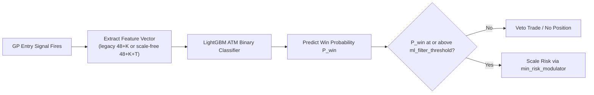
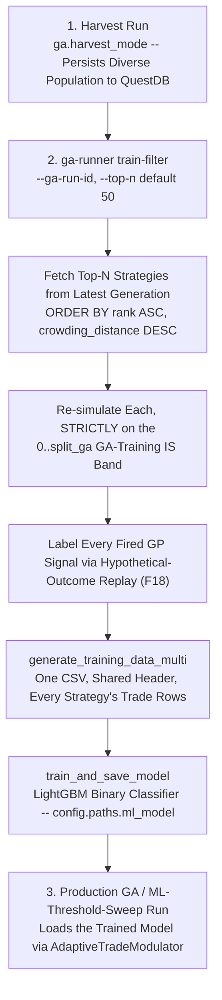
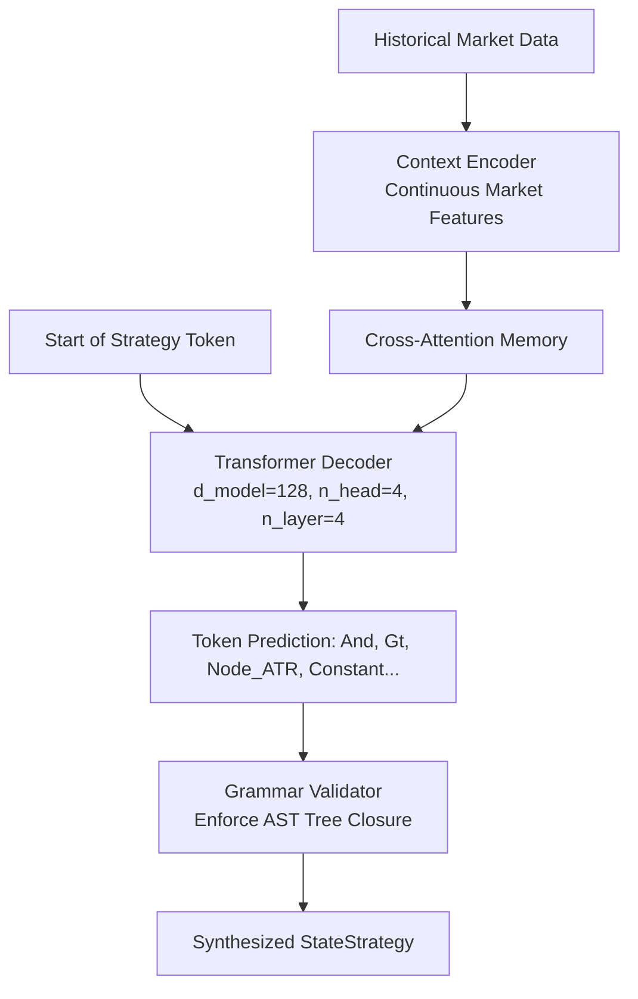

# Chapter 8: Machine Learning Filter & Neural Architect

Alpha Suite bridges symbolic evolutionary intelligence with modern deep learning. This chapter covers the two primary neural/ML components:
1. **The LightGBM Adaptive Trade Modulator (ATM)** (`alpha-simulation::ml_filter`): A gradient-boosted decision tree filter that modulates trade sizing and vetoes false-breakout signals based on market context.
2. **The Alpha Architect Transformer** (`alpha-nn`): An autoregressive sequence model that generates valid, high-performing GP strategy ASTs conditioned on market regime embeddings.

---

## 1. The LightGBM Adaptive Trade Modulator (ATM)

Even an optimal symbolic rule (e.g., `RSI < 30 AND Close > BollingerLower`) can produce false signals if the broader market context is hostile (e.g., high thermodynamic entropy or extreme downside volatility).

The **Adaptive Trade Modulator (ATM)** acts as an intelligent trade filter:



### A. Feature Extraction — Two Selectable Layouts (F18)
`alpha-simulation/src/ml_filter/features.rs` is the **single shared implementation** used at both inference (the engine, when a GP entry signal fires) and training-data generation (`training.rs`) — the two used to be two independently hand-rolled copies that could silently drift; keeping them unified means the model is always scored on exactly the feature layout it was trained on. As of F18 there are two selectable layouts, chosen at training time by `ml_filter.feature_set` (`manual/10` §8) and recorded per-model (§D below) so an already-trained model always predicts under the layout it was actually trained with, independent of the live config:

**`"legacy"`** — `build_ml_feature_vector`, output length `FEATURE_COUNT + num_hmm_states = 48 + K`. This is the ORIGINAL layout, frozen by convention (not enforced by the type system): every model trained before F18 (or explicitly with `feature_set = "legacy"`) depends on this exact ordering — new legacy features must be appended at the end; existing slots must never be reordered or removed.
- **Slot 0**: `gp_signal_score` — a constant `1.0` at inference, the actual evaluator output (`0.0`/`1.0`) at training time.
- **Slots `1..1+K`**: one-hot encoding of the active HMM state, `K = num_hmm_states` wide.
- **The remaining 47 slots**: MCV features (trend intensity, volatility state, directional efficiency, velocity), classic momentum/volatility indicators (RSI, **raw** ATR, normalized ATR, Stochastic, %B, Bollinger width, ROC, log return), volume (**raw** OBV, volume oscillator, volume imbalance), the physics family (kinetic/potential energy, Lagrangian, phase-space angular velocity/radius, momentum acceleration, microstructural entropy, thermodynamic entropy/temperature), Hurst exponent, return skewness, price correlation, distance-to-VWAP/SMA, high-low disparity, close-location value, liquidation cascade probability, kinematic jerk, HMM persistence/regime-stability, the two aggregate-timeframe indicator triples (`_agg1`/`_agg2`, including **raw** ATR), the **lagged raw close price**, and the active strategy's own `atr_multiplier`/`reward_ratio`/`base_risk_per_trade` genes.

**`"scale_free"`** (default for new models) — `build_scale_free_feature_vector`, output length `SCALE_FREE_FEATURE_COUNT + num_hmm_states + num_tickers = 48 + K + T` (plus one more slot if `include_taken_flag` is set). Raw ATR/OBV/lagged-close differ by orders of magnitude across a five-figure BTC and a fractional-cent memecoin, so a model trained across many tickers under the legacy layout effectively has to relearn per-asset magnitude thresholds instead of a scale-independent pattern. The core 47-slot block is IDENTICAL to legacy except five 1:1 replacements at the same slot positions:
- **ATR (`atr_raw_1m`, `atr_raw_agg1`, `atr_raw_agg2`)** → divided by the current close (a ratio, invariant to the asset's price level).
- **OBV (`obv_1m`)** → a rolling 1440-bar (24h of 1-minute candles) z-score instead of the unbounded cumulative raw value.
- **Lagged close** → `ln(close / lag_close)`, the log-return FROM the lagged close TO the current close, instead of the lagged close's raw price.

Appended after the core block: a **categorical asset id** — a one-hot over the run's ticker list (sorted, for determinism), `T` wide — so the model can still learn asset-specific idiosyncrasies without the excluded raw-price-scale reads smuggling that information back in. If `ml_filter.include_taken_flag` is set, one final slot records whether this row's signal was actually executed (see §C below).

### B. Risk Modulation & Execution
- **`ml_filter_threshold`** (e.g. $0.65$): If predicted win probability $P(\text{Win}) < \text{threshold}$, the trade is vetoed.
- **`min_risk_modulator`** (e.g. $0.25$): For signals passing the threshold, position size is linearly scaled between `min_risk_modulator` and $1.0$ based on model confidence:
  $$\text{Risk Modulator} = \text{min\_risk\_modulator} + (1.0 - \text{min\_risk\_modulator}) \times \frac{P(\text{Win}) - \text{threshold}}{1.0 - \text{threshold}}$$
- **`ml_filter.min_threshold`** (config key, default $0.5$, validated to `[0.0, 1.0]`): the floor the *swept, winning* `ml_filter_threshold` (§C.7 below) must meet or exceed before the post-GA pipeline bothers activating a modulator at all (`ml_filter_threshold >= min_threshold`, checked once against the winning threshold — not per-trade, unlike the two rows above). Exists so a deployment can tune how conservative the sweep's own decision to gate at all must be, independent of code.

### C. Training Workflow: `harvest → train-filter → production run`
The LightGBM filter is not trained as an automatic side effect of a GA run — it has its own explicit step in the operator workflow, wired through `ga-runner train-filter` (`alpha-orchestrator::train_filter::run_train_filter`):



1. **Harvest run**: `config.ga.harvest_mode` persists a diverse population's strategies to QuestDB (`ga_strategies` and related tables) across the run — the raw material `train-filter` draws from.
2. **`ga-runner train-filter --ga-run-id <id> --top-n <N>`** (default `top_n = 50`): resolves the run (interactively, if `--ga-run-id` is omitted), fetches its **latest completed generation's** top-`N` strategies by NSGA-II rank (then crowding distance as the tie-break — the same "best, most diverse" ordering `resume-db` uses), and reconstructs their genomes from the DB.
3. **Strict in-sample re-simulation**: every reconstructed strategy is re-run **only** on `0..split_ga` — the exact same "GA Training (IS)" band the GA itself trained on (`run.rs::calculate_data_splits`). This is load-bearing, not incidental: training the filter past `split_ga` would leak the ML-Train (60–75%), ML-Sweep, and Validation-Test (80–100%) out-of-sample bands into a model that is later used to gate strategies scored against exactly those bands.
4. **Labels come from a hypothetical-outcome replay of EVERY fired signal, not just executed trades (F18)**: `write_result_trade_rows` used to only emit a training row when a bar's timestamp matched an EXECUTED trade in `result.all_trades`, labeled with that trade's realized `outcome_risk_multiple`. `result.all_trades` is a biased subsample of every bar the GP entry evaluator actually fires on — a signal that fires while a position is already open, during cooldown, or (in a modulated run) one an ML gate itself rejects, never appears there — so training exclusively off it never showed the model what a non-executed signal's outcome would have been. Every bar the active state's entry evaluator fires on is now labeled with `engine::utils::calculate_hypothetical_outcome` — the SAME frictionless, run-forward-to-exit methodology the forensic log already uses for `ForensicDataPoint::actual_outcome_r` — regardless of whether it was ever actually executed: `target_outcome = 1.0` if the hypothetical outcome R is `> 0.0`, else `0.0`. Whether a row's signal was actually executed is preserved as the optional `taken` feature (`ml_filter.include_taken_flag`, `"scale_free"` only) rather than a gate on which rows exist. Features are captured via `build_ml_feature_vector`/`build_scale_free_feature_vector` (per `ml_filter.feature_set`) at the candle the signal fired on.
5. **One CSV, multiple strategies**: `generate_training_data_multi` folds every reconstructed strategy's trade rows into a single training CSV under one shared header (every result must agree on `num_hmm_states`, since the one-hot HMM block's width is sized from it) — training the shared gate on the union of several strategies' trades, not just one, so it learns what a good/bad entry looks like across styles rather than overfitting to a single strategy's idiosyncrasies.
6. **`train_and_save_model`** trains a LightGBM binary classifier (`config.ml_filter.lightgbm_params`) on that CSV and saves it to `config.paths.ml_model` — the file `ml_filter::model::AdaptiveTradeModulator::new` loads at inference time.
7. **Downstream, the threshold is swept separately**: after a production GA run, the post-GA pipeline (`manual/09` §1, `pipeline::select_ml_threshold`) sweeps `ml_filter_threshold` over the 60–75% "ML Train (OOS)" band — a *different* stage from training the model itself. Training decides what the model knows; the sweep decides how conservatively to act on its predictions. The sweep constructs the `AdaptiveTradeModulator` **once, up front** (a missing/unreadable `config.paths.ml_model` just logs a warning and skips the sweep — identical to a run with no model at all) and passes that SAME modulator into `run_simulation` for every candidate threshold `t` in `0.0, 0.05, ..., 0.95`, so each candidate's `BacktestResult` genuinely differs; each is scored with the identical fitness the GA itself uses (`calculate_log_utility_fitness`, over the real day count of the ML-Train band, not a placeholder), the highest-scoring threshold wins, and ties break toward the LOWER threshold (fewer rejected trades). A modulator is only actually wired into the post-GA Execute/Ensemble stages if the winning threshold also clears `ml_filter.min_threshold` (§B above). The full per-threshold table (threshold, score, trades, approved/rejected counts) is logged at `info` level for every sweep.

### D. Feature Schema Versioning (F18)
Every time `train-filter` generates training data (step 5 above), it also writes `<config.paths.ml_model>.schema.json` alongside the CSV, recording which feature layout the model it is ABOUT to train will use:
```json
{
  "feature_set": "scale_free",
  "feature_schema_version": "scale_free_v1",
  "tickers": ["BTC", "ETH", "SOL"]
}
```
`tickers` (the run's sorted ticker list) is only populated for `"scale_free"` — it fixes the asset-id one-hot's width and per-ticker index assignment so inference reconstructs the IDENTICAL one-hot, rather than re-deriving "the run's ticker list" from whatever data happens to be loaded when the model is later used to predict (a symbol added, removed, or delisted between training and inference would otherwise silently misalign the one-hot).

`AdaptiveTradeModulator::new` reads this file back before ever loading the model itself:
- **No schema file** (a pre-F18 model): treated as `FeatureSet::Legacy` with a `warn!` log — old models keep loading and predicting exactly as before, with no `.schema.json` required.
- **Schema file present, version matches** what this build currently implements for that `feature_set` (`legacy_v1` / `scale_free_v1`): the model loads normally, and the `AdaptiveTradeModulator` remembers the model's OWN `feature_set` — not the live config's — for building every subsequent `predict_outcome` feature vector. A deployment can flip `ml_filter.feature_set` for the NEXT training run without breaking predictions from an already-trained model of the other kind.
- **Schema file present, version does NOT match**: `AdaptiveTradeModulator::new` returns an `Err` naming both the model's stale version and the version this build currently expects, rather than silently feeding a differently-shaped vector into a booster trained on a different layout. Retrain the model (or restore the matching binary) to resolve it.

---

## 2. The Alpha Architect: Strategy Transformer (`alpha-nn`)

The **Alpha Architect** is an autoregressive Transformer model designed to synthesize complete trading strategies directly as symbolic token sequences:



### Architecture Specifications:
- **`d_model`**: 128 (hidden representation dimension).
- **`n_head`**: 4 multi-head attention heads.
- **`n_layer`**: 4 Transformer decoder layers.
- **Grammar Tokenizer (`tokenizer.rs`)**: Maps AST nodes (`And`, `Or`, `Not`, `CmpGt`, `PushNode(id)`, `Constant(val)`, `Sma(period)`) to discrete token IDs.

---

## 3. Neural Seeding (`use_neural_seeding`)

In traditional genetic algorithms, generation 0 starts from completely random ASTs, requiring many generations to discover basic trading structures. Neural seeding gives the population a head start by injecting Transformer-generated strategies — but not the way the config's `seeding_ratio` key might suggest.

### What Actually Happens: Every Generation, a Fixed Small Batch — Not an 80/20 Split
`generate_neural_suggestions` (`alpha-orchestrator/src/ga_loop/neural.rs`) is called **once per generation** from the main GA loop — not only at generation 0 — whenever `config.nn.use_neural_seeding` is true and `config.nn.model_path` exists. Each call requests exactly **5 candidate strategies** (a fixed loop count, `for _ in 0..5`), quality-conditioned via a `quality_target` passed to the generator, and decoded with a deterministic RNG stream keyed on `(base_seed, generation)` — so the same generation of the same run always decodes the same 5 candidates. Those (deduplicated by genome hash) are injected directly into `offspring` at the top of `MultiObjectiveGA::evolve` — for `evolve`'s very first call (an empty population), they seed `initialize_population` itself; for every subsequent generation, they are added alongside the crossover/mutation/random-fill offspring the rest of `evolve` produces.

**`config.nn.seeding_ratio` (default `0.2` in code; `0.8` in the shipped `config.toml`/`config.harvest.toml`/`config.pgo.toml`/`config.bolt.toml`) is a real, parsed config field that is not read anywhere in the seeding code path** — not in `ga_loop`, not in `nsga2::evolution`. There is no 80%-neural/20%-random split, and neural seeding is not confined to generation 0: it is a small, constant-size injection (5 candidates) repeated every generation for the life of the run, not a proportional share of the population at any point. Treat `seeding_ratio` as dead configuration until it is actually wired into the injection logic.

---

## 4. Wave 6 Corrections (F33 Deterministic Inference; F34 Training Objectives; F25 Period-Complete Decoder)

The 2026-09-03 review found four defects in this chapter's model: generation was not reproducible for a fixed seed (F33), two of the three training objectives could not teach what they claimed to (F34), and the decoder only ever restored 4 of the (now) 31 `IndicatorPeriods` fields plus none of `StrategyParams` (F25). All four are fixed as of this wave; `nn.use_neural_seeding` still defaults to `false`.

### 4.1 F33 — `Generator::generate` is now deterministic for a fixed seed

Two independent sources of non-determinism used to sit inside a single call to `Generator::generate`:
- **Dropout stayed active during inference.** `CausalSelfAttention::forward` hardcoded `Dropout::forward_t(&att, true)` regardless of caller, so every sampling step inside `generate_tree` zeroed out a random subset of attention weights — from `dropout`'s own internal RNG, never exposed to the caller at all. `StrategyTransformer::forward`, `Block::forward` and `CausalSelfAttention::forward` now all take an explicit `train: bool`: `training.rs`'s `Trainer::train`/`train_and_report_loss` pass `true`; `Generator::generate_tree` passes `false`.
- **The categorical sampler drew from `rand::rng()`.** `Generator::sample` used the OS-entropy thread RNG, unrelated to any seed the caller had in hand. `Generator::generate`, `generate_tree` and `sample` now take a `rng: &mut StdRng` parameter instead. `alpha_orchestrator::ga_loop::neural::generate_neural_suggestions` passes the SAME `StdRng` (built once from `alpha_ga::rng_seed::seeded_rng(base_seed, &[tags::NEURAL_SEEDING, generation])`) into both `generate` and the subsequent `Tokenizer::decode` call, so a fixed `(base_seed, generation)` now reproduces both which tokens are generated and how they decode into a genome, end to end.

**`nn.inference_device`** (new key, default `"cpu"`): `Generator` now runs on whichever device `alpha_nn::inference::resolve_inference_device(&config.nn.inference_device)` resolves to. `"cpu"` (the default) forces CPU — candle's CUDA/Metal kernel selection and reduction order are not bit-deterministic across runs even for an identical batch, which would silently undermine the seeding fix above if inference ran on an accelerator. `"auto"` opts back into `regime_context::get_device`'s CUDA/Metal-preferring selection for a caller that wants throughput and knowingly accepts giving up bit-for-bit reproducibility. Training (`Trainer::new`) is unaffected and still prefers an accelerator when available — see `Trainer::train`'s own doc comment for why that path's non-determinism is already priced in.

### 4.2 F34.1 — the training loss is now masked to non-PAD targets

`Trainer::prepare_batch` right-pads every sample in a batch to the batch's longest sequence with `TOKEN_PAD`. The old `candle_nn::loss::cross_entropy` averaged over EVERY position, PAD included — since the correct "next token" at a padded position is always the same constant symbol, a batch dominated by short sequences padded out to a long one let the loss (and its gradient) be dominated by an objective unrelated to generating strategies. `training.rs::masked_cross_entropy` now computes per-token negative log-likelihood, multiplies by a `(target != TOKEN_PAD)` mask, and divides by the mask's sum — appending more PAD to a batch no longer changes the reported loss (`crates/alpha-nn/src/training.rs`'s `f34_pad_tokens_do_not_change_masked_loss` test asserts this to within `1e-6`).

### 4.3 F34.2 — the "elite" harvest is ranked, not random

`DatasetLoader::load_elite_strategies`'s query used to be `ORDER BY random() LIMIT $1` — a training corpus with no relationship between a row's quality and its chance of being included. It now fetches the `top_k` best rows (`ORDER BY COALESCE(robustness_score, total_pnl) DESC`, `robustness_score` sourced from a per-`params_hash` max over `ga_runs` when that table/column is available, falling back to `total_pnl`-only ranking on any query error) plus a stratified random sample of the remainder (`alpha_nn::dataset::select_elite_indices`, pure and unit-tested with fake `EliteCandidate` rows). The split point and stratification width are configurable via the new `[nn.dataset]` table (`mix_fraction`, default `0.3`; `strata`, default `5`); the remainder sample's RNG is seeded via the new `alpha_ga::rng_seed::tags::NN_DATASET` tag, keyed on `config.ga.seed` (or a fixed constant when unset, since harvesting is not tied to a live GA run). `dataset.rs`'s query also now selects `direction`, so `Tokenizer::encode`'s training data reflects the strategy's actual evolved side instead of a hardcoded `Long` placeholder.

### 4.4 F34.3 — the context model predicts the future, not its own input

`ContextTrainer` used to reconstruct the MEAN of its OWN input snapshot — a trivial, always-satisfiable objective that could not teach anything about market dynamics. `DatasetLoader::load_context_data` now builds ordered `(timestamp, flattened per-asset features)` snapshots (a single pass over the already-`ORDER BY timestamp ASC`-sorted rows, replacing a `HashMap` grouping that silently discarded that order) and pairs each snapshot with the one immediately following it (`dataset.rs::build_context_pairs`, unit-tested); the target for snapshot `t` is the actual per-asset feature MEAN at `t+1`. The alternative considered was a contrastive objective (pull the correct next-snapshot embedding closer than a batch of negatives); MSE-to-the-actual-next-vector was chosen for a first-cut fix because it needs no negative-sampling scheme and is directly comparable to the metric already reported (`avg_loss` in the training log). Architecture dims (`input_dim`/`d_model`/`n_head`, previously hardcoded `5, 128, 4` at the `MarketContextTransformer::new` call site) now come from `[nn.context_model]` via `ContextTrainer::with_dims`; `apps/nn-trainer`'s `train-context` subcommand wires this through, `alpha_orchestrator::run`'s `auto_train` convenience path still uses the matching (5, 128, 4) struct default.

### 4.5 F25 (6.2.4) — the decoder now restores the whole genome

Before this wave, the token stream carried only 4 of `IndicatorPeriods`' (now 31) fields (`atr`/`rsi`/`stochastic_k`/`roc`) and none of `StrategyParams` — every other field decoded to `Default::default()` regardless of what the model generated. The grammar (`grammar.rs`) adds two new token families:
- **`PeriodBucket0`..`PeriodBucket4`** (ids 130-134, `NodeType::PeriodBucket`): a relative quantile-of-this-field's-own-`[min,max]`-bounds bucket, reinterpreted by fixed sequence POSITION rather than by absolute value — deliberately a different `NodeType` from the GP-tree-internal `TimeScale` tokens (`TsScalp`..`TsMacro`, still used unchanged inside `Sma`/`StdDev`/`Lag` nodes) so the two can never be confused by `Generator::apply_grammar_mask`.
- **`DirectionLong`/`DirectionShort`** (ids 135-136, `NodeType::Direction`): encodes `StrategyParams::direction`.

`VOCAB_SIZE` stays `256` — both new families land in a gap the grammar already had below 256. After the exit tree, `Tokenizer::encode`/`decode` now walk, in `IndicatorPeriods`' own struct declaration order, all 31 period fields, then `atr_multiplier`/`reward_ratio`/`cooldown_period`/`base_risk_per_trade` (bounds for all 35 copied from `alpha_config::ga`'s `IndicatorPeriodsSearchSpaceConfig`/`GaSearchSpaceConfig` for the 26 GA-searched fields, from `ga-strat-editor`'s `PeriodFieldMeta` table for the 5 `mcv_*` calibration-only fields), then one `Direction` token. Decoding a bucket draws a within-bucket jitter value from the caller's seeded RNG (`tokenizer::decode_bucket_value`) — the bucket choice is fixed by the token, only the exact value inside it is randomized. `ml_filter_threshold` is deliberately still not encoded: F02's harvesting confirmed it stays inert under evolution, so there is no training signal that could teach a value for it.

**A model trained before this wave is invalidated by this change** — not because the vocabulary size grew (it didn't), but because the fixed tail section's LENGTH and semantics changed (4 `TimeScale` draws → 35 `PeriodBucket` draws + 1 `Direction` draw). A `strategy_brain.safetensors` produced by an older build will still load (the embedding/`lm_head` tensor shapes are unchanged, since `VOCAB_SIZE` didn't move) but its learned association between "position N after the exit separator" and "which field" no longer matches this decoder's expectations, so its tail-section output should be treated as meaningless until it is retrained with `nn-trainer train`. No such file is checked into this repository; this note is for any already-deployed model.
