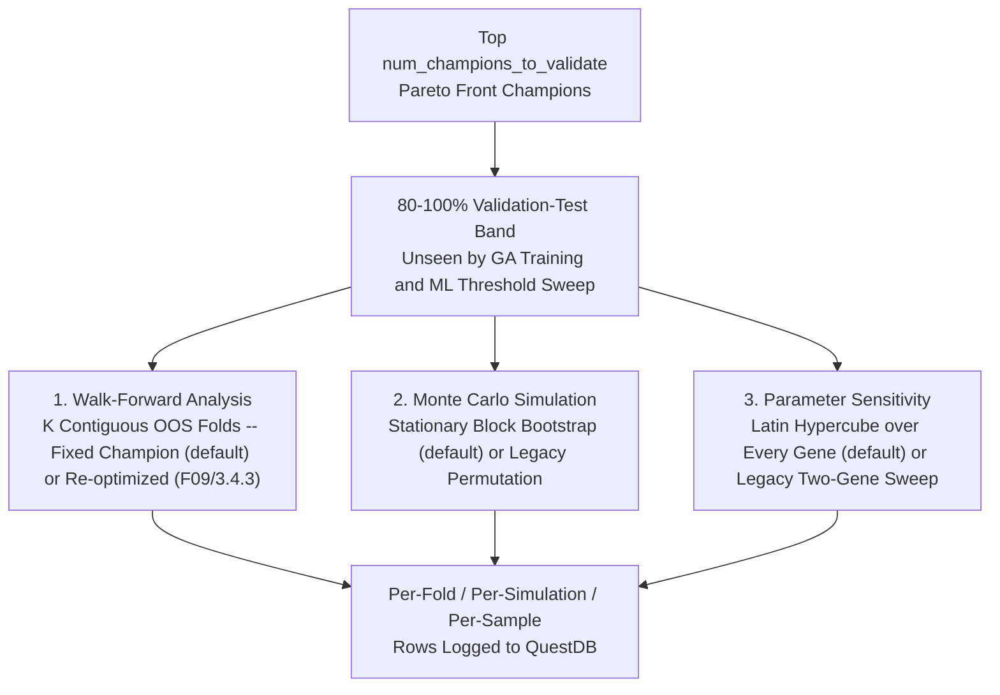
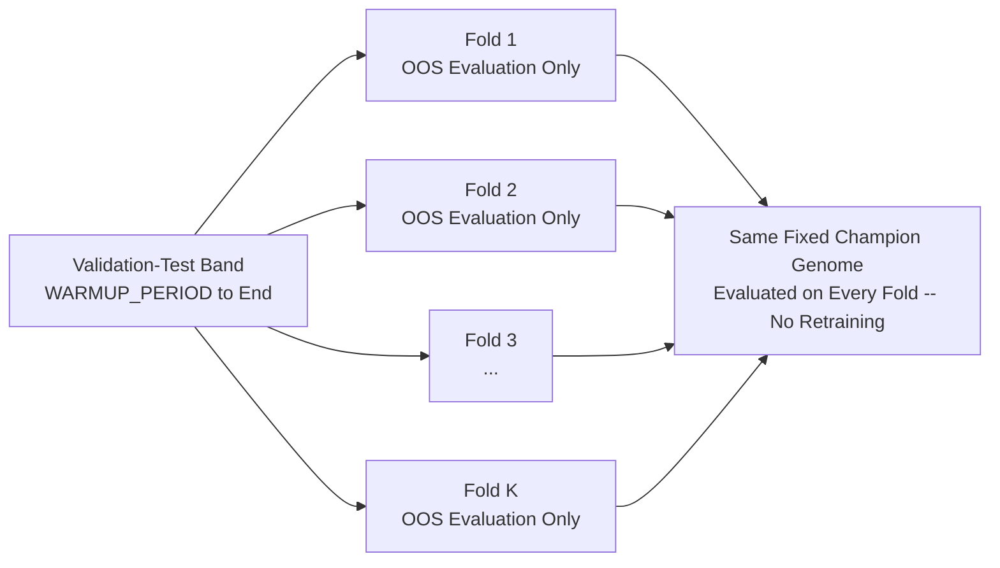
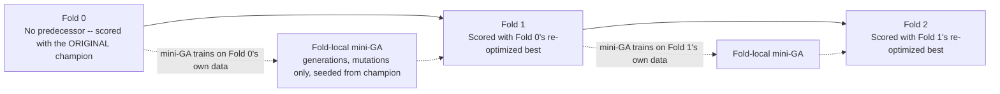
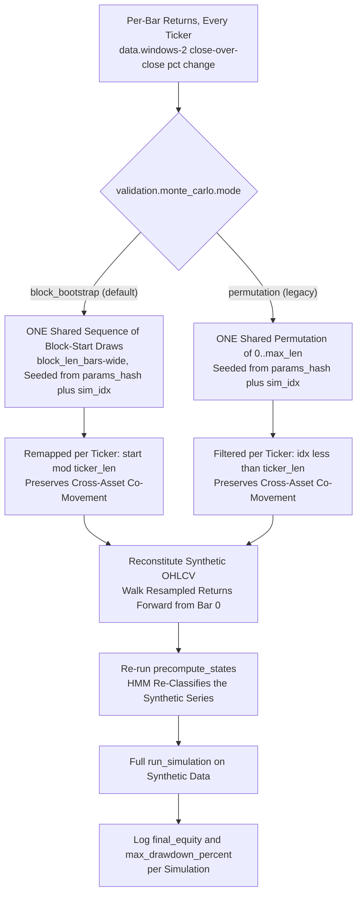
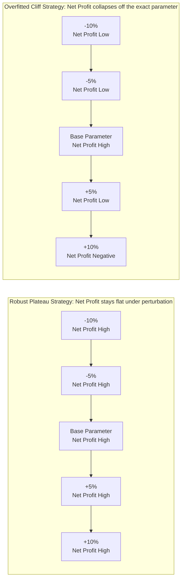
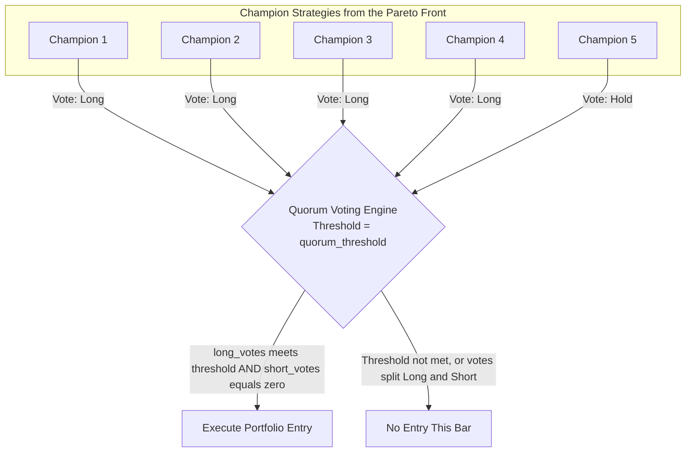

# Chapter 9: Robustness Validation, Ensemble Voting & Live Execution

A common failure in quantitative finance is **overfitting (curve-fitting)**: discovering a strategy that looks miraculous in historical backtests but collapses immediately in out-of-sample live markets.

Alpha Suite defends against overfitting through a **3-Tier Statistical Validation Suite** and an **Anti-Fragile Ensemble Voting Engine** (`alpha-simulation::validation` & `alpha-simulation::ensemble`).

---

## 0. The Partition Plan (F03: Calendar, Not Index, Boundaries)

Every band this chapter refers to (GA training, ML-train, ML-sweep, Validation-Test, Holdout) is carved out of a shared **`PartitionPlan`** (`alpha_core::plan_partitions`), not a single candle-index cutoff applied to every ticker verbatim. The old scheme derived one absolute index from whichever configured ticker happened to have the fewest candles and applied that same raw index to every other ticker's own array — for a basket where tickers start on different calendar dates (the norm, not the exception), that gave non-contemporaneous IS/OOS/holdout windows per ticker and silently discarded every candle of a longer-lived ticker beyond the shortest one's length.

`plan_partitions(warmup_complete_dates, last_dates, final_holdout_fraction, min_common_days)` instead computes ONE shared calendar window from every ticker's own WARM-UP-COMPLETE date (its `WARMUP_PERIOD`-th candle date — **not** its first candle date; see below) and its last candle date:
- `common_start = max(every ticker's warmup-complete date)`, `common_end = min(every ticker's last date)` — the earliest instant at which every configured ticker already has a full `WARMUP_PERIOD` of history behind it, through the latest instant every ticker still has data.
- Boundaries within `common_start..common_end` land at the same 60% / 75% / 80% fractions this workspace has always used (GA / ML-train / ML-sweep / Validation-Test), but **by wall-clock time**, not by raw index.
- The final `validation.final_holdout_fraction` of the common span is carved off the end as the pristine, burn-once Holdout band.
- `alpha_orchestrator::run::slice_dataset` turns a `Partition` (`Ga`/`MlTrain`/`MlSweep`/`Monitor`/`Holdout`) into a per-ticker candle slice by locating that ticker's own index for each boundary date (`partition_point`) and back-extending the start by `WARMUP_PERIOD` candles — so `states.len() == data.len() - WARMUP_PERIOD` holds for every ticker in every band.

**Why warm-up-complete dates, not first candle dates:** an earlier version of this fix set `common_start = max(every ticker's first date)`. That is wrong for a subtle reason — `slice_dataset` back-extends every band's start (including the GA band, whose left edge IS `common_start`) by `WARMUP_PERIOD` candles, and the ticker whose own first candle happens to define `common_start` structurally has ZERO candles preceding it. That ticker could therefore never supply a warmup window for the GA band and was always excluded from it — and, worse, `validate_partition_coverage` rejected it by name under the strict default, so every real basket with staggered listing dates failed by default, and the latest-listed asset could never be in-sample even under `allow_partial_history`. Anchoring `common_start` on each ticker's WARM-UP-COMPLETE date instead makes the back-extension satisfiable for every ticker BY CONSTRUCTION: the ticker whose date defines `common_start` has, by definition, exactly `WARMUP_PERIOD` candles preceding it there.

A ticker with `bars.len() <= WARMUP_PERIOD` candles cannot produce a warmup-complete date at all — it structurally can never complete warmup regardless of where any plan places `common_start`, and `build_partition_plan` rejects it BY NAME under the strict default (or excludes it, with a `warn!`, under `allow_partial_history`) before a plan is even built. Separately, `validate_partition_coverage` remains as a DEFENSIVE check for a plan that was **not** freshly built from the current data — e.g. one reloaded verbatim by `resume-db` (see below) when the data available at resume time has drifted from what built the plan originally: if a ticker fails to cover the whole `[common_start - WARMUP_PERIOD, common_end]` window and `data.allow_partial_history = false` (the default), the run fails outright naming every such ticker rather than silently narrowing the dataset. Set `data.allow_partial_history = true` to instead exclude those tickers from cross-asset scoring only.

This is the **default** (`data.partition_mode = "date"`). The pre-F03 index-based behaviour is retained, unchanged, as `data.partition_mode = "index"` so an already-completed run stays reproducible under the settings it actually used — see `manual/10` §15 for both config keys plus `min_common_days`/`allow_partial_history`. The resolved plan (all six boundaries, plus which mode produced them) is persisted to `ga_run_metadata` so `resume-db` reloads the EXACT plan a run started with rather than recomputing a possibly-different one.

### 0.1 F05/3.1.5: The Periodic Health Check No Longer Reads the ML-Train Band

The GA loop's periodic out-of-sample health check (early stopping, `manual/05` §5) used to evaluate every rank-1 candidate against the shared "ML Train (OOS)" band (`Partition::MlTrain`, `ga_end..ml_train_end`) on every `health_check_interval` generations — hundreds of times over a long run. That band is ALSO where the post-GA pipeline later trains the ML trade-filter threshold (`manual/08` §1.C.7) and (before F10) the assembled Hall-of-Fame champion is scored — so the health check's own selection pressure (which champion survives, when the run early-stops) was steering which strategy reaches that later stage using data that stage then treats as its own fresh, unseen training band. That is not out-of-sample with respect to the run's own selection process, even though it is out-of-sample with respect to the GA's fitness function directly.

**Under `data.partition_mode = "date"` (the default)**, the health check now reads a **sealed monitor band** instead: the trailing `validation.monitor_fraction` (default `0.05`, i.e. 5%) slice of the GA's OWN in-sample span (`common_start..ga_end`), carved off by `alpha_orchestrator::run::carve_sealed_monitor_band` and used EXCLUSIVELY by the health check — no other pipeline stage reads it. `build_health_check_oos_partition` refuses (logging once, and skipping the health check for the run) rather than shrink the GA's own training span below `data.min_common_days` if the dataset is too short to carve the band out. See `manual/10` §6 for `validation.monitor_fraction`'s validation rule.

**Under `data.partition_mode = "index"`** (the legacy, explicitly-retained reproducibility path — convention 9), the health check still reads the old `Partition::MlTrain` band unchanged: an already-completed run under that mode must stay reproducible under the settings it actually ran with, and the legacy `IndexSplits` type has no calendar boundaries to carve a sub-band from.

---

## 1. The 3-Tier Post-GA Validation Suite

### 1.0 F10: The Assembled Hall of Fame Champion Is Grouped, Scored, and Gated

Before the validation suite below runs, `run_post_ga_pipeline` also assembles one extra candidate genome from the **Hall of Fame** (`pipeline::hof`) — the single best per-state strategy each HMM state has produced so far, tracked independently of the Pareto front the rest of this chapter validates. This synthetic champion feeds the "Refined Base Strategy" full-history/OOS run and the ML-threshold sweep described in §1 above it, so its quality matters even though it is not itself one of the `num_champions_to_validate` Pareto members.

**Before this fix**, `assemble_hof_champion` stitched exactly one such candidate by taking whichever per-state entry happened to exist for each state — even when two states' entries were evolved and scored against **different** `IndicatorPeriods` (a genome-level field every state's strategy shares within one evolved individual; see `HofEntry`'s doc comment in `alpha-ga/src/session.rs`), silently mixing periods no real individual was ever evaluated under — and handed the result downstream without ever scoring it against anything.

**The fix (`pipeline::hof`):**
1. Group Hall of Fame entries by the exact `IndicatorPeriods` they were evolved against (`group_hof_entries_by_periods`) — entries scored under different periods can never land in the same assembled candidate.
2. Assemble one full-length candidate genome per group (`assemble_candidates`): a state a group itself lacks is backfilled from that same group's own least-bad (highest-`PnL`) entry — still evolved against the group's own periods — falling back to the single highest-`PnL` entry across the whole Hall of Fame (regardless of periods) only if the group is empty, and to an inert default strategy only if the Hall of Fame has no entries anywhere.
3. Score every candidate on the GA (IS) partition with the SAME evaluator/fitness path the GA itself uses (`run_simulation` + `calculate_log_utility_fitness`, `score_candidates`), logging every candidate's score at `info` level.
4. Admit the best-scoring candidate only if its score meets or exceeds the lowest score among the Pareto front's own admitted members (`lowest_admitted_pareto_score` + `select_admitted_candidate`) — a synthetic, never-before-evaluated champion must clear the same bar the front's own weakest member already cleared. A candidate that falls short (or a Hall of Fame with no entries at all) instead falls back to the pre-F10 best-effort `assemble_hof_champion` assembly, which is never worse than what this pipeline always did unconditionally before this fix.

The admitted candidate's `IndicatorPeriods` travel with it (`GpSimulationParams::indicator_periods`) into the same downstream "Refined Base Strategy" full-history logging every champion already goes through (`IndicatorPeriods::to_db_json`, F02's codec) — this stage does not write a separate, dedicated Hall-of-Fame-champion database row of its own. See `fdb2` subtask `3b23`.

Once a GA run completes, the top `config.validation.num_champions_to_validate` champions from the Pareto front undergo automated validation (`run_championship_validation`, `alpha-simulation::validation::mod`). All three stages below run on the **same data partition**: the "Validation-Test" band the post-GA pipeline slices off (`Partition::Monitor`, i.e. `ml_sweep_end..holdout_start` of the shared `PartitionPlan` — §0 above; `alpha-orchestrator/src/pipeline/mod.rs::run_post_ga_pipeline`) — data the GA never trained on and the ML-filter threshold sweep (`Partition::MlTrain`, `manual/08` §1.C.7) never saw either. This band is the 80% mark up to wherever the Holdout band (if any) begins, not literally "100%" when `validation.final_holdout_fraction > 0.0`:

**F01: the sweep now actually discriminates between thresholds.** Before this fix, `run_post_ga_pipeline`'s threshold sweep (and `run_seed_sweep`'s identical duplicate of it) called `run_simulation` with `modulator_opt = None` for every candidate threshold — since `ml_filter_threshold` is only ever read inside `run_simulation`'s own `if let Some(m) = modulator_opt` branch, every candidate produced a bit-identical `BacktestResult` and score, the winning threshold locked onto whichever candidate ran first (index 0, i.e. `0.0`) the instant its tied score beat the initial `f64::NEG_INFINITY` sentinel, and the downstream `> 0.5` modulator-activation guard could then never fire — so `final_modulator` stayed `None` even when a trained model existed and the Execute/Ensemble stages ran completely un-gated. The fix, `pipeline::select_ml_threshold` (extracted so both call sites share ONE implementation instead of two copies), constructs the `AdaptiveTradeModulator` once up front and passes that SAME modulator into every candidate's `run_simulation` call, scores each with the identical fitness the GA itself uses (`calculate_log_utility_fitness`, over the real day count of the ML-Train band rather than a hard-coded `0`), picks the strict maximum (ties break toward the LOWER threshold), and only then re-checks the winning threshold against `config.ml_filter.min_threshold` (default `0.5`, `manual/08` §1.B) before wiring a modulator into the rest of the pipeline.

Each stage logs raw per-run rows to its own QuestDB table (`ga_walk_forward_results`, `ga_monte_carlo_results`, and — depending on `validation.sensitivity.mode` — `ga_sensitivity_results` or `ga_sensitivity`) — none of the three computes a single pass/fail verdict in code. Interpreting the distribution of those rows (WFE, percentile drawdown, cliff detection, per-gene elasticity ranking) is a human/Grafana-side reading of the logged table, not a value the pipeline itself produces. See each section below for exactly what is and is not computed.

---

## 2. Walk-Forward Analysis (WFA) (`walk_forward.rs`)

`validation.walk_forward.mode` (`manual/10` §17, F09/3.4.3) selects between two fold-scoring strategies, both built on the same $K$ = `validation.walk_forward.num_folds` contiguous, non-overlapping slices of the 80–100% Validation-Test band described in §1:

- **`"fixed_champion"`** (default): described in the rest of this section. No per-fold retraining anywhere in `compute_walk_forward_fold_results` — the **one already-fixed champion** handed to it (a Pareto-front individual whose genome the GA already finished evolving) is evaluated, unchanged, on every fold. This is what the Grafana dashboard's **"Segmented OOS"** panel charts (renamed from "Walk-Forward Out-of-Sample Equity Curve" in F09/3.4.3, since that name is what this mode actually measures: one fixed genome's robustness across separate out-of-sample windows, not a genuine walk-forward).
- **`"reoptimize"`**: §2.1 below.

Alpha Suite's `"fixed_champion"` Walk-Forward Analysis is **not** an In-Sample-train / Out-of-Sample-test cycle repeated per fold. It takes the **one already-fixed champion** handed to it (a Pareto-front individual whose genome the GA already finished evolving) and evaluates that same, unchanged genome across every fold — each fold is purely an OOS evaluation window, never a training window:

Each fold's test window is `oos_len / num_folds` bars wide (`oos_len` = the partition length minus `WARMUP_PERIOD`), preceded by its own `WARMUP_PERIOD`-bar lead-in of real context so indicators and the HMM classifier are warm before the fold's first scored bar; the classifier decodes causally via `classify_bus` (the same forward-filter decoder as everywhere else — `manual/03` §7.2), never Viterbi. A fold whose test window would be no larger than `WARMUP_PERIOD` itself is skipped and logged, rather than silently truncated or misaligned.

**Walk-Forward Efficiency is not computed anywhere in code.** `log_walk_forward_results` writes exactly four figures per fold — `net_profit`, `max_drawdown`, `win_rate`, `trade_count` — plus, as of F09/3.4.3, a `mode` column — to `ga_walk_forward_results`; there is no `Sharpe_IS` in this picture at all (no IS evaluation happens), so a $\text{Sharpe}_{\text{OOS}} / \text{Sharpe}_{\text{IS}}$ ratio cannot be formed from what the pipeline logs. If you want a WFE-style summary, it is a **manual interpretation** an operator or Grafana dashboard builds by comparing the per-fold `net_profit`/`max_drawdown`/`win_rate` table against the champion's original GA training-partition performance — not a number this validation stage produces or gates on.

### 2.1 F09/3.4.3: True Walk-Forward Re-optimization (`mode = "reoptimize"`)

`"fixed_champion"` above measures a fixed genome's robustness across separate OOS windows; it never asks whether RE-optimizing on each fold would have produced a better next-fold result, which is what "walk-forward optimization" means in the classical sense. `mode = "reoptimize"` answers that question:

For fold $i > 0$: a short GA (`validation.walk_forward.generations`, default `30`; population size from `ga.population_size`) re-optimizes the champion against fold $i - 1$'s own classified data — its initial population is `population_size` copies of the champion, each independently perturbed on its numeric `StrategyParams` fields (`atr_multiplier`, `reward_ratio`, `base_risk_per_trade`, `ml_filter_threshold`) via a seeded RNG stream tagged `alpha_ga::rng_seed::tags::WALK_FORWARD` (mutations only — GP entry/exit trees and `IndicatorPeriods` are left untouched, since the point of this mode is a short, local search around an already-evolved champion, not rediscovering strategy structure from scratch). The resulting best individual (`ga_loop::run_ga_loop_internal`, run against a fold-local `Config`) is what actually scores fold $i$. Fold `0` has no preceding fold to train on, so it always scores the original champion unchanged — the natural degenerate case, not a special exception, so `"reoptimize"` still produces exactly one row per fold, directly comparable fold-for-fold against `"fixed_champion"`.

Persisted to the SAME `ga_walk_forward_results` table as `"fixed_champion"` (a `mode` column distinguishes the two — existing rows/queries filtering on `mode = 'fixed_champion'`, or predating this column entirely, are unaffected) and charted on its own **"Walk-forward (re-optimized)"** Grafana panel, alongside "Segmented OOS".

`alpha_simulation::validation::walk_forward::FoldReoptimizer` is the generic hook this crate defines so its walk-forward logic never depends back on `alpha-orchestrator` (which already depends on `alpha-simulation`) — `alpha_orchestrator::validation::walk_forward::GaFoldReoptimizer` is the real, `run_ga_loop_internal`-backed implementation wired into `run_championship_validation`'s callers.

---

## 3. Monte Carlo Simulation (`monte_carlo.rs`)

Even a robust strategy can experience unfavorable clustering (e.g. 8 consecutive losing trades occurring back-to-back due to bad luck). Alpha Suite's Monte Carlo stage is **not** trade-list reshuffling — it perturbs the underlying *price data* and re-runs the entire simulation (HMM regime re-classification included), `validation.monte_carlo.num_simulations` times. `validation.monte_carlo.mode` (`manual/10` §17) selects the resampler:

- **`"block_bootstrap"`** (default): a **stationary block bootstrap** — resamples whole runs of `validation.monte_carlo.block_len_bars` consecutive bars, not individual bars, so the synthetic series retains the original's own short-range (e.g. lag-1, lag-10) autocorrelation structure instead of destroying it entirely.
- **`"permutation"`** (legacy): the original single-bar shuffle, kept only so a run persisted under it stays reproducible — it destroys essentially all autocorrelation in the synthetic series, which is exactly the property the block bootstrap was introduced to fix (F09/3.4.1).

**Why one shared draw sequence, not independent per-ticker draws** (both modes): an earlier version shuffled each ticker's return series with its own independently-seeded RNG call, which destroys cross-asset correlation — two tickers that actually moved together on a given day get scattered onto unrelated synthetic days, so summing per-ticker synthetic PnL into one portfolio figure systematically understates tail risk from *correlated* drawdowns, which is the entire reason a portfolio-level Monte Carlo exists. Both resamplers instead draw exactly **one** sequence per simulation — a permutation of `0..max_len` for `"permutation"`, a sequence of block-start indices over the same range for `"block_bootstrap"` — and reuse it across every ticker, remapped down to that ticker's own length (`idx < ticker_len` filtering for the permutation; `start % ticker_len` for block starts, since blocks are drawn WITH replacement so a permutation's filter-out-of-range trick doesn't apply). So if the shared draws place original day 40 before day 12, every ticker's synthetic history reflects that same relative ordering, preserving real co-movement in the synthetic data.

**Why blocks, not single bars, by default:** resampling one bar at a time (the legacy `"permutation"` mode) treats every bar as independent, which is a good null for testing "does this strategy's edge survive if all serial dependence in returns is destroyed" but a poor model of what a *plausible* alternative history looks like — real markets have short-range momentum/mean-reversion that a single-bar shuffle erases completely. The stationary block bootstrap resamples whole `block_len_bars`-length runs of consecutive bars instead: within any one drawn block the original bar-to-bar ordering (and therefore its autocorrelation) is preserved verbatim, and only the boundaries *between* blocks are resampled — so the synthetic series' lag-1/lag-10 autocorrelation stays close to the real series', while the boundary resampling still produces genuinely different equity paths across simulations.

Seeding is deterministic: the base seed is `params_hash_u64(champion_params)`, combined with the simulation index — not `rand::rng()` — so re-running Monte Carlo for the same champion reproduces byte-identical synthetic histories and results, regardless of thread scheduling. The two modes draw from separate RNG streams (`alpha_ga::rng_seed::tags::MONTE_CARLO_BLOCK_BOOTSTRAP` for the new mode; the legacy mode's untagged `[sim_idx]` coordinate is left exactly as it was before F09/3.4.1), so switching a run's `mode` cannot retroactively change the synthetic histories an already-completed run under the other mode produced.

**Probability of ruin is not computed by code.** `log_monte_carlo_results` writes exactly `final_equity` and `max_drawdown_percent` per simulation to `ga_monte_carlo_results` — no ruin flag, no percentile calculation. The 95th/99th-percentile drawdown bands and any $P_{\text{ruin}}$ figure are read off the logged distribution in Grafana (or any other consumer of that table), not produced by `monte_carlo.rs` itself.

---

## 4. Parameter Sensitivity Analysis (`sensitivity.rs`)

A strategy that relies on exact parameters (e.g. `atr_multiplier = 3.0` produces $+100\%$, but `atr_multiplier = 3.3` loses $-50\%$) sits on a **Parameter Cliff** and will fail when market volatility shifts.

`validation.sensitivity.mode` (`manual/10` §17) selects between two sweeps that log to two different tables:

- **`"lhs_all_genes"`** (default): a **Latin-hypercube design** that perturbs **every** numeric gene on `StrategyParams` (per HMM state: `atr_multiplier`, `reward_ratio`, `base_risk_per_trade`, `cooldown_period`; the categorical `direction` gene is untouched) and every `IndicatorPeriods` field the GA's own search space publishes a bound for (`Config::get_param_bounds` — the five `mcv_*` calibration fields are excluded, since they carry no search-space bound and the GA never evolves them either) — **simultaneously**, `validation.sensitivity.samples` rows at a time. Logs to `ga_sensitivity`.
- **`"two_gene"`** (legacy): the original coordinate sweep over just `atr_multiplier` and `reward_ratio`, one at a time. Kept only so a champion validated under it stays reproducible against its already-persisted `ga_sensitivity_results` rows.

### 4.1 Legacy two-gene sweep (`"two_gene"`)

For each of the two parameters, every per-state strategy's value is perturbed by $\pm i \cdot \delta$ for $i = 1 \dots \text{num\_steps}$ (`validation.sensitivity.num_steps`, `.perturbation` $= \delta$), clamped to the **same bounds the GA's own search space is constrained to** (`Config::get_param_bounds`) — a sweep never explores a region the discovered champion's evolution couldn't itself have visited:

$$\theta'_i = \theta \times (1 + i \cdot \delta), \qquad i \in \{-\text{num\_steps}, \dots, -1, 1, \dots, \text{num\_steps}\}, \qquad \theta'_i \leftarrow \text{clamp}(\theta'_i, \theta_{\min}, \theta_{\max})$$

For an individual with multiple HMM states, the logged `param_value` is the **average** of that perturbation factor applied across every state's own base value, not a single state's value. Logged metrics: `net_profit`, `max_drawdown`, `win_rate` (`ga_sensitivity_results`) — not Sharpe or any other risk-adjusted ratio.

### 4.2 Latin-hypercube all-genes sweep (`"lhs_all_genes"`, default)

Every numeric gene is perturbed **at once**, per design row, by an independently-drawn factor in $[1 - \epsilon, 1 + \epsilon]$ (`validation.sensitivity.epsilon` $= \epsilon$):

$$\theta'_g = \text{clamp}(\theta_g \times f_g,\; \theta_{g,\min},\; \theta_{g,\max}), \qquad f_g \sim \text{LatinHypercube}(1-\epsilon,\; 1+\epsilon)$$

Integer genes (`cooldown_period` and every `IndicatorPeriods` field) round to the nearest integer after clamping. The Latin-hypercube design stratifies each gene's own column independently — `validation.sensitivity.samples` rows, one bin per row per column, so every gene's factor is spread evenly across $[1-\epsilon, 1+\epsilon]$ regardless of how the other genes are drawn for that same row — and is seeded once per champion from `params_hash_u64(champion_params)` combined with the `SENSITIVITY` RNG tag (`alpha_ga::rng_seed::tags`), so re-running this stage for the same champion reproduces the identical design.

Each row is scored with the same net-PnL aggregate `monte_carlo.rs`/`walk_forward.rs` already use (**not** the GA's full multi-objective `calculate_log_utility_fitness`, which additionally needs per-island calibration inputs that have no meaning for a single already-selected champion validated in isolation). For each gene, a **per-gene elasticity** is then computed: the ordinary-least-squares slope of a row's score against that gene's own relative change ($f_g - 1$), taken independently per gene across every row — not a joint multivariate fit controlling for every other gene simultaneously. A gene the champion's score is highly sensitive to gets a large-magnitude elasticity; a gene the score barely depends on gets an elasticity near zero.

Every `(sample, gene)` pair is logged to `ga_sensitivity` as its own row — `gene_name`, `relative_change` ($f_g - 1$ for that sample), `score`, and that gene's final `elasticity` (denormalized onto every row of that gene, so a dashboard can chart either the raw scatter or the summary slope without a second query). "Robust plateau" and "fragile cliff" above are read off this logged distribution (or its per-gene elasticity summary), not a Sharpe curve — the pipeline itself does not classify a champion as plateau or cliff.

---

## 4a. Combinatorial Purged Cross-Validation & Probability of Backtest Overfitting (F05/3.1.3)

Sections 2–4 above all validate ONE already-selected champion. They cannot detect a different failure mode: the SELECTION itself, across the whole Pareto front, may have overfit to in-sample noise — the front's apparent winner may simply be the candidate that got luckiest on the specific in-sample data the GA trained on, not the one with genuine skill.

`alpha_simulation::validation::cpcv` (pure combinatorics/PBO math) and `alpha_orchestrator::validation::cpcv` (the `run_simulation`-backed production scorer) implement Combinatorial Purged Cross-Validation and the Probability of Backtest Overfitting (Bailey, Borwein, López de Prado & Zhu, 2017):

1. **Split.** The GA's own in-sample span (`common_start..ga_end`) is divided into `validation.cpcv.groups` (default `6`) contiguous groups. Every way of holding out 2 of them for testing — $C(6,2) = 15$ splits at the default — is generated deterministically (`generate_splits`, no RNG).
2. **Purge and embargo.** Each included group's boundary against an excluded neighbor is trimmed by `purge_bars` (the candidate's own longest `IndicatorPeriods` lookback, or `WARMUP_PERIOD`, whichever is larger) plus `validation.cpcv.embargo_bars` (default `1440`) — a conservative, symmetric superset of the stricter textbook asymmetric definition (embargo only after a test block): this removes AT LEAST as much boundary data as required, never less.
3. **Score.** For each split, every front candidate is scored on the TRAIN groups (its in-sample score) and the TEST groups (its out-of-sample score) — independently per contiguous group, then summed, rather than physically concatenating non-contiguous date ranges into one series (which would create a fake time seam at every join for a stateful engine). No re-optimization happens; each candidate's genome is fixed and only its score is recomputed per group set.
4. **PBO.** For each split, the TRAIN-score winner's own TEST score is compared against the TEST-score median across all candidates. The front-wide PBO is the fraction of splits where that winner scored BELOW the median — i.e. where picking "the best in-sample candidate" would have picked a below-average out-of-sample performer. PBO near `0` means the front's winners keep generalizing; PBO near `0.5` means the in-sample ranking carries no out-of-sample information at all (the textbook "no genuine skill" signature); PBO above `0.5` means the in-sample winner is actively anti-predictive.
5. **Exclusion.** A per-candidate PBO (the fraction of splits where THAT candidate specifically was both the in-sample winner and a below-median performer) exceeding `validation.cpcv.max_pbo` (default `0.5`) excludes it from the ensemble/genome selection — logged, not silently dropped.

Both dimensions (candidate, split) are parallelized via `rayon`, and the whole computation runs inside `smol::unblock` so it never blocks the executor thread that also drives the `HiveMind` listener and worker sessions.

**Pipeline wiring.** Gated behind `validation.cpcv.enabled` (default `false`, convention 9 — `manual/10` §17): when enabled, `run_post_ga_pipeline` runs CPCV over the same top-`config.ensemble.ensemble_size` front members the Execute stage draws its council from, right after `valid_front` is finalized (ML-threshold applied) and before `top_n_individuals` is built for `[STAGE 3b] EXECUTE`. Every `(candidate, split)` row (`CpcvResultRow`: train/test score, front-wide `pbo`, per-candidate `pbo`, `admitted`) is persisted to `ga_cpcv_results` via `db::log_cpcv_results` — best-effort, a DB error is logged and does not abort the pipeline. `pipeline::apply_cpcv_admission` then removes every candidate whose per-candidate PBO exceeds `validation.cpcv.max_pbo` from `valid_front` (order-preserving; a candidate CPCV never scored — outside the top-N slice — is conservatively kept), logging each exclusion plus one kept/excluded/front-wide-PBO summary line before Execute ever sees the front. Whether a run had CPCV enabled is persisted to `ga_run_metadata` alongside the other F-remediation mode columns (`db::log_run_cpcv_mode` / `db::data::get_run_cpcv_enabled`, mirroring `friction_model`/`funding_mode` — F07).

---

## 5. The Ensemble Voting Engine (`ensemble/`)

Rather than deploying a single winner, the post-GA pipeline takes the **top `config.ensemble.ensemble_size` members of the Pareto front, in front order** (`valid_front.iter().take(ensemble_size)`, `pipeline/mod.rs`) — not a separately re-ranked or re-selected "best $N$" — and combines them into a unified **Ensemble Engine** (`run_ensemble_simulation`, `ensemble/mod.rs`):

### Key Parameters:
- **`ensemble_size`**: Total number of elite strategies (top-$N$ Pareto-front members) in the voting council.
- **`quorum_threshold`**: Minimum number of agreeing votes required to initiate or exit a position.
- **`override_params`** (F06, code default `false`): see "F06: The Executed System Now Matches the Scored Genes" below.

### Quorum Mechanics — Directional Unanimity, Not a Simple Majority
Each member casts one `Vote` per bar: `Long`, `Short`, `Hold`, or `Exit` (`ensemble::voting::Vote`). An entry fires only when **both** conditions hold (`ensemble/mod.rs`):
$$\text{long\_votes} \ge \text{quorum\_threshold} \;\land\; \text{short\_votes} = 0 \qquad \text{(or the mirror image for a short entry)}$$
A quorum's-worth of `Long` votes does **not** fire an entry if even one member simultaneously voted `Short` — the gate requires the threshold to be met in one direction with **zero** dissenting votes in the other, not merely a plurality. An exit requires only `exit_votes >= quorum_threshold`, with no equivalent opposing-vote condition. This is stricter than "at least $N$ out of $M$ agree" and is worth calling out explicitly since it changes how often the ensemble actually trades relative to a naive majority-vote reading.

### Correlation De-Duplication: Not Implemented
The manual previously described strategies with trade-return correlation $r > 0.85$ being pruned from the council before voting. **No such pruning exists anywhere in `alpha-simulation::ensemble`** — a full search of the module found no correlation computation or de-duplication logic at all. The ensemble council is exactly the top `ensemble_size` Pareto-front members, unfiltered by inter-strategy correlation. Treat correlation de-duplication as a planned feature, not current behavior, until it actually lands in `ensemble/mod.rs`.

### F06: The Executed System Now Matches the Scored Genes
Before F06, three parts of this engine silently diverged from what the GA actually scored and displayed on the Pareto front:

- **Vote emission ignored the `direction` gene.** Every triggered member voted `Long` unconditionally (`ensemble/mod.rs`'s vote-emission line), so a Short-direction strategy the GA scored was executed as its exact opposite. Fixed: a triggered member now votes `Short` when its own `StrategyParams::direction` gene (`alpha_models::strategy::StrategyDirection`) is `Short` **and** `allow_short_selling` is enabled; otherwise it degrades to `Hold` — a Short gene is never silently flipped to `Long`, mirroring `run_simulation`'s own PHASE 9 runtime re-check of the same flag.
- **Cooldown and the trailing-stop multiplier came from a single global config value**, applied to every trade regardless of which member(s) decided it, discarding the evolved `cooldown_period`/`atr_multiplier` genes entirely. Fixed (default, `override_params = false`): at entry, the cooldown later applied at exit is frozen as the MEDIAN `cooldown_period` gene across the winning-direction consensus voters, and every trailing-stop update for that trade's lifetime uses the `atr_multiplier` gene of the single "deciding" member (the lowest-index member among the winning-direction consensus voters — every consensus voter's score is identical, so this tie-break is deterministic). Set `ensemble.override_params = true` (`manual/10` §6) to restore the pre-F06 behaviour of applying `ensemble.cooldown_period`/`ensemble.trailing_stop_atr_multiplier` verbatim to every trade, e.g. to reproduce a pre-F06 run bit-for-bit.
- **The "representative" indicator state read for risk sizing, trailing-stop updates, and the ML-filter feature vector was always member zero's**, regardless of which member(s) actually voted for the trade. Fixed: every one of those reads now uses the deciding member's own `MultiScaleIndicatorState`.

Even with these three fixes, `run_ensemble_simulation` is still not a byte-for-byte replay of `run_simulation` on any single strategy — see that function's own module doc comment ("# Approximations versus `run_simulation`") for the remaining, by-design differences: initial position sizing (`atr_multiplier`/`reward_ratio`/`base_risk_per_trade`) is still AVERAGED across the winning-direction consensus rather than taken from the deciding member alone, there is one shared position per ticker rather than one per member, `TickerSimulationState::risk_modulator` (the ML-driven position-size feedback the primary engine applies) is never consulted here, and per-era/trade-PnL-moment statistics are never accumulated. An operator who wants ZERO approximation instead of these can set `pipeline.execute_mode = "genome"` (`manual/10` §16) to run the single best-ranked Pareto-front champion straight through `run_simulation` for this stage instead of through the voting engine described in this section.

---

## 5a. Multi-Seed Sweep: Cross-Run Recurrence as an Admission Gate (F05/3.1.4)

The `seed-sweep` CLI subcommand (`apps/ga-runner`) runs the full GA independently across several seeds on the same precomputed dataset/HMM states, then groups every discovered strategy across runs by phenotype/structural fingerprint (`sweep::group_by_recurrence`) to find structures that were REDISCOVERED independently, rather than found once by a single lucky seed.

Before this fix, `recurrence_count` (how many distinct seeds independently found a given structure) was purely informational: `run_seed_sweep` sent every recurrence group's representative candidate on to validation/Execute regardless of how many times it recurred, so a one-off, single-seed strategy received exactly the same downstream treatment as one ten seeds independently rediscovered.

`sweep::split_by_recurrence_admission(groups, min_recurrence)` now turns this into a real gate: a group is **admitted** to `champions_to_validate` only if `recurrence_count >= config.ga.sweep.min_recurrence` (default `2`); groups below that bar are **reported-only** — still logged to `ga_sweep_recurrence` (now with an `admitted` column) for visibility, but their representative candidate never reaches validation or Execute.

> **Two separate `min_recurrence` knobs, by design.** The `seed-sweep` CLI's pre-existing `--min-recurrence` flag (default `2`) still governs only the `recurring_count` REPORTING threshold in the sweep's own log table; `config.ga.sweep.min_recurrence` (also default `2`) governs the ADMISSION gate described above. They default to the same value, so an operator who does not override either sees identical behaviour; overriding only one changes what is reported without changing what is admitted, or vice versa. Keep both in sync in practice unless you specifically want that divergence. See `manual/10` §4 for `ga.sweep.min_recurrence`'s validation rule.

---

## 6. Live Trading Execution (`apps/live-trader`) — PLANNED, NOT IMPLEMENTED

> [!WARNING]
> **This is not a production path today.** `apps/live-trader/src/main.rs` is, in its entirety, `const fn main() {}`, and `apps/live-trader/src/engine.rs` is an empty file. There is no WebSocket feed handling, no order dispatch, and no stop management in this binary — none of it has been written yet. The five-step pipeline below describes the **intended architecture** for when this binary is implemented, mirroring how `ensemble::run_ensemble_simulation` and `HmmClassifier`'s causal decoding (`manual/03` §7.2) are already used in backtesting — it does not describe anything that runs today. Do not point real capital at this binary; treat everything in this section as a design target, not a feature.

Intended pipeline, once implemented:
1. **WebSocket Feed**: Receive real-time ticks and form closed 1-minute OHLCV candles.
2. **Streaming Indicator Pipeline**: Update `IndicatorBus` slots sequentially.
3. **Regime Classification**: Evaluate recent bars through the loaded `HmmClassifier`'s causal forward filter (`classify`/`classify_bus` — the same decoder `precompute_states` and walk-forward already use, per `manual/03` §7.2) to identify the active market state.
4. **Ensemble Evaluation**: Evaluate active-state strategies for all ensemble champions and apply the §5 quorum gate.
5. **Order Execution & Stop Management**: Dispatch authenticated limit/market orders over REST/WebSocket, track fills, and manage ATR trailing stops in real time.
