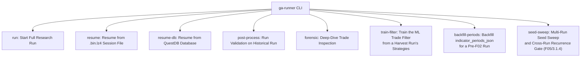
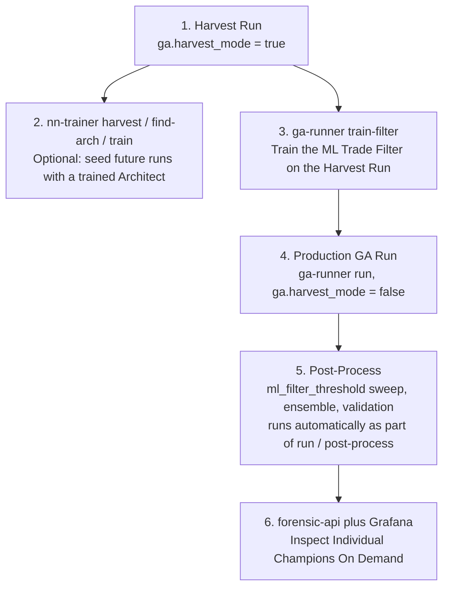
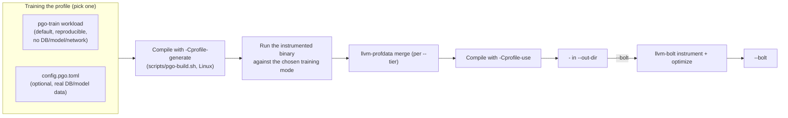

# Chapter 11: Developer & Operations Runbook

This chapter is the practical, hands-on operational guide for developers, quant engineers, and system operators running and maintaining the Alpha Suite. It covers building, testing, linting, CLI commands, database setup, performance optimization (PGO / BOLT), and common debugging pitfalls.

---

## 1. Development & Quality Standards

Alpha Suite enforces strict code quality and performance standards:

- **Rust Edition**: 2024.
- **Async Runtime**: `smol` strictly. Never introduce `tokio`.
- **Concurrency**: `rayon` for CPU parallelism; all CPU work crossing async boundaries must use `smol::unblock`.
- **Zero-Warning Policy**: `clippy::pedantic` is enabled workspace-wide at warn-level. **The workspace is kept at ZERO warnings.**
- **Formatting**: `rustfmt.toml` enforces `imports_granularity = "Crate"`.

### Essential Developer Commands
```bash
# Workspace-wide pedantic linting (must report 0 warnings)
cargo clippy --workspace --all-targets -- -D warnings

# Run entire test suite (1,000+ tests)
cargo test --workspace

# Warm up incremental build with a single crate test
cargo test -p alpha-indicators --test streaming_tests

# Format code according to workspace rules
cargo fmt --all
```

---

## 2. Operating the Master (`apps/ga-runner`)

`ga-runner` is the command-center binary that coordinates the research pipeline:



### CLI Command Catalog:

#### A. Start a Fresh GA Run
```bash
# Standard interactive run with TUI progress bars
ga-runner --config config.toml run

# Headless mode for nohup / background server execution (disables TTY ANSI escape codes)
nohup ga-runner --config config.toml --headless run > runner.log 2>&1 &
```

#### B. Resume an Interrupted Session (File Checkpoint)
```bash
ga-runner --config config.toml resume --session-file ga_session_00afed2a_25.bin.lz4
```

#### C. Resume from QuestDB
```bash
ga-runner --config config.toml resume-db --ga-run-id "ga_run_2026_08_20_btc"
```

**Reseeds each island from its OWN persisted elites, not one shared pool (F12).** Before F12, `resume-db` fetched a single combined, rank-ordered pool of up to 1000 `ga_runs` rows for the last completed generation and chunked it evenly across islands regardless of which island actually produced which strategy — every resumed island restarted from the same narrow slice of the search space, and (compounding it) that pool was drawn only from `logging.persist_population = "winners"` rows (`manual/10` §17), so a dominated-but-informative individual could never be reseeded at all. `resume-db` now fetches each island's own top hashes separately (`db::data::fetch_top_hashes_for_generation`'s `island_id` filter) and seeds that island from them via `run::group_resume_rows_by_island`, padding whatever falls short of `ga.population_size / num_islands` through `initialize_population`'s existing heuristic/random path — the same graceful degradation an under-populated island always got. A generation whose rows predate the `island_id` column (any run persisted before F12) falls back to the old even-chunk behaviour automatically, logged as `[DB-RESUME] Generation <n> has no per-row island_id (a pre-F12 run) -- falling back to even chunking across <n> islands.`; per-island seed counts are logged either way as `[DB-RESUME] Island <i>: seeded <k> individual(s) from persisted elites...`. Set `logging.persist_population = "elites"` (the F12 default) or `"all"` on the run being resumed to get real per-island diversity out of this — a run still logged under `"winners"` has fewer elites to draw from per island, though the per-island grouping itself applies regardless of which mode produced the rows.

#### D. Run Post-Processing Validation
```bash
ga-runner --config config.toml post-process --ga-run-id "ga_run_2026_08_20_btc"
```

**Re-scores against the run's own end-of-run targets, not today's config (F13).** `objective_annealing` ramps `min_trades`/`max_drawdown` from a loose "start" value toward a strict "end" value over the course of a run, and by the time a run finishes its islands are evaluating candidates against whatever those targets had annealed to at the last completed generation — not the `objective_annealing.min_trades_start` / `simulation.max_acceptable_drawdown` values the run *began* with. `post-process` and `resume-db` both persist and read back those annealed values (`ga_run_metadata.final_min_trades` / `final_max_drawdown`, written every generation and again at completion) so re-scoring the reconstructed population reproduces the same Pareto front the run actually finished with, instead of a different, easier-or-harder front implied by the start-of-run targets. A run logged before this column existed (or one whose checkpoint write never landed) has no persisted final targets; in that case `post-process` falls back to today's `objective_annealing.min_trades_start` / `simulation.max_acceptable_drawdown` and logs `[POST-PROCESS] run <id> has no final targets; using start targets (F13)` so the discrepancy is visible rather than silent.

#### E. Forensic Analysis of a Single Strategy
Inspects bar-by-bar indicators, regime triggers, and execution decisions for a specific champion:
```bash
ga-runner --config config.toml forensic \
    --ga-run-id "ga_run_2026_08_20_btc" \
    --params-hash "cbf29ce484222325"
```

#### F. Train the ML Trade Filter (`train-filter`)
Trains (and saves) the LightGBM trade filter from a completed **harvest run's** persisted strategies, re-simulated strictly on the in-sample data band — see `manual/08` §1.C for the full workflow and why the IS restriction is load-bearing:
```bash
ga-runner --config config.toml train-filter \
    --ga-run-id "ga_run_2026_08_20_harvest" \
    --top-n 50
```
- `--ga-run-id` (optional): resolved interactively (a DB picker) when omitted.
- `--top-n` (default `50`): how many of the run's latest-generation strategies (by NSGA-II rank, then crowding distance) to reconstruct and train from.

Run this **after** a harvest run (`ga.harvest_mode = true`) and **before** a production run that expects a working `ml_filter_threshold` gate — a production run started without ever having run `train-filter` has no trained model on disk (`config.paths.ml_model`), so `AdaptiveTradeModulator::new` fails to load and the pipeline proceeds without ML gating (`manual/08` §1.C, `manual/09` §5).

#### G. Backfill Legacy Indicator Periods (`backfill-periods`)
See §4's "Backfilling indicator periods (F02)" below for what this does and why it's needed:
```bash
ga-runner --config config.toml backfill-periods --ga-run-id "ga_run_2026_08_20_btc"
```

#### H. Multi-Run Seed Sweep (`seed-sweep`, F05/3.1.4)
Launches several independent GA runs against the SAME reference dataset/config, each under its own seed, then groups the resulting champions by structural/phenotype fingerprint to see which ones **recur** across seeds rather than being a one-off lucky draw of a single run (`sweep::group_by_recurrence`, `manual/09` §5a):
```bash
# Three fresh, auto-generated seeds
ga-runner --config config.toml seed-sweep --seeds 3 --min-recurrence 2

# Or three explicit seeds, for a reproducible re-run
ga-runner --config config.toml seed-sweep --seed-list 101,202,303 --min-recurrence 2
```
- `--seeds` (default `5`): how many independent GA runs to launch when `--seed-list` is not given; each gets its own auto-generated seed.
- `--seed-list` (optional, comma-separated `u64` list, e.g. `101,202,303`): explicit seeds to run instead of `--seeds` auto-generated ones — use this to reproduce a specific prior sweep exactly.
- `--master-seed` (optional): seeds the auto-generator itself when `--seed-list` is not given, so which seeds get auto-generated is itself reproducible.
- `--min-recurrence` (default `2`): the **reporting** threshold for `recurring_count` in the printed sweep table and the persisted `ga_sweep_recurrence` rows. This is a SEPARATE knob from `config.ga.sweep.min_recurrence` (`manual/10` §4 "`[ga.sweep]`", also default `2`), which is the actual **admission** gate deciding which recurrence groups' representative candidates proceed to validation/Execute (`admitted` column on the same table) — keep the two in sync manually if you change one, since `run_seed_sweep` does not read the config value for its own `--min-recurrence` flag. See `manual/09` §5a for why they are intentionally separate today.

What to check after a sweep completes (see §3e below for the specific 3-seed close-out run): the recurrence table printed to stdout/logs and the persisted `ga_sweep_recurrence` rows (per-fingerprint `recurrence_count` and `admitted`); if `validation.cpcv.enabled = true`, the `candidate_pbo` column in `ga_cpcv_results` for the admitted candidates (Grafana `strategy.json` panel-403, `manual/10` §6 "`[validation.cpcv]`"); and, if `ga.deflation.mode = "dsr"`, the DSR probability numbers `ga_loop::hof::update_hall_of_fame` logs (`tracing::warn!`, `[HOF] State ... DSR probability ...`) alongside the heuristic threshold for every admission decision on that run — the Deflated Sharpe Ratio probability is not currently written to its own persisted column, only logged (`manual/10` §4 "`[ga.deflation]`").

---

## 3. Operating Remote Compute Workers (`apps/alpha-worker`)

Workers connect to `ga-runner` to provide distributed simulation power. **Two prerequisites, both easy to skip, and both leave a worker unable to connect at all if missed:**

### 3.1 Prerequisite: Copy the Pinned TLS Certificate
The master generates a self-signed certificate the first time it starts (`certs/server.crt` relative to the master's working directory) and logs its SHA-256 fingerprint at startup. `alpha-worker` trusts **only that exact file** — there is no CA chain, no hostname verification, just certificate pinning (`manual/07` §3.2). **The operator must copy `certs/server.crt` from the master to every worker out of band** (scp, a shared volume, whatever fits the deployment) before a worker will ever complete a TLS handshake:
```bash
scp master-host:/path/to/fmp-websocket/certs/server.crt ./certs/server.crt
```
By default a worker looks for it at `certs/server.crt` relative to its own working directory; pass `--cert /some/other/path/server.crt` to point elsewhere. The worker logs its own pinned certificate's fingerprint at startup — **compare it against the master's logged fingerprint first** when a worker fails to connect; a mismatch means either the wrong file was copied or the master has since regenerated its certificate (rotate: re-copy).

### 3.2 Prerequisite: a Shared Auth Token
```bash
# Set on the WORKER (must exactly match the master's distributed.auth_token / HIVE_AUTH_TOKEN)
export HIVE_AUTH_TOKEN="<value copied from the master's own secret, never a value typed here first>"
```
Never hardcode a real token into a launch script committed to source control — see `manual/10` §7's warning about the compromised `"alpha-secret-key-2026"` example that was previously shown in this handbook.

### 3.3 Launching the Worker
The real CLI flags (`apps/alpha-worker/src/args.rs`) — there is no `--master` or `--threads` flag:
```bash
alpha-worker \
    --server-addr 135.181.227.231:50051 \
    --worker-id worker-01 \
    --auth-token "$HIVE_AUTH_TOKEN" \
    --cores 32 \
    --concurrency 3 \
    --cache-dir ./data \
    --cert ./certs/server.crt
```

| Flag | Default | Purpose |
|---|---|---|
| `--server-addr` | `127.0.0.1:50051` | Master's TLS listen address. |
| `--worker-id` | none (optional) | This worker's authenticated identity — the key `InFlightBatch` ownership is tracked by (`manual/07` §4.2). |
| `--auth-token` | none | Prefer `HIVE_AUTH_TOKEN` over this flag — a CLI argument is visible via `ps`/process listings and shell history. |
| `--cores` | machine's actual available parallelism (falls back to `16` if undetectable) | Sizes the local Rayon pool AND `HandshakeRequest::available_cores` (how much work the master hands out per `RequestWork`). |
| `--concurrency` / `-c` | `3` | How many batches this worker executes at once — bounded separately from `--cores`; raising it well past `--cores` buys no extra throughput, only more concurrent warmup-cache memory pressure. |
| `--gpu-capacity` | `16384`, or `$HIVE_GPU_CAPACITY` | Max individuals per GPU batch (GPU builds only). |
| `--cache-dir` | `./data` | On-disk dataset cache directory. **Two workers launched from the same working directory must set this to different paths** — sharing one silently corrupts the cache file. |
| `--cert` | `certs/server.crt` (relative to CWD) | Path to the pinned master certificate (§3.1). |
| `--gpu-parity-check` | — | Runs the GPU/CPU backtest-kernel parity self-check and exits (GPU builds only, `manual/13`). |

### Worker Environment Variables:
- `SMOL_THREADS=8`: Sizes the async executor thread pool for connection handling.
- `HIVE_AUTH_TOKEN`: Shared secret matching the master's `distributed.auth_token` / its own `HIVE_AUTH_TOKEN`.
- `HIVE_GPU_CAPACITY`: Overrides `--gpu-capacity`'s default.

---

## 3a. Training the Alpha Architect (`apps/nn-trainer`)

Four subcommands, all reading from `QuestDB`:
```bash
nn-trainer --config config.toml harvest --limit 10000       # Harvest elite strategies, analyze grammar
nn-trainer --config config.toml find-arch                   # Search d_model/n_head/n_layer combinations
nn-trainer --config config.toml train --epochs 50 --save-path models/strategy_brain.safetensors
nn-trainer --config config.toml train-context --epochs 30 --save-path models/context_brain.safetensors
```
- **`harvest`** (`--limit`, default `10000`): pulls elite strategies from `QuestDB` and reports token diversity — a sanity check before committing to a full training run.
- **`find-arch`**: tries a small fixed grid of `(d_model, n_head, n_layer)` triples (`(64,2,2)`, `(128,4,4)`, `(256,8,4)`) with a quick 5-epoch convergence check each, reporting the best.
- **`train`** (`--epochs`, default `50`; `--save-path`, default `models/strategy_brain.safetensors`): trains the strategy-generative Transformer `manual/08` §2 describes — the model `manual/08` §3's neural seeding loads.
- **`train-context`** (`--epochs`, default `30`; `--save-path`, default `config.paths.context_model`): trains the separate systemic market-context encoder, on CUDA/Metal if available.

## 3b. Running the Forensic API (`apps/forensic-api`)

```bash
forensic-api --config config.toml
```
Single flag: `--config` (default `config.toml`). Reads `[api]` from that file (`manual/10` §11) — `listen_address`, `strategy_dashboard_url`, `max_concurrent_forensic_jobs`, `auth_key`. Two endpoints:
- **`/forensic`**: queues `run_forensic_analysis` for a `ga_run_id`/`params_hash` pair, then 303-redirects to the Strategy Detail Grafana dashboard. Requires `X-Forensic-Auth` (or `key=` query param) matching `auth_key` — **fails closed**: if `auth_key` resolves to empty (neither configured in TOML nor `ALPHA_FORENSIC_API_AUTH_KEY`), every request is rejected, and the server logs a loud warning at startup saying so.
- **`/forensic/status`**: polls a queued job's progress. Exempt from auth, along with `/health`, since both disclose only job state.

If no `[api]` section exists in `config.toml` at all, the server falls back to `ApiConfig::default()` (`listen_address = "127.0.0.1:12326"`) and logs a warning that it did so.

### 3b.1 Running `forensic-api` as a supervised `systemd` service (blueprint `d752` task C6)

`api.supervisor.enabled = true` turns `forensic-api` into the control plane `manual/17_control_plane.md` describes — a long-lived, unattended service is the normal way to run it in that mode. **Do not flip `api.supervisor.enabled` to `true` on a `systemd`-managed unit until the operator has run `scripts/control-plane-smoke.sh` successfully against this host's real `ga-runner`/QuestDB** (see that script's own header comment) — everything below assumes that has already happened at least once.

**`api.auth_token` resolves exactly like `api.auth_key` (`ALPHA_FORENSIC_API_AUTH_KEY`) and `distributed.auth_token` (`HIVE_AUTH_TOKEN`)**: an explicit `auth_token = "..."` in `config.toml` wins when present; only when it is ABSENT from the TOML does the code fall back to the `ALPHA_API_AUTH_TOKEN` environment variable; if NEITHER is set, the value resolves to an empty string, which `alpha_core::security::verify_shared_secret` rejects unconditionally — **fail closed**, not fail open (`crates/alpha-config/src/api.rs::default_auth_token`, manual/10 §11.1). There is no third, literal fallback baked into source, for the same reason `ApiConfig::auth_key`/`DistributedConfig::auth_token` have none: a value committed to source is compromised the moment it's committed.

**Never put the token in the unit file itself.** `systemd`'s own secret-passing idioms exist precisely so a real secret never sits in a world-readable `.service` file under `/etc/systemd/system/`. Two equivalent options — pick whichever this host's `systemd` version and ops conventions already use elsewhere:

**Option A — `EnvironmentFile=` with a root-owned, mode-600 file** (works on any `systemd` version):

```bash
# /etc/alpha-suite/forensic-api.env -- root:root, mode 600
install -o root -g root -m 600 /dev/null /etc/alpha-suite/forensic-api.env
printf 'ALPHA_API_AUTH_TOKEN=%s\n' "$(head -c 32 /dev/urandom | od -An -tx1 | tr -d ' \n')" \
    > /etc/alpha-suite/forensic-api.env
```

```ini
# /etc/systemd/system/forensic-api.service
[Unit]
Description=Alpha Suite forensic-api (control plane)
After=network-online.target
Wants=network-online.target

[Service]
Type=simple
User=alpha-suite
Group=alpha-suite
WorkingDirectory=/opt/alpha-suite
EnvironmentFile=/etc/alpha-suite/forensic-api.env
ExecStart=/opt/alpha-suite/bin/forensic-api --config /etc/alpha-suite/config.toml
Restart=on-failure
RestartSec=5s
# Startup adoption (manual/17 §7.4) means a restart is safe for
# already-supervised jobs -- it is NOT safe to run two instances of this
# service against the same runs_dir/host at once (D3's single-registry
# assumption), so this unit must stay a singleton.

[Install]
WantedBy=multi-user.target
```

`EnvironmentFile=` requires the referenced file to be root-owned and readable only by the user `systemd` starts the service as (mode `600` plus matching ownership, or `640` with a matching group) — `systemd` itself refuses to honor an `EnvironmentFile=` with looser permissions on recent versions, and even where it doesn't, a mode-644 file defeats the entire point.

**Option B — `LoadCredential=`** (`systemd` ≥ 246), if this deployment already uses credential-based secrets elsewhere: `LoadCredential=alpha_api_auth_token:/etc/alpha-suite/secrets/alpha_api_auth_token` exposes the file's contents at `$CREDENTIALS_DIRECTORY/alpha_api_auth_token` inside the unit's sandbox rather than as a plain environment variable — since `forensic-api` itself only ever reads `ALPHA_API_AUTH_TOKEN` from the process environment (not a credentials directory), pair this with a tiny `ExecStart=` wrapper (or `Environment=` sourced via `systemd`'s `%d`-style specifier expansion in newer releases) that exports `ALPHA_API_AUTH_TOKEN` from that file before invoking `forensic-api` — out of scope to spell out further here since it is genuinely `systemd`-version-dependent; Option A is the simpler, portable default.

```bash
systemctl daemon-reload
systemctl enable --now forensic-api.service
journalctl -u forensic-api -f
```

## 3c. Recommended Full Workflow Order


1. **Harvest run** (`ga.harvest_mode = true`) to build a diverse strategy corpus in `QuestDB`.
2. *(Optional)* Train the Alpha Architect Transformer from that corpus (`nn-trainer`) to seed future runs.
3. **`ga-runner train-filter`** against the harvest run to produce a trained ML trade filter — do this before a production run that expects `ml_filter_threshold` gating to mean anything.
4. **Production GA run** (`ga.harvest_mode = false`) — the post-GA pipeline automatically sweeps `ml_filter_threshold` on the 60–75% band, runs the ensemble stage, and runs the three-part validation suite (`manual/09`).
5. **`ga-runner post-process`** if you need to re-run validation/ensemble against an already-completed run without re-running the GA.
6. **`forensic-api`** (plus Grafana) for on-demand, bar-by-bar inspection of any individual champion.

---

## 3d. GPU Change Checklist (F27/2.2.3)

None of this runs in ordinary CI — it is the developer's/reviewer's responsibility every time `backtest_kernel.hip.cpp` or any of its Rust twins changes. The same checklist is also carried as a comment block at the very top of `crates/alpha-simulation/src/backtest_kernel.hip.cpp` itself, so it is visible to anyone editing that file directly without also having this manual open.

Before merging **any** change to `backtest_kernel.hip.cpp`, `gpu.rs`, `gpu_evaluator.rs`, `kernel_reference.rs`, or `device_gather_reference.rs`:

1. **Mirror the change in every CPU twin.** `kernel_reference.rs`'s f32 twin AND both f64 twins (`f64_twin::evaluate_individual_reference` and `f64_twin::evaluate_individual_reference_f64_inputs`) must all reflect the same behavior as the kernel — and `device_gather_reference.rs` too, if the change touches the column-gather path. A twin left out of sync silently stops being a meaningful equivalence check.
2. **Bump the ABI version together, on both sides, if the change touches the FFI boundary.** Any edit to `launch_backtest_kernel`'s signature, the `backtest_kernel` `__global__` signature, `GpSimulationParamsGpu`, or `OhlcGpu` requires bumping `LAUNCH_BACKTEST_KERNEL_ABI_VERSION` (`gpu.rs`) AND `backtest_kernel.hip.cpp`'s `launch_backtest_kernel_abi_version()` return value TOGETHER, by the same amount, with a History note added to both (see F32/2.3.1's 5 -> 6 bump for a worked example — it added three new pointer/count parameters for the year-boundary `loss_pot` reset).
3. **Run `cargo test -p alpha-simulation --features gpu` on the A100 host** (`manual/16`) — this crate's `gpu` feature does not compile on the ordinary (non-A100) development host, so this is the first point any of the change has actually executed.
4. **Run the on-device self-check and require PASS.** `alpha-worker --gpu-parity-check` (`manual/13`) must report `RESULT: PASS`. This is the exact-match `trades`/`wins` comparison manual/13 §4 calls "the strongest possible signal of a real kernel bug" — run it after any change to either the kernel or a twin.
5. **Update the audit row.** The relevant row (and, where one exists, the per-item §4 detail section) in `manual/14_gpu_cpu_kernel_divergence_audit.md` must be updated to reflect the new behaviour — this manual chapter is this codebase's single source of truth for where GPU and CPU are known to agree, differ, or have an accepted gap between them, and it goes stale the moment a change lands without a matching edit here.

---

## 3e. Blueprint `fdb2` Wave 8 Close-out Checklist (A100 + formatting + seed-sweep)

Blueprint `fdb2` ("Alpha Suite Review Remediation") task `c766` ("Wave 8 - Closeout") verified `cargo clippy --workspace --all-targets -- -D warnings` (zero warnings) and `cargo test --workspace` (per-crate, all green — pre-existing exceptions noted below) from a host with **no GPU**. Four steps from that task's own verify list cannot run here and are left for whoever next has A100 access. Run them in this order:

**Pre-existing exceptions** (present before this close-out pass, confirmed still true and unchanged by it, not fixed here — none are in this task's scope):
- `crates/alpha-orchestrator/tests/orchestrator_gpu_dispatch_tests.rs::test_gpu_worker_handshake_and_active_gpu_tracking` and `::test_local_fallback_suppression_when_gpu_worker_active` both fail on this (non-A100, sandboxed) host with `WorkerManager::new: Operation not permitted (os error 1)` out of `alpha_orchestrator::distributed::tls::load_or_generate_tls_config` — the self-signed TLS cert/key generation this test's `create_test_worker_manager` helper triggers needs a filesystem permission this sandbox denies. `test_gpu_batch_dispatch_scaling` in the same file does not hit this path and passes.
- `crates/alpha-orchestrator/tests/holdout_tests.rs::test_holdout_evaluation_determinism` did not complete within this tooling's 60s per-call test timeout on this host (two full-history simulation runs compared for byte-identical determinism); it was not observed to fail, only to not finish inside the timeout. Run it standalone with a longer budget (`cargo test -p alpha-orchestrator --test holdout_tests test_holdout_evaluation_determinism`) to get a real pass/fail.
- `crates/alpha-worker` lib tests: 4 `gpu_parity::kernel_reference_parity::tests::*` cases are `#[ignore]`d with an inline reason each (documented f32/f64 close-call decision-flip divergence against the `manual/14` fixture, not a confirmed coding bug) — these are intentionally-ignored characterization tests, not failures.

1. **`cargo test -p alpha-simulation --features gpu`** — this crate's `gpu` feature does not compile at all on a non-A100 host; this is the first point any of Wave 2's kernel fixes (F27/F28/F31/F32) actually execute.
2. **`alpha-worker --gpu-parity-check`** (blueprint subtask `6e55`, "2.2.1 Run the parity self-check on the A100") — record device name, compute capability, free memory, and the per-field PASS/FAIL table into `manual/16_a100_bring_up.md` §4 with the date. **Any FAIL is a blocker**: open a subtask under blueprint `fdb2`'s 2.1 naming the failing field, fix it, and re-run before proceeding. Steps 1 and 2 together are also subtask `9304`'s (2.2.3) standing "GPU change checklist" from §3d above — running them here additionally closes out 2.2.2's `gpu_cpu_parity_tests.rs` (code-complete, unexecuted) for the first time.
3. **Blueprint subtask `40b2` ("2.4 F31 — Measure the kernel before sizing the fleet around it")** — run the `manual/15_throughput_benchmark_harness.md` harness after step 2 passes. Collect achieved occupancy (`nsight`, or the `nvcc -Xptxas -v` / `--resource-usage` spill report from this crate's `build.rs` output), local-memory spill bytes, and ms/generation for tier-1/tier-2/full-history at 1000/4000/16384 individuals; write the results into `manual/15` with the date. If spills `> 0` or occupancy `< 25%`, write the comparison design note into `manual/17_gpu_layout_options.md` (warp-per-individual vs. bar-parallel layouts) per that subtask's notes — no kernel rewrite in this step.
4. **`cargo fmt --all --check`** — the very last step, only after 1-3 (and any fixes step 2 required) are green; this task's own edits were not run through `cargo fmt` (no such tool is available in this environment) and still need it, same as everything else queued behind this checklist.

Once 1-4 are done, close blueprint `fdb2` by marking `c766` done and confirming every subtask above (including `6e55` and `40b2`) shows done in `read_blueprint id:"fdb2"`.

### Final verification: one 3-seed sweep on the reference dataset

After steps 1-4 above, re-run the seed-sweep from §2.H at `--seeds 3` against the reference dataset/config this remediation was validated against, then confirm all three of the following are populated for that sweep before considering the whole blueprint closed:

- **Recurrence report**: the sweep's printed stdout/log table and the `ga_sweep_recurrence` rows it persists (`recurrence_count` per structural fingerprint, and the `admitted` column gated by `config.ga.sweep.min_recurrence` — `manual/10` §4).
- **PBO column**: `ga_cpcv_results.candidate_pbo` for the sweep's admitted candidates — requires `validation.cpcv.enabled = true` (default `false`, `manual/10` §6 "`[validation.cpcv]`"); set it for this run if it is not already on. Cross-check against Grafana `strategy.json` panel-403 ("CPCV PBO per Candidate").
- **DSR column**: with `ga.deflation.mode = "dsr"` (default is `"heuristic"` — set it for this run), the per-candidate Deflated Sharpe Ratio probability logged by `ga_loop::hof::update_hall_of_fame` (`[HOF] ... DSR probability ...`, always computed and logged regardless of `mode`, `manual/10` §4 "`[ga.deflation]`"). This number is not currently persisted to its own database column — "populated" here means present in the run's logs for every admission decision, not a queryable table column; if a queryable column is wanted, that is new scope beyond blueprint `fdb2` and should be its own follow-up subtask, not silently added here.

---

## 4. QuestDB Storage & Schema Migrations

Alpha Suite writes time-series metrics to QuestDB using two protocols:
1. **InfluxDB Line Protocol (ILP) (Port 9009 / 12317)**: Ultra-fast row streaming for live ticks and completed trades.
2. **PostgreSQL Wire Protocol (Port 8812 / 12319)**: SQL queries for session resumes, strategy retrieval, and forensic queries.

### Automatic Schema Evolution:
`ga-runner` automatically executes `setup_database` on startup, checking and issuing non-destructive `ALTER TABLE ... ADD COLUMN` statements for any newly introduced strategy metrics.

### Backfilling indicator periods (F02)

Before F02, only 9 of `IndicatorPeriods`'s (now 31) fields were persisted per strategy (`ga_strategies.indicator_periods_str`, a `key:value` string); the other fields were silently reset to `IndicatorPeriods::default()` on every read — resume-db, post-process, forensic replay, hall-of-fame reconstruction, the editor's import, and the neural training set were all reconstructing a *different* strategy than the one the GA actually scored.

Every row written **after** F02 carries a lossless `indicator_periods_json` column (`IndicatorPeriods::to_db_json`) alongside the legacy string, so nothing further is needed for new runs. For a run logged **before** F02, run:

```bash
ga-runner --config config.toml backfill-periods --ga-run-id "ga_run_2026_08_20_btc"
```

What it does:
- Streams every `ga_strategies` row for `--ga-run-id` (a single `.fetch()`, never a giant `IN (...)` list — the same streaming pattern every other reader in `db::strategies` uses).
- For each row that has no `indicator_periods_json`, decodes its legacy `indicator_periods_str` (`IndicatorPeriods::from_legacy_kv`) and writes a JSON sidecar row into `ga_strategies_periods` — a separate table, **not** an edit to the original row, because `QuestDB` rows are append-only via ILP and an existing `ga_strategies` row can never be updated in place.
- Sets `periods_backfilled = true` on the sidecar row, so nothing downstream can mistake a backfilled value for the strategy's real evolved periods.
- Every reader added in F02 (`db::strategies::fetch_target_strategies_for_generation`, the `ga-strat-editor` importer, `alpha-nn`'s dataset harvester) prefers a genuine `indicator_periods_json` column when present, falls back to the `ga_strategies_periods` sidecar next, and only falls back to the lossy legacy string as a last resort — see `IndicatorPeriods::decode_row`'s JSON > sidecar > legacy order.
- **Idempotent**: rows this or a previous invocation already backfilled (checked against `ga_strategies_periods` up front) are skipped, so running the command twice against the same `--ga-run-id` reports `rows_written: 0` on the second run.
- Prints a report: `Scanned N ga_strategies rows for run '<id>'; wrote M new ga_strategies_periods sidecar rows.`

**Backfilled periods are not the evolved strategy.** The legacy 9-field string only ever carried `atr`, `rsi`, `stochastic_k`, `stochastic_d`, `roc`, `lag`, `agg_period_1`, `agg_period_2`, and `hurst` — the other 22 fields in a backfilled row are `IndicatorPeriods::default()`, not whatever the GA actually evolved. A strategy reconstructed this way will almost always fail its `params_hash` verification (§ below); that mismatch is *expected*, not corruption, and `HashMismatchPolicy`-aware callers only proceed past it when `--allow-lossy-reconstruction` is explicitly passed (`post-process`, `forensic`) or implicitly for resume-db / hall-of-fame rebuild, where losing history to a hard failure would be worse than flagging it and moving on.

---

## 5. Performance Optimization: PGO & BOLT

To maximize simulation throughput, production binaries are compiled with **Profile-Guided Optimization (PGO)** and, optionally, **BOLT (Binary Optimization and Layout Tool)**. There are two ways to train a profile, and one way to launch the Windows GUI's own build:



### 5.1 The two training modes

**Mode A -- the self-contained `pgo-train` workload (default, reproducible).** `alpha_orchestrator::pgo_train` (behind that crate's own `pgo-train` cargo feature, default off) is a deterministic, database-free, model-file-free, network-free synthetic workload that drives every CPU hot path the production binaries actually spend time in: dataset generation, the indicator pipeline, HMM regime discovery, GA population construction/evaluation/evolution, the validation suite (Monte Carlo, sensitivity, CPCV), fitness scoring, and the `HiveMind` wire protocol's rkyv+LZ4 encode/decode. It is reachable three ways:

```bash
# Quick, ad-hoc run (needs the pgo-train feature; not built by default)
cargo run --release -p alpha-orchestrator --features pgo-train --example pgo_train

# The hidden subcommand/flag scripts/pgo-build.sh actually drives, on the
# real production binary (so the binary being profiled is the one being
# shipped, not a separate example):
ga-runner --config /dev/null pgo-train        # requires ga-runner's own pgo-train feature
alpha-worker --pgo-train                       # requires alpha-worker's own pgo-train feature
```

Both hidden entry points are `#[command(hide = true)]` / `#[arg(hide = true)]` and feature-gated so a normal build never sees them and a production binary built WITHOUT `--features pgo-train` is byte-identical to before this workload existed (convention 9). Every stage is seeded via `alpha_ga::rng_seed::seeded_rng` under the `tags::PGO_TRAIN` domain, so a run with a fixed `PGO_TRAIN_SEED` is byte-for-byte reproducible regardless of `RAYON_NUM_THREADS`.

**`apps/ga-gui`'s `api-mode` feature (blueprint `d752` task C5), the same pattern applied to a CLI flag instead of a subcommand.** `--api <url>` (`src/api_client.rs`) streams a `forensic-api` job's `GET /v1/jobs/{id}/events` Server-Sent-Events stream directly into a minimal status-label display, as an alternative to the default `HiveMind` master TLS connection -- see `manual/17_control_plane.md` §5 for the SSE contract it parses. Off by default, exactly like `pgo-train` above:

```
cargo build --release -p ga-gui --features api-mode
ga-gui --api http://127.0.0.1:12326/v1/jobs/<job-id>/events
```

A `ga-gui` binary built WITHOUT `--features api-mode` has no `--api` flag at all and is byte-identical to before this feature existed. `url` must be the FULL events URL (this mode does not resolve a `ga_run_id` to a `job_id` itself -- use `GET /v1/runs/{ga_run_id}` first); it is plain HTTP only (no TLS, no bearer token), and reconnects are manual (restart `ga-gui`) rather than using `Last-Event-ID` resume. See that module's own doc comment for the full, deliberately minimal scope.

Environment knobs (read by `PgoTrainOptions::from_env`):
- `PGO_SCALE` (default `1.0`, clamped to `[0.01, 20.0]`): linearly scales every stage's dataset/population/sample-count sizes. `1.0` targets a 30-90s run on a 16-thread host; `0.05` still exercises every stage (each size is floored above its own structural minimum) and finishes in a few seconds -- useful for a quick smoke test before committing to a full `--tier all` build.
- `PGO_TRAIN_SEED` (default `42`).
- `PGO_TRAIN_SKIP` (default empty): comma-separated stage names to skip (see the stage table below) -- intended for skipping trailing/optional stages (`validation`, `wire`, `forensic`) when a shorter BOLT instrumentation pass is wanted, not for skipping the pipeline's own spine.

**Stage table** (see `alpha_orchestrator::pgo_train`'s own module doc comment for the authoritative, always-up-to-date version):

| Stage | What it exercises |
|---|---|
| `dataset` | Seeded GBM-with-regime-switching synthetic multi-ticker OHLCV, mirroring `crates/alpha-simulation/tests/common.rs::two_ticker_unequal_dataset`'s unequal-length/overlapping-calendar shape. |
| `indicators` | `alpha_indicators::build_default_registry_with_options(false)` and `(true)`; the full per-bar `MultiScaleIndicatorState` pipeline over every ticker, friction slots included. |
| `hmm` | `alpha_hmm::setup::find_optimal_hmm_states` (Baum-Welch + BIC), `precompute_states` (causal `filter_batch`), `precompute_confidence` (M1's `filter_batch_with_confidence`). |
| `evaluate` | Population construction (`MultiObjectiveGA::create_random_individual_stateless`) + `evaluate_batch_tiered` (tiers on, both `ga.objective.mode`s) + one direct `run_simulation_with_regime_confidence` call. |
| `evolve` | `MultiObjectiveGA::{select_survivors, apply_annealing, evolve}` for a few generations, `ga.periods.sharing = "family"` (M2) toggled on for one of them. |
| `validation` | Block-bootstrap Monte Carlo, Latin-hypercube sensitivity, and CPCV/PBO (`alpha_orchestrator::validation::cpcv::run_cpcv_for_front`) on the best individual. |
| `fitness` | `evaluator::compute_objectives` / `calculate_log_utility_fitness` called directly, both objective modes. |
| `wire` | `ServerMessage::Work` / `ClientMessage::SubmitWork` / `WorkerResult` round-tripped through the exact rkyv + LZ4 sequence the `HiveMind` protocol uses, no sockets. |
| `forensic` | Always reported **skipped**: `alpha_orchestrator::run::{load_forensic_context, replay}` both require a live QuestDB connection with no database-free fallback. |

**Mode B -- `config.pgo.toml` / `config.bolt.toml` (optional, real data).** The pre-existing "run N generations against a real, configured dataset" approach: point `ga-runner run` at one of these config files (they need a reachable QuestDB, trained HMM/ML models, and real historical data) when a profile trained on THIS deployment's actual ticker mix and data volume is wanted instead of the synthetic workload's representative-but-generic shapes. Slower to set up, not reproducible across environments, but can surface hot paths (real query patterns, real data-volume-dependent branches) the synthetic workload's smaller, synthetic dataset does not exercise identically.

### 5.2 The Linux build pipeline (`scripts/pgo-build.sh`)

```bash
# Defaults: --tier znver4 (this host's own .cargo/config.toml baseline),
# --bins ga-runner,alpha-worker,forensic-api, --gpu cpu, --scale 1.0
scripts/pgo-build.sh

# Build every tier in parallel, then also BOLT each one
scripts/pgo-build.sh --tier all --parallel --bolt

# Reuse an already-merged profile (skip re-training)
scripts/pgo-build.sh --tier znver4 --skip-train

# See every command without running anything
scripts/pgo-build.sh --tier znver4 --dry-run
```

Bash is not executable inside a `chmod`-less checkout via this manual's own tooling -- run it as `bash scripts/pgo-build.sh [options]` if the executable bit was never set on your checkout.

**Tier semantics** (`--tier`): `znver4` (default, this host's `.cargo/config.toml` baseline target-cpu), `x86-64-v4`, `x86-64-v3`, or `all` (every tier, sequentially unless `--parallel`). Each tier gets its own isolated `--target-dir target/pgo-builds/<tier>`, its own raw-profile directory `target/pgo-profiles/<tier>/raw`, and its own merged profile `pgo-profiles/<tier>.profdata`. **`CARGO_ENCODED_RUSTFLAGS` (0x1F-joined, not plain `RUSTFLAGS`) restates `.cargo/config.toml`'s baseline flags on every build** (`linker=clang`, `-fuse-ld=mold`, the CUDA rpath) because setting either RUSTFLAGS variable makes cargo ignore the `[target.*] rustflags` table entirely -- see `scripts/profile_gui.ps1`'s `Set-CargoFlags` comment (the Windows PGO pipeline's own version of this problem) and the script's own header comment for the full explanation. `llvm-profdata` is resolved from the rustup sysroot (`$(rustc --print sysroot)/lib/rustlib/<host>/bin/llvm-profdata`), never a system one, since the profile format is tied to rustc's own bundled LLVM version.

**Existing `pgo-data/*.profraw` and `pgo-profiles/merged.profdata` belong to the OLD `scripts/profile_gui.ps1` GUI-driven flow** (see §5.4) and are never read or deleted by `pgo-build.sh` -- the two flows' artifacts live in disjoint locations (`pgo-profiles/<tier>.profdata` vs. `pgo-profiles/merged.profdata`; `target/pgo-profiles/<tier>/raw` vs. `pgo-data/`) specifically so they can coexist.

**SIMD-cap limitation.** This workspace has no runtime SIMD cap environment variable: `alpha-indicators`/`alpha-hmm`'s AVX-512/AVX2 dispatch is per-file `is_x86_feature_detected!`, decided at RUNTIME on whichever host actually executes the code. Training always runs on this znver4 host, so it always exercises the AVX-512 code paths, REGARDLESS of which `--tier` the resulting binary is being built for. A `--tier x86-64-v3` binary (no AVX-512 in its own codegen) still gets profiled against an AVX-512-collected trace; `-Cprofile-use` tolerates this (it simply can't apply branch-weight/inlining hints to code paths the training run never took on ITS OWN host), but the profile is not a perfectly ISA-matched one for that tier. A future "cap SIMD dispatch to match the shipped tier" env var is out of scope for this task and is not added here.

**BOLT (`--bolt`).** Requires `llvm-bolt` and `merge-fdata` on `PATH` (the script dies with an install hint if either is missing). The profile-use build BOLT instruments is additionally compiled with `-C link-arg=-Wl,--emit-relocs -C force-frame-pointers=yes` and (for `ga-runner`/`alpha-worker`) keeps the `pgo-train` feature, so BOLT has that binary's own `pgo-train` subcommand to run as its instrumentation workload -- the final `<bin>-<tier>-bolt` artifact therefore still carries that hidden subcommand, unlike the plain (non-BOLT) `<bin>-<tier>` binaries the same script run also produces, which are rebuilt WITHOUT the training feature so the normally-shipped binary's feature set is unchanged. `forensic-api` has no training entry point of its own; BOLTing it runs `--version` as a trivial (near-empty-profile) instrumentation workload instead, with a warning.

**`--dry-run`** prints every command (`cargo build ...`, `llvm-profdata merge ...`, `llvm-bolt ...`, etc.) without executing any of them, and skips the final `<bin> --version` verification step. Useful for confirming argument/flag construction on a host where a full instrumented build would take too long to observe interactively.

**Output.** Finished binaries land in `--out-dir` (default `bin/`) as `<bin>-<tier>` (or `<bin>-<tier>-bolt` under `--bolt`). The script prints each binary's size and runs it with `--version` to confirm it actually launches, unless `--dry-run` is given.

### 5.3 The Windows GUI build (`scripts/profile_gui.ps1`, unchanged)

`scripts/profile_gui.ps1 -Pgo` remains the GUI-only path: it PGO-trains `ga-gui` specifically (not `ga-runner`/`alpha-worker`) by launching the compiled GUI against a live master and driving it interactively (or via `-AutoStartWorker -ProfileBatches N`) until the operator closes the window normally (LLVM only flushes `.profraw` on a clean exit). It needs a live master to connect to and is Windows-only; it is not a substitute for `scripts/pgo-build.sh` and vice versa -- they PGO-train different binaries for different platforms. Nothing in this task changed that script.

---

## 6. Common Pitfalls & Traps (Lessons from the Field)

### 1. `smol::unblock` & `'static` Lifetimes
- **Trap**: Attempting to pass references (`&Data`) across `smol::unblock` or `smol::spawn` fails compilation because the closure requires `'static`.
- **Solution**: Always use **`Arc<T>`** for shared data crossing async/thread boundaries.

### 2. Derived `Clone` Reallocation Bug
- **Trap**: In Rust, `#[derive(Clone)]` implements `clone_from` as `*self = source.clone()`, dropping existing vector allocations and reallocating from scratch.
- **Solution**: For streaming buffers (`SortedWindow`, `AtrRunner`), always write explicit `clone_from` methods using `self.buf.clear()` and `self.buf.extend(...)`.

### 3. `rkyv` Positional Struct Layout
- **Trap**: Changing field order or inserting a field into a struct alters the `rkyv` binary layout without warning.
- **Solution**: Any change to `alpha-proto` types requires rebuilding both `ga-runner` and all `alpha-worker` nodes simultaneously.

### 4. Logging & `MultiProgress::suspend()` Deadlocks
- **Trap**: Calling `println!` or un-wrapped logs inside `smol::unblock` while `indicatif` progress bars are drawing causes an internal mutex deadlock.
- **Solution**: All logging must route through `alpha_orchestrator::progress_log::SuspendingWriter`.
