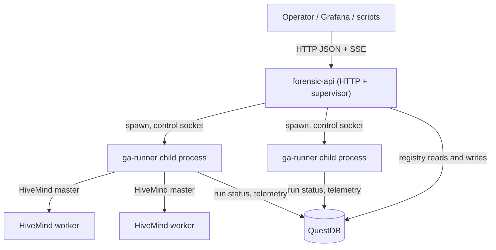

# Chapter 17: Control Plane — forensic-api as Run Supervisor

> **Status: design freeze (C0). Implemented by C1–C6.** Nothing in this
> chapter describes code that exists yet, except where a section explicitly
> says "today" or "unchanged". This is the contract later tasks implement
> against: the run state machine (C2), the supervisor process (C3), the
> HTTP routes (C4), the telemetry model (C5), and the runbook + smoke test
> (C6). Where this chapter and a later task's own PR disagree, the later
> task's characterization tests are the tie-breaker, but the disagreement
> should be called out as a deviation in that task's CHANGELOG entry.

## 1. Architecture

`forensic-api` (this workspace's existing hand-rolled `smol` HTTP server,
`apps/forensic-api/src/{main.rs,handler.rs,worker.rs}`) becomes the Alpha
Suite's control plane: it stays the one process an operator, Grafana, or a
script talks to, and it supervises every GA run and one-shot job as a
**child `ga-runner` process** rather than running any of that work inside
its own executor (decision D1). `QuestDB` is the durable registry a
supervisor restart can rebuild its in-memory state from (decision D3) —
mirroring how `ga_forensic_jobs` already works for the existing forensic
endpoints today. Each child that runs a distributed GA also has its own
HiveMind master inside it, dispatching to HiveMind workers exactly as it
does today; the control plane never talks to workers directly.



The existing forensic worker (`worker::JobRegistry`, an in-process
`smol::lock::Semaphore` over direct, in-executor calls to
`alpha_orchestrator::run_forensic_analysis`) is untouched by any of this —
see §5's note on backward compatibility. It is a separate, smaller job
system that predates the control plane and continues to run forensic
replays synchronously inside `forensic-api` itself; it does not become a
`ga-runner` child under this design (a `ForensicReplay` **job kind** in the
control plane, §3, is a distinct, new code path that spawns `ga-runner
forensic` as a child instead — the two are not the same mechanism, and
`worker.rs`'s existing behavior is what the C0 characterization tests
pin).

## 2. Run state machine

States: `Queued, Starting, Running, Pausing, Paused, Resuming, Stopping,
Stopped, Completed, Failed, Orphaned`.

`Completed` and `Failed` are **terminal** — no event legally leaves them.
A job that failed is not retried in place; the operator submits a brand
new job (a fresh `job_id`) if they want to try again, optionally as a
`Resume` job kind pointed at the last good checkpoint if one exists.

C2 implements this table directly as a pure function:

```rust
fn transition(from: State, event: Event) -> Result<State, InvalidTransition>
```

| From | Event | To | Triggered by |
|---|---|---|---|
| *(none)* | `POST /v1/jobs` accepted | `Queued` | operator (HTTP) |
| `Queued` | scheduler acquires a slot and dispatches | `Starting` | supervisor |
| `Queued` | `DELETE /v1/jobs/{id}` | `Stopped` | operator (HTTP) |
| `Starting` | child spawned, control socket accepting, first `run_started` progress event observed | `Running` | supervisor (relaying the child's own event) |
| `Starting` | spawn failed (exec error, missing/invalid profile, resource token lost between admission and spawn) | `Failed` | supervisor |
| `Running` | `POST /v1/jobs/{id}/pause` | `Pausing` | operator (HTTP) |
| `Running` | `POST /v1/jobs/{id}/stop` | `Stopping` | operator (HTTP) |
| `Running` | child exits 0 with a `completed` progress event | `Completed` | child process |
| `Running` | child exits with any code other than the pause/stop contract below, or the process is observed dead without a matching progress event | `Failed` | child process |
| `Running` | liveness sweep finds the pid gone with no terminal event ever recorded | `Orphaned` | liveness sweep |
| `Pausing` | child checkpoints at the next generation boundary and exits `0` with a `paused` progress event | `Paused` | child process |
| `Pausing` | child exits nonzero (and not the pause contract) while a pause was in flight | `Failed` | child process |
| `Pausing` | liveness sweep finds the pid gone before the pause completed | `Orphaned` | liveness sweep |
| `Pausing` | `POST /v1/jobs/{id}/stop` (escalating an in-flight pause straight to a stop) | `Stopping` | operator (HTTP) |
| `Paused` | `POST /v1/jobs/{id}/resume` | `Resuming` | operator (HTTP) |
| `Paused` | `DELETE /v1/jobs/{id}` | `Stopped` | operator (HTTP) |
| `Resuming` | scheduler re-acquires a slot and spawns `ga-runner resume` | `Running` | supervisor |
| `Resuming` | spawn failed | `Failed` | supervisor |
| `Stopping` | child exits `0` (checkpoint saved) or `3` (no checkpoint) — see §6's exit-code contract | `Stopped` | child process |
| `Stopping` | control request timed out and the kill escalation (§6) completed | `Stopped` | supervisor |
| `Stopping` | liveness sweep finds the pid gone before the stop completed | `Orphaned` | liveness sweep |
| `Stopped` | `POST /v1/jobs/{id}/resume` (only if a session checkpoint exists — see the footnote below) | `Resuming` | operator (HTTP) |
| `Starting`/`Running`/`Pausing`/`Stopping` | startup adoption: pid alive and the control socket answers `status` | whatever run state the child reports (`Running`, `Pausing`, or `Stopping`) | supervisor (startup adoption) |
| `Orphaned` | startup adoption: pid alive and the control socket answers `status` (reached when the liveness sweep already marked the row `Orphaned` before an adoption attempt) | whatever run state the child reports (`Running`, `Pausing`, or `Stopping`) | supervisor (startup adoption) |
| `Orphaned` | `POST /v1/jobs/{id}/resume` (session file exists) | `Resuming` | operator (HTTP) |
| `Orphaned` | operator gives up (no resumable session, or an administrative decision) | `Failed` | operator (HTTP) |
| `Completed` | *(none — terminal)* | — | — |
| `Failed` | *(none — terminal)* | — | — |

Explicitly **illegal** transitions (the DB writer and the HTTP handlers
both refuse these with `409`, not merely "unlikely"):

- Any event against `Completed` or `Failed` (terminal).
- `pause`/`stop`/`resume` against `Queued` (nothing is running yet to
  pause/stop, and there is nothing to resume — `DELETE` is the only
  operator action on a `Queued` job).
- `pause` against `Paused`, `Pausing`, `Stopping`, `Stopped`, `Starting`,
  `Resuming`, or `Orphaned` (only a `Running` job can start pausing).
- `stop` against `Stopping`, `Stopped`, `Starting`, `Resuming`, `Paused`,
  or `Orphaned` before adoption decides its next state. Only `Running`
  and `Pausing` may transition via `stop` — **`Pausing --stop--> Stopping`
  IS legal (decided by C2)**: escalating an in-flight pause straight to a
  stop is a real operator need (the operator changed their mind about
  wanting this run back at all before the pause even finished
  checkpointing), so this is the ONE exception among the otherwise-
  `Running`-only `stop` transitions — see the table row above and C2's
  CHANGELOG entry.
- `resume` against anything other than `Paused`, `Stopped` (with a
  checkpoint), or `Orphaned` (with a session file).
- `DELETE` against anything other than `Queued` or `Paused` (a running
  child cannot be deleted out from under itself — it must be stopped
  first).

Footnote on `Stopped → Resuming`: the state alone does not say whether a
checkpoint exists — that lives in the job's `session_path` column (C2's
`ga_run_supervisor` table, per the blueprint's C2 task notes). A `resume`
request against a `Stopped` job with `session_path IS NULL` (exit code 3,
"stop without checkpoint") is a `422` (nothing to resume from), not a
`409` (the state itself permits resuming a stopped job in general).

**Implementation note (C3) — a gap this table left open, closed
pragmatically**: the table gives `Starting` exactly two legal events
(`ChildStarted`, `SpawnFailed`) and no direct way to express "the process
spawned successfully via the OS but exited before ever emitting its first
`run_started` progress event" (a crash in the first instant of the
child's own startup, before it even reached the point of binding its
control socket or writing to stdout). `apps/forensic-api/src/
supervisor.rs::run_job` treats this exactly like a spawn failure —
`Event::SpawnFailed` — reasoning that the process never became a real,
observably-running job in any sense this control plane can tell apart
from one that never truly started. This is the only place C3's
implementation reused an existing event for a case this table's authors
may not have had in mind; flagged here rather than silently decided.

**Correction (CP) — adoption is legal directly from `Starting`/`Running`/
`Pausing`/`Stopping`, not only from `Orphaned`**: an earlier version of
this table gave `Event::Adopted` exactly one row, `Orphaned -> whatever
the child reports`, on the assumption that a row is always marked
`Orphaned` before adoption ever looks at it. That assumption was wrong:
`db::supervisor::fetch_adoptable_jobs` (C2) deliberately narrows its
candidate set to rows whose CURRENT state is `Starting`/`Running`/
`Pausing`/`Stopping` — `Orphaned` rows are excluded from that query
entirely, because an `Orphaned` row has already been resolved one way or
another (resumed, given up, or re-adopted) and is not a fresh adoption
candidate. `Supervisor::adopt_one`'s happy path (C3) therefore always
called `Event::Adopted` against a row in one of those four states, never
`Orphaned` — every real startup adoption hit `InvalidTransition` against
the table as originally written and silently failed. Fixed by making
`Event::Adopted` legal directly from all five states a live,
socket-answering child can be found in (`Starting`/`Running`/`Pausing`/
`Stopping`/`Orphaned`), per the two new/updated table rows above, rather
than routing every adoption through a transient, factually wrong
`Orphaned` write first — the child in this path was never actually
orphaned; its process is alive and answering the control socket right
now. `Orphaned -> Adopted -> reported` remains legal too, for the case
where the liveness sweep genuinely marked the row `Orphaned` (its own
`LivenessLost` transition) before a later adoption attempt looks at it.
`is_legitimate_adopted_state`'s guard is unchanged: a live, socket-
answering child can still only ever legitimately report `Running`,
`Pausing`, or `Stopping` — never `Paused` (an earlier version of the
`Orphaned` table row's own example listed `Paused`, which was itself
inconsistent with that guard; corrected above too).

## 3. Job kinds

Eight job kinds, one per one-shot or long-running `ga-runner` workload the
control plane can supervise. The exact `ga-runner` argv below was
transcribed from `apps/ga-runner/src/main.rs`'s real `clap` definition
(`enum Command`), not invented — two places where the real CLI disagrees
with earlier planning assumptions are called out explicitly.

Every job kind's argv is prefixed with `ga-runner --config <profile>`,
where `<profile>` is a shipped config file referenced **by name** (never a
literal path containing secrets constructed by the API — the profile file
on disk is what carries `questdb_pg_uri` etc., and the API only ever
passes its filename).

| Job kind | `ga-runner` subcommand | Flags |
|---|---|---|
| `GaRun` | `run` | *(none — `run` takes no subcommand-specific flags)* |
| `Resume` | `resume` | `--session-file <path>` |
| `SeedSweep` | `seed-sweep` | `--seeds <n>` (default 5), `--seed-list <a,b,c>` (optional, comma-delimited `u64`s), `--master-seed <n>` (optional), `--min-recurrence <n>` (default 2) |
| `PostProcess` | `post-process` | `--ga-run-id <id>` (optional), `--allow-lossy-reconstruction` (bool flag) |
| `BackfillPeriods` | `backfill-periods` | `--ga-run-id <id>` (**required**, not optional) |
| `TrainFilter` | `train-filter` | `--ga-run-id <id>` (optional), `--top-n <n>` (default 50) |
| `ForensicReplay` | `forensic` | `--ga-run-id <id>` (**required**), `--params-hash <hash>` (**required**), `--allow-lossy-reconstruction` (bool flag) |
| `PgoTrain` | `pgo-train` | *(none — hidden, DB-free smoke workload)* |

### Deviations from earlier planning, found while reading the real CLI

- **`Resume` is a named flag, not a bare positional.** The blueprint's own
  prose ("spawns `ga-runner resume <session_path>` as a new child") reads
  as a positional argument. The real subcommand is
  `resume --session-file <path>` (`#[arg(long)] session_file: PathBuf`).
  C3's spawn code must pass `--session-file`, not append a bare path.
- **`PgoTrain` is not unconditionally present.** `Command::PgoTrain` is
  gated `#[cfg(feature = "pgo-train")]` **and** `#[command(hide = true)]`
  — it is compiled into the `ga-runner` binary only when built with
  `cargo build --features pgo-train` (see `scripts/pgo-build.sh` and the
  2026-09-07 PGO CHANGELOG entry for the existing precedent). A
  production `ga-runner` binary built the normal way does **not** have
  this subcommand at all; invoking it returns clap's "unrecognized
  subcommand" error, not a job failure inside `pgo-train` itself. C3/C4/C6
  test fixtures that rely on `PgoTrain` as their DB-free smoke workload
  must either (a) build their own `ga-runner` test binary with
  `--features pgo-train`, or (b) document that the control plane's own
  test suite runs against such a binary and a normal production install
  cannot dispatch `PgoTrain` jobs unless it, too, was built with that
  feature. This is a real constraint on deployment, not just on testing —
  manual/11 (or wherever C6's runbook lands this) should say so plainly.
- A related, adjacent subcommand exists that no job kind maps to:
  `resume-db --ga-run-id <id>` (re-derives the session from `QuestDB`
  rather than a session file). It is not one of the eight required job
  kinds and this chapter does not add a ninth — noted here only so a
  future task does not "rediscover" it and wonder why it has no kind.
- `Args` (the top-level struct, shared by every subcommand) also carries
  `--headless` (disables TUI progress bars/ANSI colors) with no default
  value shown to clap (bool flag, defaults `false`). A supervised child
  should almost certainly always pass `--headless` (there is no terminal
  to draw a progress bar to), and C3 should add it to every spawn's argv;
  it is not itself a per-job-kind flag so it is not repeated in the table
  above.
- **`--override-file <PATH>` now exists (C3), top-level.** Added to
  `apps/ga-runner/src/main.rs`'s `Args` struct alongside `--control-socket`/
  `--progress-json`/`--headless`, so it composes with every job kind above.
  Applied in `main` immediately after `Config::from_file` loads the
  profile named by `--config`, and BEFORE the `--headless` CLI override
  (so an explicit `--headless` flag still wins even if the overlay file
  itself set `headless`) — via `alpha_config::Config::apply_overlay_file`,
  which merges the TOML overlay's tables recursively onto the loaded
  `Config` (a partial `[ga]` table in the overlay does not blank out
  `[ga]`'s other, already-loaded fields) and re-validates the merged
  result before returning it. Absent by default: with no `--override-file`,
  behaviour is byte-identical to before this flag existed. The overlay
  file itself never carries a secret — `apps/forensic-api`'s supervisor
  (C3) writes it to `<runs_dir>/<job_id>/overrides.toml` from a job's
  `overrides` object (`POST /v1/jobs`, C4), and only ever contains
  ordinary tunables like `[ga] population_size`, never `questdb_pg_uri` or
  similar — that still comes only from the profile named by `--config`.

### Implementation notes (C3) — spawn, logs, and the SSE event bus

- **Every spawn's argv** is `build_argv(&kind, &profile)` (C2, unchanged)
  plus, appended by C3: `--control-socket <runs_dir>/<job_id>/control.sock`,
  `--progress-json`, and — only when the job has a non-empty
  `config_overrides` — `--override-file <runs_dir>/<job_id>/overrides.toml`
  (rendered from the stored JSON via `serde`'s data model into
  `toml::Value`, then `toml::to_string`; see the `overrides_json`
  encoding note under §8).
- **`stderr.log` rotation**: appended to line by line; once it exceeds
  **10 MiB**, the existing file is renamed to `stderr.log.1` (overwriting
  any previous one) and a fresh `stderr.log` is started. Exactly one
  rotation is kept, not a numbered series — enough to bound one
  misbehaving job's disk use without the added complexity of a
  multi-generation rotation policy this control plane does not otherwise
  need.
- **The SSE bus C4 will subscribe to** is `supervisor::JobEvent`
  (`Progress(ProgressEvent)` relayed verbatim from the child's stdout, or
  `StateChanged { state }` for every `ga_run_supervisor` transition this
  supervisor recorded, including ones the child itself never reported —
  e.g. a liveness-sweep `Orphaned`). `Supervisor::subscribe(job_id) ->
  smol::channel::Receiver<JobEvent>` hands out one receiver per
  subscriber, fed by a small hand-rolled fan-out (`smol::channel` — this
  workspace's `async-channel` re-export — is MPMC but delivers each
  message to exactly ONE receiver, not a broadcast to every subscriber, so
  a bespoke one-`Sender`-per-subscriber list was needed instead). Each
  subscriber's channel holds up to 256 events; a publish to a full or
  closed channel is dropped for that one subscriber rather than blocking
  the job's own run task — a slow SSE client must never be able to stall a
  job's progress handling. C4 owns turning this into the exact SSE frame
  names/shapes below (`generation_done` here becomes `generation` there,
  etc.) and the `Last-Event-ID` ring buffer.

## 4. Resource model

Four independent resource pools the scheduler (C3) allocates from before
spawning a child:

1. **CPU slots** — `api.max_concurrent_runs` (§ manual/10 stub, below):
   the maximum number of `ga-runner` children running at once, full stop.
2. **GPU token** — one exclusive token, held only by a run whose config
   profile has `gpu.enabled = true`. At most one GPU-using child runs at a
   time regardless of how many CPU slots are free.
3. **Distributed token** — one exclusive token, held only by a run whose
   config profile has a `[distributed]` section. The HiveMind *master*
   lives inside the child process (§1), so two simultaneous distributed
   runs would mean two masters competing for the same worker fleet —
   decision D6 forbids that outright rather than trying to partition
   workers between masters.
4. **Shared DB pool** — the one process-wide `alpha_orchestrator::db::
   DbHandles` (F17) that `forensic-api` already constructs once at
   startup. The control plane does not get its own pool; it reuses this
   one, the same way the existing `worker::JobRegistry` does.

**The existing forensic-job semaphore is a separate pool.** `worker::
JobRegistry`'s `Semaphore(max_concurrent_forensic_jobs)` bounds
in-process, synchronous `run_forensic_analysis` calls (today's
`/forensic` route) and is not touched, resized, or shared by the control
plane's scheduler — a busy control plane does not throttle `/forensic`
and vice versa. This separation is deliberate (D7: existing forensic
behavior stays byte-identical) and is exactly what §7's characterization
tests exist to pin down.

### Implementation notes (C3)

- **Two more `[api]` switches gate the two exclusive tokens**:
  `api.gpu_exclusive` and `api.distributed_exclusive` (both default
  `true`, manual/10 §11.1). A job's `ResourceRequirement` is
  `{ gpu: config.gpu.enabled && api.gpu_exclusive, distributed:
  config.distributed.is_some() && api.distributed_exclusive }`
  (`apps/forensic-api/src/scheduler.rs::resource_requirement_for_config`)
  — turning either switch off stops that token from being accounted for
  at all, even for a profile that would otherwise need it. `gpu.enabled`
  itself defaults to `true` (`alpha-config`'s `GpuConfig`), so in practice
  almost every profile needs the GPU token unless it explicitly disables
  GPU mode.
- **The admission decision is a pure function**
  (`scheduler::next_admissible(queue, held_tokens, max_concurrent_runs) ->
  Option<usize>`), deliberately a SCAN of the queue in submission order
  rather than strict FIFO: a queued job that needs a token not currently
  free is skipped over (not blocked on), so a later, ordinary job behind
  it can still dispatch. Concretely, `[gpu_job, cpu_job]` with the GPU
  token already held returns `cpu_job`'s index — a GPU (or distributed)
  job at the front of the queue never starves unrelated jobs behind it for
  the whole time its exclusive token is held elsewhere. Submission order
  IS still respected among jobs that are equally admissible. Unit-tested
  exhaustively (CPU exhaustion, each exclusive token held, the
  no-starvation property, submission ordering) with no `smol`, no
  `DbHandles`, no child process at all — see that module's tests.
- **In-flight resource bookkeeping is process-local, not the database.**
  `HeldTokens`/`in_flight: HashMap<job_id, ResourceRequirement>` live only
  in `Supervisor`'s own memory; a restart rebuilds them from
  `fetch_adoptable_jobs` (startup adoption reserves each successfully
  re-adopted job's tokens before the dispatch loop starts, so a freshly
  restarted supervisor does not over-admit new jobs past capacity while
  several old ones are still actually running).

## 5. HTTP contract

All new routes are versioned under `/v1`. **The existing `/forensic`,
`/forensic/status`, and `/health` routes, and their `X-Forensic-Auth` /
`key=` query-parameter authentication, are unchanged** — this is a hard
requirement (D7), verified by the C0 characterization tests
(`apps/forensic-api/tests/forensic_characterization.rs`) and re-run,
unmodified in intent, by every later task in this blueprint.

The one exception, and it is additive-only: when `api.supervisor.enabled
= false` (the default — the off switch), `GET /health`'s response body is
byte-identical to today's `{"status":"ok"}`. When the supervisor is
enabled, `GET /health` MAY grow additional fields (`db_ok`,
`supervisor_enabled`, `running_jobs`) alongside the existing `status` key
— existing consumers reading `status` are unaffected either way. No
existing field is ever renamed or removed.

**Implemented by C4 — the exact enabled-mode body**: `{"status": "ok",
"db_ok": <bool>, "supervisor_enabled": true, "running_jobs": <usize>}`.
`db_ok` is a bounded (500ms), best-effort `SELECT 1` against the shared
`DbHandles::pg` pool (`handler::check_db_ok`) — `/health` must stay a
fast, pollable endpoint even when `QuestDB` is unreachable or slow to
accept a connection; a false `db_ok` never changes the HTTP status itself
(still `200`), since the endpoint's own liveness is what the status code
communicates. `running_jobs` is `Supervisor::running_jobs_count()`
(jobs currently occupying a resource slot, not the queue depth).

### Auth

Every mutating route (`POST`, `DELETE`) and the SSE `events` stream
require `Authorization: Bearer <token>`, checked with
`alpha_core::security::verify_shared_secret` against a new `api.auth_token`
(manual/10 stub, below). Read routes (`GET /v1/jobs*`, `GET /v1/runs/*`)
are also token-gated when `api.require_token_for_reads = true` (default
`true`); set it to `false` only for a deployment that already restricts
network access to `forensic-api` by other means. `verify_shared_secret`
already fails closed on an empty `expected` (see `ApiConfig::auth_key`'s
identical contract today) — an unset `api.auth_token` rejects every
request rather than opening the control plane.

### Error envelope

Every non-2xx control-plane response body is:

```json
{"error": "human-readable message", "code": "machine_readable_code", "job_id": "optional-uuid-if-relevant"}
```

| Status | `code` | Meaning |
|---|---|---|
| `400` | `bad_request` | malformed request (bad JSON body, bad query param) |
| `401` | `unauthorized` | missing or invalid bearer token |
| `403` | `forbidden` | reserved for a future scoped-token scheme; no C0–C6 handler returns this today, since decision D5 defines exactly one shared bearer token with full access — the code exists so a later scope check does not need a wire-format change |
| `404` | `not_found` | unknown `job_id` / `ga_run_id` |
| `409` | `invalid_transition` | the requested state change is illegal per §2's table |
| `422` | `validation_failed` | the job's config (profile + overrides) failed `Config::validate` before spawning, or a `resume` was requested against a job with no checkpoint to resume from |
| `500` | `internal_error` | a database failure NOT already covered by one of the rows above (e.g. `submit`'s initial `insert_supervised_job`, or a control operation's own `ga_run_supervisor` read failing against an unreachable database) -- added by C4; `SupervisorError`'s own doc comment (C3) already documented this mapping, this table just did not have the row for it yet |
| `503` | `supervisor_disabled` | `api.supervisor.enabled = false`; every `/v1/*` route returns this until the operator turns the supervisor on, checked BEFORE auth or body parsing (C4) -- a disabled supervisor never leaks even a "your token was wrong" |

### Routes

| Method | Path | Query | Request body | Response | Status |
|---|---|---|---|---|---|
| `POST` | `/v1/jobs` | — | `{"kind": "GaRun", "profile": "config.toml", "overrides": {...}?, "resume_of": "job-id"?}` | `{"job_id": "uuid"}` | `202`; `422` on config validation failure; `503` if disabled |
| `GET` | `/v1/jobs` | `state=`, `kind=`, `limit=` (all optional filters) | — | `{"jobs": [JobSummary, ...]}` | `200` |
| `GET` | `/v1/jobs/{id}` | — | — | `JobDetail` (full record: kind, state, `ga_run_id`, pid, host, profile, config_hash, session_path, control_socket, timestamps, exit_code, last_error) | `200`; `404` |
| `POST` | `/v1/jobs/{id}/pause` | — | — | `{"job_id": "uuid", "state": "Pausing"}` | `202`; `404`; `409` |
| `POST` | `/v1/jobs/{id}/stop` | — | — | `{"job_id": "uuid", "state": "Stopping"}` | `202`; `404`; `409` |
| `POST` | `/v1/jobs/{id}/resume` | — | — | `{"job_id": "uuid", "state": "Resuming"}` | `202`; `404`; `409`; `422` (no checkpoint) |
| `DELETE` | `/v1/jobs/{id}` | — | — | *(empty body)* | `204`; `404`; `409` (not `Queued`/`Paused`) |
| `GET` | `/v1/jobs/{id}/telemetry` | `from=`, `to=` (RFC3339 or QuestDB-style timestamps, optional range) | — | `RunTelemetry` (C5 defines the exact shape — history from `QuestDB` plus, if the job is live, the in-memory progress state) | `200`; `404`; `500` (database unreachable/timeout AND no live in-memory snapshot for the job — see the C5 follow-up note below) |
| `GET` | `/v1/jobs/{id}/events` | — | — | `text/event-stream` SSE (see below) | `200` (stream); `404`; `401` |
| `GET` | `/v1/runs/{ga_run_id}` | — | — | resolves a `ga_run_id` to its owning `job_id` and current `JobDetail` | `200`; `404` |
| `GET` | `/health` | — | — | see the additive-only note above | `200` |

Request bodies are bounded by the same body-size guard the header read
already uses (`MAX_HEADER_SIZE`-style cap — C4 decides the exact constant
for a JSON body, separate from the existing header cap since this server
has never needed to read a body before).

**Implemented by C4**: `apps/forensic-api/src/handler.rs::MAX_BODY_SIZE`
is **64 KiB**, deliberately separate from `MAX_HEADER_SIZE` (16 KiB) —
generous for any realistic `alpha-config` overlay while bounding a
malicious or buggy client's footprint on one connection. An oversized
`Content-Length` is rejected immediately from the header value alone
(`400 bad_request`), before attempting to buffer anything close to the
cap. Only `POST /v1/jobs` reads a body at all today; every other `/v1/*`
route ignores whatever `Content-Length` a client sends, exactly like
`/forensic`/`/forensic/status` always have.

**`POST /v1/jobs`'s body shape, sharpened**: `kind` is NOT a nested
object — `JobKind` (C2/C3) is internally tagged
(`#[serde(tag = "kind")]`), so a kind's own parameters sit at the SAME
JSON level as `"kind"` itself, alongside `"profile"`/`"overrides"`/
`"resume_of"`. A `GaRun`/`PgoTrain` submission is exactly
`{"kind": "GaRun", "profile": "config.toml"}` (matching the table's
example verbatim); a `SeedSweep` submission additionally carries
`"seeds"`/`"seed_list"`/`"master_seed"`/`"min_recurrence"` at the top
level. `apps/forensic-api/src/routes/mod.rs::SubmitJobRequest` implements
this with `#[serde(flatten)]`.

**`resume_of` is accepted but not wired to new behaviour (C4 deviation)**:
`Supervisor::submit` (C3) has no notion of "create a new job that resumes
another job's checkpoint" — resuming in this design always re-dispatches
an EXISTING job under its OWN `job_id` (`POST /v1/jobs/{id}/resume`), not
a new one. A `resume_of` field in a `POST /v1/jobs` body is parsed (for
wire compatibility with this section's own documented shape) and logged,
but otherwise ignored. Use `POST /v1/jobs/{id}/resume` against the
ORIGINAL job's `job_id` instead.

**`POST /v1/jobs/{id}/stop`'s checkpoint choice, sharpened**: this
section originally documented no way to choose §6's `checkpoint: true`
vs. `false`. C4 added an optional `?checkpoint=false` query parameter
(default `true` — save a resumable session whenever possible) since
`Supervisor::stop` (C3) requires the caller to decide.

**`JobSummary`/`JobDetail`, sharpened**: `JobSummary` (the `GET /v1/jobs`
list-item shape) is `{job_id, kind, state, ga_run_id, created_at,
updated_at}` — deliberately narrower than `JobDetail`, which additionally
carries `pid, host, profile, config_hash, session_path, control_socket,
exit_code, last_error` as this section's route table already names.
`GET /v1/runs/{ga_run_id}` returns the same `JobDetail` shape.

**`GET /v1/runs/{ga_run_id}`, a deviation**: `alpha_orchestrator::db::
supervisor` has no `fetch_by_ga_run_id` query — C4 loads every current
`ga_run_supervisor` row and matches client-side. Fine for the job counts
this control plane manages; a future task should add an indexed,
parameterized query if that stops holding.

**`GET /v1/jobs/{id}/telemetry`'s real shape (implemented by C5)**:
`{"job_id", "run": RunHeader | null, "generations": [GenerationPoint,
...], "fleet": null, "live": bool}`. `404` for an unknown job, `200`
otherwise — including for a job that exists but has no `ga_run_id` yet
(`Queued`/`Starting`, before the child has logged `run_start`), which
gets `200` with every field empty/`null` rather than a `404`/`422`: the
job genuinely exists, it simply has no run to report telemetry for yet.

`run` is `alpha_orchestrator::telemetry::RunHeader` (`ga_run_id`,
`status`, `end_generation`, `end_reason`, `ga_seed`, `objective_mode`,
`partition_mode`, `sweep_group_id`), built from `ga_run_metadata`.
`generations` is `Vec<GenerationPoint>` — the SAME shape §5's SSE
`generation` frame below carries, per this section's "one parser for
both" requirement. `from`/`to` are parsed as RFC3339 or a `QuestDB`-style
space-separated timestamp and filter `generations` by
`ga_generation_diagnostics.timestamp`; an unparseable or absent value
degrades to "no filter on that bound" rather than a `400` (a read-only
query parameter that only narrows an otherwise-successful response).

**Fixed (C5 follow-up): `live` now reflects a real in-memory overlay.**
C5 originally shipped `live` derived purely from the job's OWN
`ga_run_supervisor` state, with `alpha_orchestrator::telemetry::
LiveTelemetryBuilder` built and tested but never wired to this route. A
follow-up task closed that gap: `Supervisor::live_generation_snapshot`
reads `JobEventBus`'s own C4 ring buffer (the same bounded, per-job
history `Last-Event-ID` replay uses — no second parallel store of live
points) and replays it through `LiveTelemetryBuilder`. `live` is `true`
exactly when that snapshot exists and is not recorded terminal — proof
the supervisor actually holds in-memory progress for a still-running
child — not merely a DB-state guess. `is_live_state` (the original
DB-only check) is kept, but demoted to the fallback used only when the
supervisor has NO memory of the job at all (e.g. after a restart, before
this process has re-observed a progress event for an adopted job).
History and live points are merged by generation number
(`telemetry::merge_generation_points`): for a generation known to both
sources, the history point's fields win (it is strictly richer), with
only the live-only `evals` field filled in — never the reverse, which
would silently drop every history-only field. A live-only point carries
no timestamp at all, so it is always included regardless of any
`from`/`to` filter (which only ever narrowed the history half's SQL
query) — documented, not silently ignored. This also makes the route
resilient to `QuestDB` being unreachable: if either database read this
route makes fails or times out, and the supervisor has a live snapshot
for the job, the response falls back to a live-only body instead of an
unconditional `500`. A client that wants the child's raw progress stream
itself should still use `GET /v1/jobs/{id}/events`.

**Telling the two `200`-with-thin-data shapes apart (C6 clarification)**:
a job with no `ga_run_id` yet (`Queued`/`Starting`) is `200` with
`run: null`, `generations: []`, `live: false` — the job genuinely exists
but has nothing to report yet. A `QuestDB` outage on a job the supervisor
DOES hold live progress for is also `200`, but with `live: true` (or
`false` only if that snapshot is already terminal) and non-empty
`generations` (the live points alone) — a reader who checks `live`
already tells these apart. Only when NEITHER condition holds (a database
failure or timeout AND no in-memory snapshot for the job at all, e.g.
this process restarted and has not yet re-observed a progress event for
an adopted job) does the route fall through to a genuine `500`, per the
route table's row above.

**Deviation, deliberately deferred: `fleet` (`FleetSnapshot`) is defined
but never populated.** Populating it needs `forensic-api` to become an
AUTHENTICATED client of a running child's own `HiveMind` master query
endpoint (mirroring §4.2's five-connection design) — no such client
exists anywhere in `forensic-api` today, and building one (TLS, the
handshake, the `QueryTelemetry`/`QueryRuns` wire messages) is a
substantial feature in its own right. Authenticating that client would
also mean pulling `distributed.auth_token` into the `forensic-api`
process — a secret this API is specifically designed NEVER to hold (the
child `ga-runner`'s own `HiveMind` master authenticates workers, not the
control plane) — and even setting that aside, this environment has no
live distributed run and no real worker fleet to verify such a client
against end to end. `fleet` therefore stays `None` from both producers,
left for a future task with both a live distributed run and an accepted
answer to the secret-handling question.

### SSE event names

`GET /v1/jobs/{id}/events` streams `event: <name>\ndata: <json>\nid:
<n>\n\n` frames. Event names mirror `ga-runner --progress-json`'s own
newline-delimited JSON events one-to-one, plus one control-plane-only
addition:

- `run_started`
- `generation` (one `GenerationPoint`, the same JSON shape the history
  endpoint's `generations` array uses (implemented by C5) — so a client
  needs exactly one parser for both)
- `checkpoint_saved`
- `state_changed` (control-plane-only: emitted on every §2 transition,
  including ones the child itself did not report, e.g. a liveness-sweep
  `Orphaned`)
- `completed`
- `failed`

**`GenerationPoint`'s shape (implemented by C5)**: `generation` (wire key
`"gen"` — `gen` is a reserved keyword in Rust edition 2024), `best`,
`stall_fallback_count` are always present, from both the live SSE frame
and the history endpoint's array. `evals` is present only on a LIVE
point (from the child's own `--progress-json` stream) —
`ga_generation_diagnostics` has no per-generation evaluation-count
column, only a whole-run total, so a history-sourced point never
carries it. Every
other field (`max_generations`, `best_pnl`, `best_win_rate`,
`best_drawdown`, `best_sharpe`, `best_trades`, `population_size`,
`positive_count`, `crushed_count`, `failed_count`, `stagnation`,
`score_dist`, `trade_dist`, `min_trades_target`, `max_trades_target`,
`min_dd_target`, `max_dd_target`) is present only on a HISTORY-sourced
point — a live SSE `generation` frame omits all of them (not `null`,
omitted entirely) rather than changing shape from before this task, so
an existing SSE consumer parsing only `gen`/`best`/`evals`/
`stall_fallback_count` is unaffected.

A `: keep-alive\n\n` SSE comment is sent every 15 seconds so a proxy or
browser does not time out an idle connection. `Last-Event-ID` (the
standard SSE reconnect header) resumes from a bounded in-memory ring
buffer of recent events per job — C4 settled the exact buffer size and
retention policy (see below); a client reconnecting after the buffer has
rolled over gets the current state as of reconnection, not a gap-filled
replay.

**Implemented by C4's follow-up — a genuine ring buffer, not size
zero**: every `JobEvent` gets a `u64` sequence number assigned ONCE, at
publish time, inside `Supervisor::publish` — not per-connection in the
SSE handler — so the `id:` field means the same thing across every
connection to a job and never restarts while the job exists.
`supervisor::JobEventBus` retains the most recent 256 `(seq, JobEvent)`
pairs per job (`EVENT_HISTORY_CAPACITY`, matching the live
per-subscriber channel's own capacity — retaining more history than a
live subscriber could ever have received live in the first place buys
nothing), and at most 512 jobs' worth of history at once
(`MAX_RETAINED_JOB_HISTORIES`), evicting oldest-terminal-first (then
oldest-empty-history-phantom, e.g. a job id that was subscribed to but
never existed) once that cap is exceeded — a job that is still active
with a live subscriber is never evicted, even over the cap, since ids
never restarting while the job exists is a correctness property, not a
soft memory target. `Supervisor::subscribe_with_history(job_id,
last_event_id)` (new — `Supervisor::subscribe` is kept, unchanged, for
C3's own tests) returns the replay decision and a live receiver from ONE
lock acquisition, so a publish can never land in the gap between reading
history and subscribing (no gap, no duplicate). `routes::events::
stream_events` parses `Last-Event-ID` via `alpha_core::security::
extract_header_value` (a non-numeric or absent value is treated
identically, never an error): a `Last-Event-ID` still within the
retained window replays every buffered event past it under its OWN
original sequence number, then continues live with no synthetic frame
in between; an absent, rolled-over (older than the oldest retained
event), or nonsense-future (newer than any event this job has ever
published) id falls back to exactly the ORIGINAL behaviour above — one
synthetic `state_changed` frame reflecting the job's current
`ga_run_supervisor` state immediately after connecting, then the live
stream — now sent under a reserved id (`0`,
`routes::events::SNAPSHOT_FRAME_ID`) that can never be confused with a
real sequence number (real ones start at 1). If a job has already
reached a terminal state (`Completed`/`Failed`/`Stopped`) before the
client connects, the replay (or that one synthetic frame) is the entire
stream and the connection then closes.

**`ProgressEvent::Paused`/`Stopped` are intentionally never their own SSE
frame**: this section's frozen event-name list has no slot for them —
the control-plane-only `state_changed` event (published by `Supervisor::
pause`/`stop` and the run task's own exit handling) already communicates
exactly that transition, so forwarding the child's raw progress event too
would be a duplicate frame under an unfrozen name.

**Best-effort existence check (C4 deviation)**: the current-state lookup
above is best-effort against the database, matching §3's "database is
best-effort where it must be" principle — a definite "no such row"
(`Ok(None)`) is still a genuine `404`, but a database FAILURE, or a call
that does not resolve within a bounded timeout (see below), is logged and
does NOT prevent subscribing to the supervisor's in-memory event bus,
which needs no database at all. Without this, `GET .../events` would be
the one control-plane route that cannot stream a single live event
without a fast, reachable database — worse than merely missing the
reconnect snapshot for a route whose entire point is live events. The one
cost: a genuine `404` cannot be told apart from "database
unreachable/slow" without a live, responsive database (both otherwise
looked identical before this note) — a human with a live `QuestDB` should
confirm the `404` path directly; see C4's report.

**Subscribe before the database check, not after (C4 correctness fix)**:
`Supervisor::subscribe_with_history` -- like `Supervisor::subscribe`
before it -- hands out a receiver that only ever delivers events
published from this call onward (its replay, if any, comes from history
already retained separately, per the ring-buffer section above) --
subscribing AFTER the (best-effort, but not instant) database check would
still open a window in which a fast-completing job publishes every one of
its events before anyone is listening for them LIVE, even though the
history-based replay softens the consequence today. `stream_events`
subscribes first; the database check (and its own timeout) runs after.

**Every database call this HTTP layer makes is bounded (C4, `with_db_
timeout`, 3 seconds)**: `Supervisor`'s public control methods
(`pause`/`stop`/`resume`/`delete`, C3) call `update_supervised_job_state`
(and, for `resume`, `fetch_current_supervised_job` first) with no timeout
of their own — unlike `Supervisor`'s OTHER, best-effort internal writes,
which already use a 500ms `DB_WRITE_TIMEOUT`. C4's own integration
testing found that, in its test environment, a `ga_run_supervisor` query
against an unreachable database does NOT fail fast as `supervisor.rs`'s
module doc comment assumes — it can take much longer than a few hundred
milliseconds. Every `/v1/*` route that touches the database (reads AND
the four control operations) is therefore wrapped in a 3-second timeout
at the HTTP layer, rendering as `500 internal_error` on expiry, so a slow
or unreachable database degrades a response rather than hanging it
indefinitely.

## 6. Control-socket protocol

One Unix domain socket per run, at `<runs_dir>/<job_id>/control.sock`,
newline-delimited JSON, versioned with a `v` field so the wire format can
change without breaking an in-flight child/supervisor pairing across an
upgrade. **Windows is out of scope** — `smol::net::unix::UnixListener` has
no Windows equivalent in this workspace's `smol` usage, and this control
channel is not expected to run there.

```json
{"v": 1, "cmd": "pause", "checkpoint": true}
```

`cmd` is one of `"pause" | "stop" | "status" | "snapshot"`. `checkpoint`
is meaningful for `"stop"` (whether to save a resumable session before
exiting — see the exit-code contract below) and ignored for the others
(`"pause"` always checkpoints — there is no such thing as a non-resumable
pause; `"status"`/`"snapshot"` do not exit anything).

The child answers on the same socket:

```json
{"v": 1, "ok": true, "state": "Pausing", "detail": ""}
```

### Pause semantics

A `pause` request is queued and drained non-blockingly (`try_recv`) inside
`handle_generational_maintenance` — never mid-generation. At the next
generation boundary the child: (1) calls the existing atomic, fsynced
`alpha_ga::session::save_session` path: (2) logs a `PAUSED` status via
`db::log_run_completion_status` with an end-reason naming the request;
(3) exits cleanly with code `0`. There is no partial-generation pause —
the worst-case latency between the request and the child actually exiting
is one generation's wall-clock time.

### Exit-code contract

| Exit code | Meaning |
|---|---|
| `0` | pause completed (checkpoint always saved), OR stop completed with `checkpoint: true` (checkpoint saved) |
| `3` | stop completed with `checkpoint: false` (no checkpoint saved — this run is not resumable from this exit) |
| anything else | the child crashed or exited from a genuine error path unrelated to a control request — the supervisor records `Failed`, not `Stopped` |

Because `0` is shared between "paused" and "stopped-with-checkpoint", the
supervisor distinguishes the two cases from the **last progress-json
event it saw before exit** (`paused` vs. `stopped`), not from the exit
code alone — the exit code only ever discriminates "was a checkpoint
saved" (`0`) from "was it deliberately not" (`3`) from "something else
happened" (anything else).

### Kill escalation

If a `pause`/`stop` control request gets no answer, or the child does not
actually exit within a bounded timeout after answering, the supervisor
escalates in order: (1) the control request itself (already attempted);
(2) wait up to a configured timeout for the process to exit on its own;
(3) `SIGTERM`; (4) after a further short grace period, `SIGKILL`. A child
killed at step 3 or 4 never got to save a checkpoint or log its own
terminal status — the supervisor is responsible for writing a `Failed` (or
`Stopped`, if a very recent checkpoint from a not-yet-acknowledged pause
is known to exist) row itself in that case, which is exactly the kind of
gap the startup-adoption/liveness-sweep logic (§2's `Orphaned` transitions)
also exists to close for the "supervisor itself restarted mid-escalation"
case.

### Implementation notes (C1)

The control channel and `--progress-json` stream are implemented exactly
as frozen above, with these additions the implementation surfaced:

- **CLI flags, exact spelling**: `--control-socket <PATH>` and
  `--progress-json` are both **top-level** `Args` fields (composing with
  every subcommand, matching `--headless`), not per-subcommand. Only
  `run`/`resume`/`resume-db` have a generational loop that ever drains the
  control queue or emits per-generation progress events; every other
  subcommand parses and accepts both flags harmlessly. **Unix domain
  sockets have no Windows equivalent in this workspace's `smol` usage —
  `--control-socket` is a no-op there and this whole channel is out of
  scope on Windows.**
- **`v` rejection**: an unrecognized `v` is rejected with an explicit
  `ControlProtocolError::UnsupportedVersion`, distinct from a JSON parse
  failure (`Malformed`) — a supervisor/child protocol-version mismatch and
  a garbled line are two different failure modes on the wire, both
  answered with `{"ok": false, ...}` rather than the connection silently
  hanging or panicking.
- **`status`/`snapshot` never touch the pause/stop queue**: they are
  answered directly by the accept loop from a shared, mutex-guarded
  `ProgressSnapshot` that `handle_generational_maintenance` refreshes every
  generation (not only when a request happens to be pending) — exactly as
  frozen above, called out here only because it is easy to misread "one
  queue" as "one queue for everything."
- **`--progress-json` `generation_done` fields**: `gen`, `best`, `evals`,
  `stall_fallback_count` — sourced from `GenerationDiagnostics` and the
  maintenance hook's own `cumulative_evaluations` parameter, nothing
  invented. `checkpoint_saved` carries the exact on-disk session filename
  (`ga_session_<ga_run_id>_<generation>.bin.lz4`).
- **Exit-code contract confirmed as implemented**: `apps/ga-runner`'s
  `main` reads the recorded `ControlOutcome` after the GA future resolves
  and calls `std::process::exit(3)` explicitly for "stop without
  checkpoint" — every other path (pause, stop with checkpoint, normal
  completion, an error) falls through to the pre-existing `Ok(())`/`Err(e)`
  return, which already exits `0`/non-zero respectively.
- **Resume finding**: `ga-runner resume --session-file <path>` (the real
  flag — see §3's deviation note) previously continued the generation
  counter correctly (`GaSessionState::start_generation` round-trips
  through `run_ga_loop_from_state`) but never re-logged a `STARTED`
  `ga_run_metadata` row on resume, unlike `run()`. Fixed by having
  `orchestrator::resume` call `db::log_run_start` followed immediately by
  `db::log_run_final_targets` (to re-assert the session's real
  `cumulative_evaluations`/seed/targets, which `log_run_start` alone would
  otherwise zero out) right after loading the session and connecting
  `DbHandles`.

### Implementation notes (C3) — kill escalation's exact timeouts

`apps/forensic-api/src/supervisor.rs` implements the four-step escalation
this section describes with these concrete, documented values (none of
them exposed as `[api]` config keys — C3's brief scoped exactly six new
keys, all in §4/manual/10 §11.1, none of them a timeout):

1. The control request itself: connect + write + read-reply, bounded by a
   single **5 second** timeout (`CONTROL_REQUEST_TIMEOUT`) — generous for
   a local Unix-domain-socket round trip, whose ordinary latency is
   microseconds; a slow reply here reflects `pause`/`stop` only being
   drained at the next generation boundary (§6 above), not a fault.
2. Wait for the child to exit on its own: **5 minutes**
   (`GRACEFUL_EXIT_AFTER_CONTROL`) after step 1, regardless of whether it
   was acknowledged. This section's own text ("the worst-case latency ...
   is one generation's wall-clock time") has no single fixed value across
   deployments — 5 minutes is a deliberately generous, documented default
   rather than a measured one; a deployment whose generations routinely
   run longer should treat a resulting `SIGTERM` as a signal to raise this
   constant, not evidence of a bug.
3. `SIGTERM`, then wait **10 seconds** (`SIGTERM_GRACE_PERIOD`) — enough
   for Rust destructors and any in-flight (non-checkpoint, that path
   already either happened or didn't before the control reply) I/O to
   unwind, short enough that an operator's `stop` does not itself hang for
   minutes on a child that will never exit cleanly.
4. `SIGKILL`.

Liveness is polled every **250ms** (`PID_POLL_INTERVAL`) while waiting out
steps 2/3, via `libc::kill(pid, 0)` (no `libc` signal-sending crate existed
in this workspace before this task — added as a direct dependency:
`std::process::Child` exposes only `SIGKILL`, with no way to send
`SIGTERM` first). The escalation task never itself performs the terminal
`ga_run_supervisor` write — the job's own run task (the one awaiting
`Child::status()`) is the sole writer of that, regardless of which of the
three ways (clean exit, `SIGTERM`, `SIGKILL`) actually ended the process;
see `supervisor::decide_exit_event`'s doc comment for exactly how it maps
an observed exit status + last progress event to a `state::Event` in each
case, including the two phases (`Pausing`, `Stopping`) this table's own
edges cover for a kill outcome.

## 7. Runbook

Every `curl` invocation below assumes `forensic-api` is listening on
`127.0.0.1:12326` (the shipped default) with `api.supervisor.enabled =
true`, and `$TOKEN` holds a valid `api.auth_token` value. Replace both to
match your deployment. See `manual/11_developer_operations_runbook.md`
§3b for `systemd`-managed startup and the `ALPHA_API_AUTH_TOKEN`
env-var handling, and `scripts/control-plane-smoke.sh` for a scripted,
end-to-end version of most of what follows (submit → SSE → completion,
pause → resume, run against a `PgoTrain` smoke workload).

### 7.1 Starting the service with the supervisor enabled

```toml
# config.toml
[api]
runs_dir = "/var/lib/alpha-suite/runs"   # absolute path in production
ga_runner_path = "/opt/alpha-suite/bin/ga-runner"
max_concurrent_runs = 4

[api.supervisor]
enabled = true
```

```bash
forensic-api --config config.toml
```

`api.auth_token` is deliberately not shown above — set it via
`ALPHA_API_AUTH_TOKEN` (manual/10 §11.1's fail-closed fallback) rather
than a literal in `config.toml`. Confirm the supervisor actually came up
before submitting anything:

```bash
curl -s http://127.0.0.1:12326/health
# {"status":"ok","db_ok":true,"supervisor_enabled":true,"running_jobs":0}
```

`supervisor_enabled: false` here means either `[api.supervisor] enabled`
was never set to `true`, or `config.toml` has no `[api]` section at all
(main.rs falls back to `ApiConfig::default()` and logs a warning) — check
the process's own startup log, not just this endpoint, before assuming
the config was even read from where you think it was.

### 7.2 Submitting each job kind

Every submission is `POST /v1/jobs` with a bearer token, `kind` flattened
alongside `profile` (§3, §5):

```bash
# GaRun -- a fresh, full GA run against a shipped profile
curl -s -X POST http://127.0.0.1:12326/v1/jobs \
    -H "Authorization: Bearer $TOKEN" -H 'Content-Type: application/json' \
    -d '{"kind":"GaRun","profile":"config.toml"}'

# SeedSweep -- explicit seeds, mirroring manual/11 §2.H's CLI example
curl -s -X POST http://127.0.0.1:12326/v1/jobs \
    -H "Authorization: Bearer $TOKEN" -H 'Content-Type: application/json' \
    -d '{"kind":"SeedSweep","profile":"config.toml","seeds":3,"seed_list":null,"master_seed":null,"min_recurrence":2}'

# PostProcess -- re-run validation against a completed run
curl -s -X POST http://127.0.0.1:12326/v1/jobs \
    -H "Authorization: Bearer $TOKEN" -H 'Content-Type: application/json' \
    -d '{"kind":"PostProcess","profile":"config.toml","ga_run_id":"ga_run_2026_08_20_btc","allow_lossy_reconstruction":false}'

# BackfillPeriods -- ga_run_id is REQUIRED for this kind (§3)
curl -s -X POST http://127.0.0.1:12326/v1/jobs \
    -H "Authorization: Bearer $TOKEN" -H 'Content-Type: application/json' \
    -d '{"kind":"BackfillPeriods","profile":"config.toml","ga_run_id":"ga_run_2026_08_20_btc"}'

# TrainFilter -- against a harvest run (manual/11 §2.F)
curl -s -X POST http://127.0.0.1:12326/v1/jobs \
    -H "Authorization: Bearer $TOKEN" -H 'Content-Type: application/json' \
    -d '{"kind":"TrainFilter","profile":"config.toml","ga_run_id":"ga_run_2026_08_20_harvest","top_n":50}'

# ForensicReplay -- ga_run_id AND params_hash are REQUIRED (§3). Note
# this is a DIFFERENT code path from the existing /forensic route (§1) --
# this one supervises a `ga-runner forensic` CHILD PROCESS instead of
# running run_forensic_analysis synchronously inside forensic-api itself.
curl -s -X POST http://127.0.0.1:12326/v1/jobs \
    -H "Authorization: Bearer $TOKEN" -H 'Content-Type: application/json' \
    -d '{"kind":"ForensicReplay","profile":"config.toml","ga_run_id":"ga_run_2026_08_20_btc","params_hash":"cbf29ce484222325","allow_lossy_reconstruction":false}'

# PgoTrain -- DB-free smoke workload. ONLY dispatchable if
# api.ga_runner_path points at a binary built with `--features
# pgo-train` (§3's deviation note) -- against a normal production
# ga-runner this returns 202 (the job is durably recorded as Queued) but
# then fails at spawn time (clap's "unrecognized subcommand", mapped to
# Event::SpawnFailed -> Failed, §2's implementation note) because the
# subcommand does not exist in that binary.
curl -s -X POST http://127.0.0.1:12326/v1/jobs \
    -H "Authorization: Bearer $TOKEN" -H 'Content-Type: application/json' \
    -d '{"kind":"PgoTrain","profile":"config.toml"}'
```

Every submission returns `202 {"job_id": "<uuid>"}`. `Resume` is not
submitted this way — see §7.3: resuming always re-dispatches an EXISTING
job's `job_id` via `POST /v1/jobs/{id}/resume`, never a fresh submission.

Watch it run, and check where it ended up:

```bash
curl -s -H "Authorization: Bearer $TOKEN" \
    http://127.0.0.1:12326/v1/jobs/<job_id>/events
# event: run_started
# data: {}
# id: 1
#
# event: generation
# data: {"gen":0,"best":1.23,"evals":4096,"stall_fallback_count":0}
# id: 2
# ...
# event: completed
# data: {}
# id: 9

curl -s -H "Authorization: Bearer $TOKEN" \
    http://127.0.0.1:12326/v1/jobs/<job_id>
```

### 7.3 Pause/resume and stop/resume walkthroughs

**Pause, then resume** (only legal from `Running`, §2):

```bash
curl -s -X POST -H "Authorization: Bearer $TOKEN" \
    http://127.0.0.1:12326/v1/jobs/<job_id>/pause
# {"job_id":"<job_id>","state":"Pausing"}
```

The child checkpoints at the NEXT generation boundary and exits (§6) —
poll until the transition lands:

```bash
curl -s -H "Authorization: Bearer $TOKEN" http://127.0.0.1:12326/v1/jobs/<job_id> \
    | grep -o '"state":"[^"]*"'
# "state":"Paused"
```

A `Paused` job's `GET /v1/jobs/{id}` response carries a non-null
`session_path` — that is the checkpoint `resume` will reload. Resuming
re-dispatches the SAME `job_id` as a new `ga-runner resume --session-file
<path>` child (§3's deviation note on the real flag spelling):

```bash
curl -s -X POST -H "Authorization: Bearer $TOKEN" \
    http://127.0.0.1:12326/v1/jobs/<job_id>/resume
# {"job_id":"<job_id>","state":"Resuming"}
```

The SAME `GET /v1/jobs/{id}/events` connection you opened before pausing
keeps working across the whole pause → resume cycle with no reconnect —
`Paused` is not a terminal SSE state (§5's frozen terminal set is
`Completed`/`Failed`/`Stopped` only), and the event bus is keyed by
`job_id`, not by which child process is currently alive.

**Stop, with or without a checkpoint** (legal from `Running` OR
`Pausing` — the one documented exception where `stop` reaches past
`Running`, §2):

```bash
# Save a resumable checkpoint before stopping (the default)
curl -s -X POST -H "Authorization: Bearer $TOKEN" \
    http://127.0.0.1:12326/v1/jobs/<job_id>/stop
# {"job_id":"<job_id>","state":"Stopping"}

# Or stop WITHOUT saving one (exit code 3, §6) -- session_path stays
# NULL, and a later `resume` against this job is a 422, not a 409
curl -s -X POST -H "Authorization: Bearer $TOKEN" \
    "http://127.0.0.1:12326/v1/jobs/<job_id>/stop?checkpoint=false"
```

A `Stopped` job with a checkpoint resumes exactly like a `Paused` one
(`POST .../resume`); a `Stopped` job with `session_path IS NULL` returns
`422 validation_failed` instead of dispatching anything (§2's footnote).

**Deleting a job** — only legal against `Queued` or `Paused` (a running
child cannot be deleted out from under itself, §2):

```bash
curl -s -X DELETE -H "Authorization: Bearer $TOKEN" \
    http://127.0.0.1:12326/v1/jobs/<job_id>
# 204 No Content
```

### 7.4 Recovering the registry after a `forensic-api` restart

`ga_run_supervisor` (§8) is the durable registry a fresh supervisor
instance rebuilds its in-memory state from (decision D3). On `Supervisor::
start`, in order:

1. **Re-queues still-`Queued` jobs** — a job accepted (`insert_supervised_
   job` ran) but never dispatched before the previous instance exited.
   Its full `JobKind` is reconstructed from `overrides_json` (§8) and
   handed back to the scheduler exactly like a fresh submission.
2. **Adopts `Starting`/`Running`/`Pausing`/`Stopping` jobs** —
   `fetch_adoptable_jobs` (filtered to THIS host, §8's `host` column) for
   each such row: if the recorded `pid` is alive AND its control socket
   answers `status`, the job is re-attached at whatever state the child
   reports (an `Orphaned -> <reported state>` transition, §2) and its
   resource tokens are reserved BEFORE the dispatch loop starts (so a
   restarted supervisor cannot over-admit new jobs past capacity while
   several old ones are still actually running, §4's implementation
   note). If the pid is gone, or the socket does not answer, the job is
   marked `Orphaned` instead (§7.5 below) — re-attached telemetry is
   DB-only until the job is spawned fresh (re-opening a dead process's
   stdout is impossible, §3).
3. Only then does the periodic liveness sweep and the dispatch loop
   start.

Confirm what got adopted after a restart:

```bash
curl -s -H "Authorization: Bearer $TOKEN" \
    'http://127.0.0.1:12326/v1/jobs?state=Running'
curl -s -H "Authorization: Bearer $TOKEN" \
    'http://127.0.0.1:12326/v1/jobs?state=Orphaned'
```

None of this needs an operator action for the common case (adoption
succeeds silently); §7.5 covers what to do when it doesn't.

### 7.5 Where logs live

- **Child stdout** (`--progress-json` newline-delimited JSON) is consumed
  line by line by the supervisor itself — it is never written to a file
  on its own; it becomes the `ga_run_supervisor` state transitions plus
  the `JobEvent` stream `GET /v1/jobs/{id}/events` and `GET /v1/jobs/{id}/
  telemetry` serve (§3, §5). There is no separate `progress.jsonl` file —
  an earlier draft of this chapter described one that C3's actual
  implementation does not write; the event bus (in-memory, §5's
  `Last-Event-ID` ring buffer) is the only place a live job's progress
  lives outside the database.
- **Child stderr** lands at `<runs_dir>/<job_id>/stderr.log`, appended to
  line by line as the child writes it (§3). Once it exceeds **10 MiB**,
  it is rotated ONCE — the existing file is renamed to
  `stderr.log.1` (overwriting any previous one) and a fresh `stderr.log`
  is started; only one rotation is kept, not a numbered series
  (`STDERR_ROTATE_THRESHOLD_BYTES`, `apps/forensic-api/src/
  supervisor.rs`). This is the first place to look for a child that
  crashed with a Rust panic or an `anyhow` error the control plane itself
  never saw a progress event for.
- **The job's own directory**, `<runs_dir>/<job_id>/`, additionally holds
  `control.sock` (removed once the child exits for good) and
  `overrides.toml` (only if the submission carried `overrides`, §3/§8) —
  useful for confirming exactly what a job was actually run with.
- **`forensic-api`'s own process log** (stdout, `tracing`) carries every
  `tracing::warn!`/`tracing::info!` this chapter's other sections
  reference — spawn failures, database-timeout warnings
  (`with_db_timeout`, §5), and the startup-adoption summary (§7.4).

### 7.6 Troubleshooting a job stuck in `Orphaned`

A job reaches `Orphaned` from `Running`/`Pausing`/`Stopping` when the
periodic liveness sweep (every 30s, `LIVENESS_SWEEP_INTERVAL`) finds its
recorded `pid` gone with no terminal event ever recorded, OR from startup
adoption when the pid is gone or the control socket does not answer
`status` (§2, §7.4). It means: **the control plane lost track of whether
this job's work is safe to consider done, failed, or resumable** — not
that the underlying `ga-runner` process necessarily did anything wrong.

1. **Check `session_path` first**:
   ```bash
   curl -s -H "Authorization: Bearer $TOKEN" \
       http://127.0.0.1:12326/v1/jobs/<job_id> | grep -o '"session_path":"[^"]*"'
   ```
   A non-null value means a checkpoint exists — `POST .../resume` against
   an `Orphaned` job with a session file is legal (§2) and re-dispatches
   it exactly like resuming a `Paused` one.
2. **No checkpoint, but the underlying work might still be resumable via
   the database**: `ga-runner resume-db --ga-run-id <id>` (manual/11
   §2.C) re-derives a session from `QuestDB` directly, independent of
   `session_path` — this is NOT one of the eight control-plane job kinds
   (§3's note on `resume-db`) and cannot be dispatched through `POST
   /v1/jobs`; run it by hand, out of band, then treat the ORIGINAL job as
   abandoned (see step 3).
3. **No way to recover this job's own run**: give up on it explicitly —
   ```bash
   # There is no dedicated "give up" route; DELETE only ever works on
   # Queued/Paused (§2) and Orphaned is neither. Confirm the situation is
   # genuinely unrecoverable (steps 1-2 above), then treat it as an
   # administrative closure: leave the row as Orphaned (it is informational
   # at that point, not blocking anything new) and submit a FRESH job
   # (a new job_id) for the work that still needs doing -- Completed and
   # Failed are the only states a job cannot be resurrected from, and
   # Orphaned with no checkpoint and no DB-derivable session is, in
   # practice, the same dead end.
   ```
4. **Check for a leaked `ga-runner` process** — an `Orphaned` job whose
   liveness sweep raced a slow control-socket reply (rather than a truly
   dead pid) can leave an actual child process still running, competing
   for the same CPU/GPU/distributed tokens a freshly dispatched job would
   need. `ps aux | grep ga-runner` on the host named by the job's `host`
   column (§8) and kill it by hand if it is still there and genuinely
   unwanted.
5. **A supervisor restart mid-escalation** (§6's kill-escalation
   sequence killed at `SIGTERM`/`SIGKILL` but the supervisor itself died
   before writing the resulting terminal row) is exactly the case
   startup adoption's `Orphaned` fallback (§7.4) exists to catch on the
   NEXT restart — if a job is stuck `Stopping`/`Pausing` with no progress
   for much longer than §6's documented timeouts (5 minutes + 10 seconds
   plus network latency), a restart of `forensic-api` itself is a
   reasonable, low-risk way to force the liveness sweep/adoption logic to
   resolve it one way or the other.

## 8. `ga_run_supervisor` registry schema (C2)

C2 (`crates/alpha-orchestrator/src/db/supervisor.rs`) implements §2's state
machine and §3's job kinds as pure functions
(`control::state::{transition, build_argv}`) and this durable registry
table, created via `ensure_run_supervisor_table` exactly like
`db::forensics::ensure_forensic_jobs_table` creates `ga_forensic_jobs`.
`ga_run_supervisor` is **append-only**: every write (`insert_supervised_job`
for a brand-new `Queued` job, `update_supervised_job_state` for every later
transition) is a COMPLETE snapshot row, never a partial update — `QuestDB`
has no UPDATE semantics, so a partial-column write would read back `NULL`
for whichever fields it omitted the moment it became the newest row.
Readers use `LATEST ON timestamp PARTITION BY job_id` to resolve exactly
one current row per job, the same pattern `ga_forensic_jobs` uses keyed on
`(ga_run_id, params_hash)`.

| Column | Type | Nullable | Notes |
|---|---|---|---|
| `job_id` | `SYMBOL` | no | The job's UUID, as text. `SYMBOL` rather than `QuestDB`'s native `UUID` type, mirroring `ga_run_id`/`params_hash` elsewhere in this crate — consistency with the rest of the schema beats a type nothing else here reads or writes. |
| `kind` | `SYMBOL` | no | One of the eight §3 job-kind names (`control::state::JobKind::name`) — `"GaRun"`, `"Resume"`, `"SeedSweep"`, `"PostProcess"`, `"BackfillPeriods"`, `"TrainFilter"`, `"ForensicReplay"`, `"PgoTrain"`. Kind-specific parameters (a `SeedSweep`'s `--seeds`, etc.) are NOT separate columns — they live in `overrides_json`. |
| `state` | `SYMBOL` | no | One of §2's eleven state names (`control::state::State`'s `Display`/`FromStr` round trip covers exactly these eleven strings). Every write goes through `control::state::transition` first — `update_supervised_job_state` refuses to write a row for an illegal `(state, event)` pair rather than writing an inconsistent one. |
| `ga_run_id` | `SYMBOL` | yes | `NULL` until the child logs its own `run_start` (i.e. through `Starting`); set once the run is known to `ga_run_metadata`. |
| `pid` | `LONG` | yes | `NULL` before the child is spawned. |
| `host` | `SYMBOL` | no | This supervisor's own hostname (`db::supervisor::resolve_host` — `$HOSTNAME`, else `/etc/hostname`, else the literal `"unknown"`; no hostname crate was added). `fetch_adoptable_jobs` filters on this so a supervisor only tries to re-adopt jobs it itself last owned. |
| `config_profile` | `STRING` | no | The shipped config file's NAME (never a path the API constructs, never file contents) — §3's rule that the profile on disk carries secrets and the API only ever passes its filename. |
| `config_hash` | `STRING` | no | `alpha_config::Config::canonical_hash()` — the same canonical hash exercised by `crates/alpha-config/tests/config_tests.rs::test_canonical_hash_changes_when_periods_sharing_changes` and its neighboring `canonical_hash_*` tests. |
| `overrides_json` | `STRING` | yes | See "Implementation notes (C3) — the `overrides_json` encoding" below for the exact shape this task settled on. |
| `session_path` | `STRING` | yes | Set once a checkpoint exists (after a `Pausing -> Paused` or a `Stopping -> Stopped` with `checkpoint: true`, §6). `NULL` here on a `Stopped` job is exactly the "no checkpoint" case §2's footnote describes: a `resume` against such a row is a `422`, not a `409` — the state itself permits `Stopped -> Resuming`, but there is nothing to resume from. |
| `control_socket` | `STRING` | yes | `<runs_dir>/<job_id>/control.sock` (§6) once the child has one; `NULL` before spawn and after the child has exited for good (`Completed`/`Failed`/`Stopped`). |
| `exit_code` | `LONG` | yes | The child's process exit code once it has exited — `0`/`3`/other per §6's exit-code contract. `NULL` while the job has never yet had a child exit (`Queued`, or a live `Starting`/`Running`/`Pausing`/`Stopping`). |
| `last_error` | `STRING` | yes | Set on `Failed` (spawn failure, unexpected exit, or an administrative `Orphaned -> Failed` give-up); `NULL` otherwise. |
| `created_at` | `TIMESTAMP` | no | The job's original creation instant. Carried forward UNCHANGED on every subsequent append — never reset to "now" — exactly like `ga_run_metadata`'s writers carry `ga_seed`/`sweep_group_id` forward (`db::mod`'s doc comments) so a `LATEST ON timestamp` read never loses it. |
| `updated_at` | `TIMESTAMP` | no | Refreshed to "now" on every append. Distinct from the designated `timestamp` column below so a query can read it back as an ordinary field (e.g. in a `SELECT *`) without relying on `QuestDB`'s designated-timestamp projection behaving identically to a plain column in every client. |
| `timestamp` | `TIMESTAMP` | no | The **designated** timestamp (`timestamp(timestamp) PARTITION BY DAY`) — wall-clock write time, stamped via `TimestampNanos::now()` exactly like `db::forensics::log_forensic_job_status` stamps `ga_forensic_jobs`. This is the column every reader's `LATEST ON timestamp PARTITION BY job_id` resolves against. |

### Implementation notes (C3) — the `overrides_json` encoding

C2 left this column's exact contents to whichever task first needed to
reconstruct a full `JobKind` from it — this task (C3) settled on:

```json
{"job_kind": {"kind": "SeedSweep", "seeds": 5, "seed_list": null, "master_seed": null, "min_recurrence": 2}, "config_overrides": {"ga": {"population_size": 200}}}
```

- **`job_kind`**: `control::state::JobKind` serialized with
  `#[serde(tag = "kind")]` (added to that enum by this task) — the wire
  tag's value is, by construction, always identical to `JobKind::name()`
  (`unit_variant_json_tag_matches_name`, `crates/alpha-orchestrator/src/
  control/state.rs`'s own tests), so the `kind` embedded here can never
  legitimately disagree with `ga_run_supervisor.kind`, the discriminant
  column. This is what makes a job still sitting `Queued` when a
  supervisor instance exits (never adopted — only `Starting`/`Running`/
  `Pausing`/`Stopping` rows are, §2) re-dispatchable at all after a
  restart: `Supervisor::requeue_still_queued_jobs` reconstructs each such
  row's full `JobKind` from here before calling `build_argv` again.
- **`config_overrides`**: the arbitrary, freeform overrides object from
  `POST /v1/jobs`'s `overrides` field (C4), reapplied via
  `alpha_config::Config::apply_overlay_value` whenever this job is
  re-dispatched (a fresh `Queued -> Starting` after a restart, or a
  `resume`) so the SAME overlay the original submission used is layered
  onto the profile again — this is genuinely a *different* concept from
  `job_kind` (a `SeedSweep`'s own `--seeds` count is NOT a "config
  override", it is that job kind's own required argv parameter) that this
  column happens to carry alongside it in one JSON blob rather than a
  second column.
- **`NULL`** is reserved for the one case that needs nothing stored at
  all: a `GaRun` or `PgoTrain` job (manual/17 §3: both parameterless
  subcommands — the discriminant column alone is enough to reconstruct
  `JobKind::GaRun`/`JobKind::PgoTrain`) with an empty or absent
  `config_overrides`. Every other kind always has a non-`NULL`
  `overrides_json`, even with no config overrides at all, because
  `build_argv` needs its own parameters back (a `SeedSweep`'s `--seeds`,
  etc.) — see `supervisor::encode_overrides_json`/`decode_overrides_json`.

### Read pattern

```sql
-- One job's current row (CP: was `WHERE job_id = $1 LATEST ON timestamp`
-- with no PARTITION BY -- QuestDB requires one on every LATEST ON clause
-- and rejected that form outright with 'partition' expected, for every
-- job_id, unconditionally; see this task's CHANGELOG entry and report):
SELECT * FROM (
    SELECT * FROM ga_run_supervisor LATEST ON timestamp PARTITION BY job_id
) WHERE job_id = $1;

-- Every job's current row, optionally filtered by state/kind (C2's
-- fetch_supervised_jobs -- the inner LATEST-resolved subquery must come
-- BEFORE the outer WHERE, or the filter would match stale historical rows
-- instead of just each job's current one):
SELECT * FROM (
    SELECT * FROM ga_run_supervisor LATEST ON timestamp PARTITION BY job_id
) WHERE state = $1 ORDER BY timestamp DESC;

-- Jobs this host should try to re-adopt at startup (C2's
-- fetch_adoptable_jobs):
SELECT * FROM (
    SELECT * FROM ga_run_supervisor LATEST ON timestamp PARTITION BY job_id
) WHERE host = $1 AND state IN ('Starting', 'Running', 'Pausing', 'Stopping');
```
